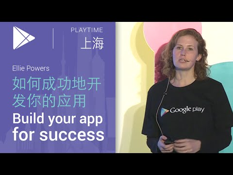

## 如何成功地开发你的应用 Ellie Powers 

 

** 视频发布时间**
 
> 2015年4月2日

** 视频介绍**

>  Build your app for success, by Ellie Powers (如何成功地开发你地应用, 演讲者 Ellie Powers).

** 视频推介语 **

>  暂无，待补充。

### 译者信息

| 翻译 | 润稿 | 终审 | 原始链接 | 中文字幕 |  翻译流水号  |  加入字幕组  |
| -- | -- | -- | -- | -- |  -- | -- | -- |
| 姜昭宇 | 程路 | ——| [ Youtube ]( https://www.youtube.com/watch?v=mEO9gxn2VtM )  |  已发布  | 1504060550 | [ 加入 GDG 字幕组 ]( {{ book.host }}/join_translator )  |

### 解说词中文版：

Chris刚才讲了

我要跟大家讲的就是怎么来使得你的App获得成功

我们发现

要在Google Play要获得成功很重要的一点

就是高质量

 用户们是很看重App的质量的

所以我们要讲的就是怎么帮助你去

打造一个高质量的App

作为一名 Google Play 的产品经理  

我认为非常兴奋的一点就是今天

假设你有一个点子或者业务想做

希望把它推向市场  最好的方法就是

通过移动应用

在 play 市场发布  我们在这方面有非常

广泛的覆盖

那么我们所说的这些开发

高质量的App是什么概念呢

我们其实在整个软件开发周期的

各个不同阶段  从设计  

开发直至发布你的应用

都可以给大家提供支持

每一个步骤都能够做到更高的品质

首先从设计来看讲

要明白的是Google Play的用户

正在被熏陶并已经

能够认可并欣赏这些高品质的设计

前不久我们发布 Android5.0 的时候

发布了这个概念  刚才Chris已经提到过这一点

我们称之为Material Design

它是一种新的设计的范式

它可以帮助你理解

在各式各样的设备上  如何构建一个精彩的体验

如果你要自己完成

那可是需要两把刷子的  你的网页和

不同的手机应用以及不同的系统之间

都可以通过Material Design

来提供更好的体验和一致的视觉效果

另外如果用户使用Android 5.0系统

用这个设计范式  会让你的App看起来

与整个系统浑然天成

在我们即将深入探讨它之前

我将从不同的角度与您分享

为什么Material Design能够对你有帮助以及为什么它

是你App设计的首选方案

首先  Material Design 有着很多不同的明亮的颜色

它能够帮助展现公司的理念

第二点  它能够让取悦我们的用户

用户实际上很希望自己的应用程序

与其他应用在系统里保持一致的

Material Design可以帮助你做这些的

它同样可以跨平台跨设备性的帮助

你的 App 与设备和平台保证相似的体验

不管他们用手机  平板电脑  电视等等等等

最后一点  这里其实还有一个机会能够让你的App

被更多的人所发现

很多开发者已经开始践行Material Design了

我们会找出一些最佳案例

做一个优雅设计系列推荐（把这些应用放置进去）

如果你的App希望被选中作为案例的话

请确保你的应用使用了Material Design风格

而且大家要抓住这个机会

我们来看看一个案例  我们看到Gmail团队遵循

Material Design这个原则重新设计了他们的应用

大家可以看一下他们是怎么做的

左侧是旧的版本  右侧是新的版本

你可以看到新的版本更加的干净

它增加了更多白色的空间看上去不会感觉

非常拥挤或者很乱

看起来色泽鲜艳

你可以看到上面的红颜色很明亮

右下角有一个红颜色按钮

意味着  写邮件这个按钮可以被很容易的

识别和使用

用起来非常方便

第二个例子是Google Play Music

是如何重新设计的

同样的  它看起来色泽鲜艳

标识着不同的音乐专辑

还有一个强调色

它看起来十分清爽

另外我们与这个应用互动的时候

你能看到的触碰特效

使用户真切的感受到在平板电脑上

浏览不同音乐专辑之间的是如何过渡的

同样重新设计的还有  Play Store

我们在今年年初同样也是使用Material Design

升级了它的界面

如果您对比一下左右两侧

新旧版本的变化

您可以看到我们在上面添加了

一个特色图片  它可以用来

把你的品牌特点  给用户留下一个直观的印象

其次在底部我们有一段非常短的文字说明

能够帮助用户理解这个应用

是干什么的

并在中间使用鲜艳的色彩和大胆的图标

显示用户安装你的应用的理由

接下来我们来看一下Material Design背后的

四个不同设计的原则

源于实际质感的表面  有意义的动画

印刷基础的设计  以及自适应设计

首先来看第一个  源于实际质感的表面

它起源于一种思路

现实生活中的东西进行的互动

怎么样能够在电脑的界面中

表现出来

你需要展示出光线和阴影区域

你也可以使用布局把内容从

导航条中分离

所有的互动都应当给予提示

如果有用户界面  

你需要用虚拟的视觉效果

来让用户知道应用程序是如何根据用户的点击进行反应的

第二点是  印刷基础的设计

我们需要使用一个精美的印刷排版样式

Material Design在颜色的使用上也是更加的大胆

来突出重点

你可以看到右边的这个音乐播放器的例子

应用程序的顶部专辑封面

就是大胆的使用了粉红色

同样也使得明亮高光的

不同的按钮更加的明显

我们也喜欢用几何图表

来帮助提供一致的外观和用户在不同的设备上

使用的感觉

这点是我自己非常喜欢的  就是  有意义的动画

你希望真正这个应用被触碰的时候

它是怎么样来响应用户的

你肯定不希望太多的动画

让用户不知所措  动画是为了要让你的应用

更加的具有趣味性和互动性

最后一点  叫自适应设计

主要的设计原则就是

不论任何时候用户使用这个App  在其他Android设备

或者其他应用平台以及在网页上

甚至是他们从来都没有用过的平台  他们都能

他都能够出于本能的知道

怎么去使用

在不同的界面中 

用户应当看到的是一致的元素

而且你要好好考虑一下在每个界面上

到底该显示那些元素

同样的  有一致的基本的

设计原则  用户可以学着

怎么与这个App进行互动

我们接下来讨论的话题是各种不同的

设备类型中  你作何调整可以使得

你的应用程序适合不同的设备

首先我们谈到的是平板

我们能够发现  尤其是

很多全球热门的应用和游戏  都已经适配了平板电脑

看到这个现象我很高兴

他们利用了平板电脑

大屏的优势  为用户带来

更好的体验

当你把应用上传至Google Play Developer Console的时候

我们实际上会自动检查

确保应用符合基本的要求

并且在平板电脑上会获得良好的用户体验

你可以上传应用程序在7英寸和10英寸的

平板电脑上的应用截图

并且如果你想确保你的应用

在Play Store和平板电脑上面有

最好的可视性  确保你认真阅读了

针对平板电脑的一个品质说明

你在developer.android.com上可以

看到很多关于今天话题的内容

在那里有指引来帮助您了解

一个伟大的平板电脑的应用是怎样的

下一点我们要提到的是Android Wear

有很多人很关注智能手表

这里是有三种不同的方法来实现

如何去做一个Android Wear 应用

我们每一种解决方案都会具体来讲

最基础的版本  如果你的应用

使用的是普通的推送通知平台

那这个就可以正常运行（手表兼容普通推送）

你只需要确保你运行一下

而且要按照你所想要的方式发挥它的效果

确保推送通知按照你的方式

显示了就可以

其次是  如果你刚刚接触Android Wear开发

你想快速简单的尝试一下

这些的话  你只需要大约

10行代码就可以创建一个增强版的推送通知

而且它可以帮助你格式化你的推送通知

使其看起来像是页面

你甚至可以集成语音回复

我们关注了很多在Android Wear上的有意思的东西

用户也很兴奋  尤其是

一些消息类应用  比如

在手表推送显示新的信息  

是非常容易的  然后用户

可以直接通过语音指令来回复就很棒了

如果你想要建立一个纯Android Wear App的话

那很棒

所以接下来跟大家分享一些

我们的早期合作伙伴

他们用过的方法

如果你们以前做过软件的话

可能注意过左边的这张图

看起来是你在项目一开始最希望达到的一个状态

你会想  我花很小的一部分时间

做设计  大部分的时间做App

然后花点时间最后做一下调试

但是事实上

你可能需要更多的设计的时间

你仍然还需要开发你的App  但是在最后

你会花费比你想象中更多的时间来找Bug

现在  当你想开始做 Android Wear App的时候

有一点非常重要

它与我们之前做手机应用

和网页应用的

交互是大不一样的

如果要确保很好的体验

你需要留足够的时间做用户体验的迭代

为你的应用做了一个早期的

原型之后  你需要搞到一个 Android Wear 设备

你需要在家里或者办公室尝试它

然后看看是否有哪些不对劲的地方

然后对交互进行调整

这样的话  你会拥有一个非常棒的结果

并且很高兴  但是需要

在开头花费更多的时间

下一点就是Android TV

它即将掀起一场客厅革命喔

我们的Nexus Player设备已经发布了

未来即将有更多的乐趣和设备

上线和投入使用

在你创建Android TV

应用时需要牢记的  有三个基本的原则

对于这个客厅里的电视来讲

它不像是一个手机或者是台式电脑

对用户来讲  他肯定是希望很快能得到他们想要的内容

不要在电视应用或游戏中有过多的界面

用户和我们的游戏之间不能有太多的不同的步骤

另外  你的互动要尽可能的简单

对于用户来讲  他可能要用游戏的操纵杆

而不是去触摸屏幕

你需要做一些特别的测试  确保

所有各种不同的游戏里面的内容都是通过UI来体现

与此同时  你要有电影院这样的体验

对于用户来讲  他就是坐在沙发上

然后看着电视  不希望做

很多其他的互动

我们提供了Leanback这个主题  使得 Android TV 的应用

更具备一致性的风格

我们强烈建议您使用这个主题风格

一旦你做好一个的电视应用的时候

你可以将它提交到 Google Play Developer Console

我们会做一个检测来确保应用

会提供良好的用户体验

刚才已经说到了如何提高你的应用的设计质量

接下来我们要讲的是如何在我们整个开发的过程中

带来更高的品质

Android Lolipop在今年年初的时候发布

真的非常激动 

因为它与大量的API同时发布

数量甚至超过了我们之前发布过的系统版本

着实令人激动

我会告诉你一些有关Android L的一些要点

首先是我们刚才已经讨论过

的Material Design 

此外对于推送通知  我们也做了很多的改变

我们也做了很多的性能优化

尤其是关于电池  蓝牙

网络性能  如果以前总是掉线的话 

现在的应答性会更好

我们在来讨论一下在Lollipop上的推送通知

有一些东西我们希望

确保你知晓

并检查一下你的应用程序

首先  你会立刻注意到

它的背景有了很大的变化

之前它的背景颜色是黑色的

现在它的背景的颜色是白色

此外也有定制化的加重的颜色

在这个例子中闹钟通知有一个

蓝色的圈

你可以根据你的需要  

来把它进行定制化

其次是  你需要添加一个推送通知的标记

加到 AndroidMainfest 文件里  因为在 Android L 系统里

用户可以进入设置面板

管理您的应用程序通知的内容

如果你希望你的应用也在那里（可以自定义设置）的话

最后  我们在Lollipop里增加了新的特性

推送通知可以显示在锁屏窗口了

这是一个很棒的方式去吸引用户

但是有一件事你需要注意

你要确保你要给用户呈现的是

合适的信息

你不想在锁定屏上放一些

私人的信息

所以我们有特殊显示设置

因此你可以为你的推送通知

设定隐私相关  是公开还是私人

这将确保用户获得他们想要的

合适的信息

然后  对Android L来讲  

非常让人兴奋的一点是

我们是有这样的潜力可以通过移动电话的技术

将世界上所有人都联系在一起

这非常令人兴奋

但是这里有几个提示

开发者需要牢记在心

如果开发者想开发非常好的高质量的应用

在这些新兴市场的话

首先  在新兴市场中  

数据流量往往很昂贵

为了改善这个问题

你必须要确保你的应用程序安装包（APK）

尽可能的小

第二就是  不要总是想着3G或者LTE网络

要想着你的用户是只有基于2G接入  甚至有的时候

没有Wi-Fi

那你要是进行足够的测试

确保你的App在2G的环境下也能够

提供良好的用户体验

甚至是在网络经常掉线的情况下

此外你在测试的时候  内存使用也很重要

在新兴市场通常这些设备会是

内存比较吃紧

所以你要确保  使用不同的内存测试工具

来确保应用在内存较少的机器上运行流畅

Android Studio Beta 提供了很多

性能测试工具

比如说他有内存监控工具

刚才我们所讲的在内存低的情况下

进行测试

这是非常非常有用  不论是

你在创建 Android Wear、Android TV

等新兴应用的时候

此外在全球的市场当中

大量用户使用了的Google Services框架

它提供了一系列的工具去监测性能问题

包括关于可用性  不同版本的兼容性

以及其他开发者遇到的典型问题

各种用户可能碰到的不同的问题

所以大家要在早期考虑到这些问题

当我们要发布一个游戏

或者应用的时候  我们有一个很棒的点子

但是我们没有一个足够强大的预算去建立一个

严谨设计的后台

这个时候 Google云计算平台（ Google Cloud Platform）就飘进来了

它可以帮助你快速成长

而且当你的App以及游戏推出的时候

并获得大量关注的时候

你能够在不花太大力气的情况下

升级服务器配置

它提供了非常优秀的性能  它

使用了Google的网络平台技术

此外他能够提供全球的接入

如果你在我们的全球市场中

发布了应用  并使用我们的这个云计算平台服务

就可以确保用户不论在哪个地方都可以就近

请求服务器端后台

此外  为了帮助大家起步

我们有一个叫做移动起步者工具包（Mobile Starter Kit）

这是让大家得到比较容易承受的

来自Google的特别优惠的价格  而且

设置起来也相当容易

Google Play Services非常令人兴奋

它提供了一个方便使用所有

Google服务的渠道

并且是自动更新的

用户使用 Google 的服务  你并不需要

嵌入任何的 SDK 到你的应用程序里

我们今年推出了几个新的功能

比如活动识别 

它有特别的API能够让你检测到

用户是在跑步  行走还是在做其他的事情

还有一个就是云端存储（Cloud Save）

这也是一大亮点  尤其是你在开发

游戏的时候  希望将用户的状态同步到云端

不管是用户在线或者不在线

都可以正常同步

我们讨论了设计和开发

接下来我们讨论可以帮助你提升应用质量

Google play为你提供的各种工具

帮助你在全球市场发行

我们刚刚有提到我们的Google Play Store

充分利用了Material Design  给我们带来了新的形象

所以如果你是一个开发者  这里有几点

非常重要的内容来确保你知道如何

让这个页面看起来非常棒

其中之一是你要确保上传大的

在屏幕顶端显示的

横幅的图片

大家在这个屏幕上可以看到一个深蓝色的背景

之前这个是大家无法上传上去的

第二  在每一页的下面都会有一个

短的文字介绍

这样你可以做一个

简要的描述

让人们了解这个App

是做什么的

嗯哼

喵~

卡住了么~

哇哈哈  好啦~

我们继续~

用户评级对我们Google play

来讲是非常重要的

当用户对不同的Apps进行比较时

他们经常会参考评级

然后决定是否来安装

很多成功的开发者

向我们分享说  他们从用户的评论里就可以知道

如何可以改善他们的应用

于是他们花费大量的时间阅读这些用户评论

看看用户们的吐槽

看看用户们希望有什么新的功能

Google Play有一个新的功能就是开发者们

可以回复用户的评论了

如果用户反馈说  喵  这里有个Bug啊

然后App就崩溃了  或许这个时候你应该说

谢谢您  我们马上就来查看这个问题

等到你修复了这个错误之后  你可以再次回复用户说

老弟  你说的那个Bug偶们已经解决了

您可以检查一下是否还存在问题

用户也是会给开发者好的评价的

通常情况下用户们对于这种出色的用户服务会非常满意

而且这个答复是公开的

如果你回复了某个用户评论  其他用户在商店看到

你的回复的时候会想

哇哦  这个公司着实靠谱

我们在Google Play最有力的

工具之一就是Beta测试阶段

和分步推出的想法

所以我们看到了超过8万的应用程序

使用Beta测试阶段来改善应用的质量

这个趋势逐渐在上升

实际上  在Play中卖的最好的应用程序都是

采用这样的方式来提升质量

然后我们看到了一些做过beta测试的应用

得到的评级就会比平均分高很多

让我们来谈谈每个不同的概念的意思

所谓beta测试就是你对

应用做的非公开的测试

你可以创建一个Google Groups 群组或者

Google+社群  用户可以选择加入

来测试你的应用程序

你可以同时进行两个版本的测试

一个我们称之为Alpha  另一个我们称之为Beta

为了确保新的功能不被泄露  或者用户分享了应用的Bug

等类似的事情  我们的设定是  

处在Alpha和Beta测试的用户  是不能留下任何用户评论的

也就是意味着  如果你前期进行了

一小部分人的内测

这不会对你（线上）应用的用户评价造成任何负面影响

之后  你可以将数据进行比较

比如说  你可以对比一下两个版本之间

哪个崩溃的信息更多

如果你已经完成了小范围内测

你就可以大范围的推出你的应用了

你就可以使用分阶段发布了（staged rollouts）

这个主要的理念就是  当你要发布你的应用之前

你应该非常确定它

运行起来非常棒

大家都会担心  如果应用程序

里面有Bug怎么办

分阶段发布模式就是让你在发布应用之前  先把App

给到一个小组的人进行测试

如果你发现有任何问题的话  就可以尽早解决

而不会造成用户直接甩出一个评论说

他们不喜欢新的版本

或者你收到了很多关于新版本的报错信息

你就可以在这里暂停发布  修复Bug 之后

然后再继续发布

避免任何Bug影响到你的整个用户群

很多开发者经常会问我

我的应用接下来该做什么

为了使得我们的建议尽可能的帮到你

我们也会有一些优化的建议和警告

通过这些提醒  你可以决定接下来该怎么做

如果我们发现你的App

有改善的机会的话  我们会给大家优化的建议

比如你的App在俄罗斯

有很多人想要安装

但是你没有俄语的版本

那我们就会告诉你

然后你可以很方便的购买俄语

的本地化翻译服务

这样你就不会

错失任何机会

当我们发现你的应用有问题的时候

我们会通知你

比如你的App出了一个新版本

而你的用户对新版本的评分

比你的老版本低了太多

那我们就会通知你说

你需要检查一下

可能这里会有什么问题

告诉我们你的电子邮箱  你就会

更快的收到警告

如果你想了解你的App做的怎么样

你就会想知道用户在你在App里面在做什么

最简单的办法就是使用Google Analytics

Google Analytics对我们非常有助

并且它是跨平台的

你可能会有一个Android App  但你也

可能有其他平台的App  甚至是网页

那我们的Google Analytics就可以让你从

不同的平台中来综合的衡量

只需要简单的三行代码

就可以为你的应用增加Google Analytics功能

你在那儿（Google Analytics后台）就能得到很多详细的信息

举个例子  集成Google Analytics了之后

你可以用一个叫Google Tag Manager的东东

你知道用户在你的应用里都做了什么

你可能会做一些小小的改进

Google Tag Manager可以帮助你完成这些实验

举个栗子  这个App有两个版本

在一个版本中游戏中  动物的角色是狗狗

另外一个角色是一只喵

我会想知道大家更喜欢哪一个

我想要增加一个度量单位

比如收入或者是在游戏中的时间

然后我会去决定在游戏中

到底是阿喵还是阿狗胜出

假以时日  通过分析  你就可以让大家

选择你之前优选的结果

另外一个常见问题是

我想知道用户是如何发现我的应用程序的

有一个最佳的方法就是

Google Play 引荐流报表（Google Play Referral Flow Report）

如果你的App里使用了Google Analytics

你就可以启用这个独特的功能

这个可以跟踪你在Google Play上的用户

完成从查找到启动您的应用的过程

每个系列

你都可以看到有多少用户查看了你的应用

有多少安装量  有多少人运行了你的应用

这样就可以让你知道哪种宣传更有效

并且最精确的

使用市场营销

的开支

另外一个Google Analytics可以

帮你做的复杂的事情是

它还可以对客户进行细分并让你找到

最有价值的客户  并且和平均用户

进行比较

举个例子  我的游戏中有一些用户

七级以上的

花费多于五美元的并且

是在十二月份安装我的应用的用户

我可以关注一下这批用户

在应用发生了不同设定的时候

他们还有多少是继续留下来的

很多开发商可以在Google Play上

有着很高增长的收入

我们也可以提供一个收入报告

不仅告诉你总的收入

而且告诉你每个用户的单收入

有多少人购买  同时可以让你根据不同的

国家  不同的市场查询你的

收入情况

这对你全球发行的应用或者游戏

帮助很大

你希望了解全球各个市场的财务状况

开发者还对我们提出过建议

尤其是那些有着大量应用的  每个应用

又有着大量语言的开发者  做不同语言的更新

真是非常花时间

因此如果你也花费了大量时间更新

尤其是有大量应用的翻译

需要更新的话  Developer Publishing API

应该可以帮到你

所以你可以先上传你的apk文件

再做Alpha和Beta的测试

然后上传你的本地化图片和文本等

在发布的过程中

它可以帮助你尽量不出错

这会使你不会有过多的时间花在上传上  留下多一点的时间

给应用的开发阶段

我们今天向大家介绍了如何

做一个高质量的应用或者游戏

在设计阶段  开发阶段

以及产品发布阶段

现在大家对Google play的了解更多了

我们希望大家可以积极地使用我们所提供的工具

在你的应用里加入

Material Design  以及更积极的倾听用户的反馈

谢谢

