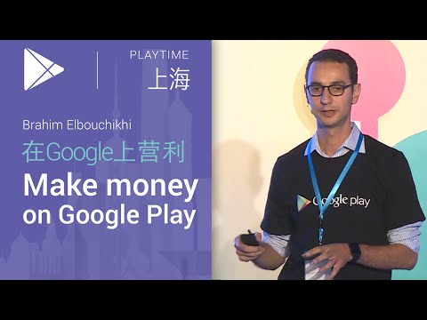

## 在Google上营利 Brahim Elbouchikhi 

  

** 视频发布时间**
 
> 2015年4月2日

** 视频介绍**

>  Make money on Google Play, by Brahim Elbouchikhi (在Google Play上营利, 演讲者Brahim Elbouchikhi)

** 视频推介语 **

>  暂无，待补充。

### 译者信息

| 翻译 | 润稿 | 终审 | 原始链接 | 中文字幕 |  翻译流水号  |  加入字幕组  |
| -- | -- | -- | -- | -- |  -- | -- | -- |
| 姜昭宇 | 高洁 | ——| [ Youtube ]( https://www.youtube.com/watch?v=RVhmpEHa8Jg )  |  已发布  | 1504060551 | [ 加入 GDG 字幕组 ]( {{ book.host }}/join_translator )  |

### 解说词中文版：

你好吗

为了保证效果  我还是与大家讲英文吧

回到正题

我叫Brahim

我是Play Store的产品经理

我做很多的事情

不过今天要跟大家讲的是商业和盈利

我站在这的目的之一

就是要确保在座的各种中国的开发者

都可以成功的在全球市场贩售大家的应用程序

我们提供给大家的主要的服务之一就是支付

有130多个国家已经支持了付费应用

中国的开发者也可以从全球收钱了

所以这是我在接下来的发言当中

要跟大家所分享的

我实在是忍不住要把这个数字再说一遍

前面Chris已经说过了

现如今我们整个团队都

非常的激动

我们这个团队三年之前成立

当时的情况和现在非常的不一样

我们在一年内支付给开发者钱超过了50亿美元

我想有了我们在中国的这些用户

我们还会在未来有更大的成功

就这个这个数字本身来讲

已经让我们非常的兴奋了

说到支付  其实有两种不同的形式

一种就是大家在做这个应用程序

大家正在做的这些应用程序和游戏最终会让用户去付费购买

当然这是很有趣的

但我是个商业咖 我只关心购买量

当大家吸引越来越多的用户

去点击购买的这个按钮

那我们从Google的角度来讲  我们的责任就是

要尽可能的去确保它的转化率

能够更高

为了实现这个想法 我们在过去几年

做了很多的事情  我跟大家会一一的来介绍

然后我也会介绍在大家的应用程序当中

大家可以做什么来确保用户

可以成功的走到最后购买的那一步

其实是有两方面的工作

一来是要用户要点击购买那个按钮

二来就是我们的工作了  我们来把越来越多的来自全球的用户

转化过来

这里是一个参考框架

我想来谈谈

关于一个企业家和企业的起步

那其实大家都是在自己熟悉的市场

我们不说欧洲

我们说说中国

我们在这可能会这样想

大家有一个需求

大家有一个自己觉得非常重要的机会

然后大家说

我要做一个app来满足这个需求

然后大家就从大家自己最熟悉的市场开始

也有可能扩展

到另外一个

也有类似需求的市场

然后突然之间大家就其实在做一个全球的业务了

恩  就是全球性的产业了

在过去  这没两下子功夫是办不到的

一个企业在全球化的进程中

需要要去雇佣不同的人

对于大家而言

这个全球化的过程是太快了

而且你不需要做任何额外工作

大家的运营的方式没有任何的变化

事实上这真的很重要

在利用Google Play的平台

打造全球业务的时候

在建立自己业务的过程中  

大家要有这种全球化的思维

我确信  在座的各位都是做全球化业务的

还有一点  实际上开发者大部分的收入

其实是在他自己的本土市场以外的  

其他的国家所获得的

（全球市场开发者）收入比只做本土市场的多了2.5倍

当大家走向全球化的时候  大家迈出那一步的时候

各位就会发现大部分的收入都是来自于其它国家

比在自己的本土市场赚的更多

这个数字也非常令人兴奋

过去的一年  这样做的开发者

有38%的增长率

他们大部分的收入都是来自于

自己的本土市场以外的市场

这点对我们非常的重要

我们坚信Google Play是最完美的全球平台

它能够帮助实现大家的目标  如果有更多的

开发者利用Play成功的话

我们肯定会更开心

当然每个人都有选择权利  所以我是开玩笑的

如果大家不想大家开心一下  这也没关系

从另一方面来说

让我们来聊聊  从 Google 的角度

我们做了哪些工作来确保各位成功走向国际市场呢

首先是覆盖面

大家可以在全球190多个国家发布大家的应用

这样大家就会有

很多国家的用户

大家能在130个国家的市场销售

这就成为了一个全球性的业务

大家可以从20到30个以上的市场里收钱

这是真的  这不是梦

65个国家里  大家可以定制化大家的价格

我稍后会谈到  对大家的用户来讲

这个将十分重要

如此大范围的覆盖  全球性覆盖

这将有助于帮助大家成就全球性业务

有意思的事是  当我们在构建全球的

支付以及商务平台时

我们认识到  全球的平台

必须要有本地化的观念

也就是要考虑到每个市场

用户的支付偏好（支付习惯）

我们在这项工作上  花了大量的时间

比如  在美国  信用卡是主要的支付方式

这个是他们最为顺畅的支付方式

在亚洲  运营商直接代扣

由电信运营商直接收款  

就是在大家每月的电话上的费用当中进行支付  这非常受欢迎

这两个市场都很大  

也都很成功  但是他们使用的支付的方式是

完全不一样的

中国也不例外

因此当大家思考自己的市场

考虑这些市场用户的时候

必须要有本地化的思维才行

在过去的一年中

我们是在25个国家当中推出了Google Play礼品卡

在28个国家市场中推出直接运营商支付

在19个国家是 Paypal

所有的这些步骤  都是为了确保

在不同市场的用户可以使用 Google Play

我们尽可能多的给大家转换用户

当用户按下购买按钮  

我们就要尽可能的留下用户

我们所做的这些本地化的支付对接

就是可以做到的（尽可能的提高转化率）

我来给大家举个成功案例吧

这是我们在德国所推出的Google Play的礼品卡

在德国非常有意思

大家看

自推出以来  销量每年在德国年度增幅高达70%

越来越多的德国人

都养成了付费习惯

所以第一步就是  更多的人愿意付费

第二步  就是所谓的提高25%转化率

意味着至于多少人点击购买按钮

大家是不关心的  最重要的是

用户得成功购买才成啊

对不对

大家在乎的是他们是否购买

我们的年增长率能达到25%

这就是德国销售额能增长3倍的原因

这就是我们支付本地化

的体现

进入一个市场  大家需要提供他们所喜欢的支付方式

这样越来越多的用户就会变成买家

这个转化率越高

那大家的销售额就会大幅的上升

我们希望能够在其他市场也复制这样的模式

在香港  我们每年会增长80%

的销量

在这一年中  我们推出了运营商直接支付和礼品卡

在俄罗斯  买家数量的上升达到了100%

我们同样推出了推出了运营商直接支付

我们推出这些付款方式

并看到这些模式的复制和增长

提高了转化率和销售额

这可能不应该说  从现在开始

我们推出这个模式  已经有一段时间了

从本质上来说  付款都是一样的

虽然运营商直接收款已经

推出很长的时间了

但是当他们使用无线平板时

他们还是不能直接付款  这还是

不够完美

所以说  在几个月前  我们

允许在平板上  使用DCB的这种支付方式支付了

如果使用手机SIM卡激活运营商付款

这种付款方式  就可以在其他

设备采用这种方式付款

包括Wi-Fi设备喔

此举对提升平板用户的

用户体验来说是非常重要的

对我们而言也是一个重要的经验

此外  我们还很重视的一点

就是要实现内容的本地化

在过去一年里  我们一直很重视

哪个国家的开发者

能在国际市场卖出更多的应用

我们在中国也实现了这个（在全球市场贩售App）

在这里和大家探讨这个问题

我们现在可以看到这个数字

已经从54上升到62了

我们推动开发人员在更多的市场

打造一些本地化的内容  众所周知

这都是关于本地化的

越多本地化内容就会吸引越多的用户

这时候  就有现金流了哈哈

想到这些数字真的很激动

那我们讨论一下采取什么样的行动来

增加自己的收入

首先就是将大家的内容本地化

对于不同的市场和用户

到底本地化哪些内容

大家是需要有一个侧重点的

如果大家有目标市场

想要认真对待

大家需要投入广告费   买用户等

去做用户采集

当大家想这么做时  下一步就需要本地化你的应用啦

让来自印尼或马来西亚的用户

使用英语或者是韩语的应用

这是行不通滴

我们可以看到

做本地化的会比不做本地化的多6倍的转化率喔

从这个角度讲Pocket App确实做的很棒

另外就是本地化大家的价格

听起来很简单

却并不好实现

我总是听说本地的开发人员会比

国外的开发人员

对本地市场的了解更多一点

这对本地开发人员来说很简单

但是对国外开发人员来说并不简单

那比如说在日本  价格为100日元

会比101日元更好接受

因此我们就要大家对货币价格进行转换

要转换65个国家的货币

大家就要了解怎样的价格

才是对的

什么样的价格

才能最合适最有吸引力

这个价格要能给用户的一个好印象

让用户想买

并能给大家的应用一定的停留时间

最后转换成购买

所以说在大家定价的时候

大家一定要考虑到当地市场的情况  调整大家的定价

就像把101日元改为100日元

我们特别对日本做了价格分析

我们发现有定价不满100日元的

和超过了100日元  事实上的购买额会

相差两倍

回头想想

这就很重要了

这就是规则之一

大家只要照做就好

我想我们今天也涉及了一些

当然还有多种模式供大家选择

在这我想指出的是  大家的商业模式应该

随市场的变化而变化

不同的市场它可能有不同的购买的规律

有时候是要靠做广告的

也许只有这样才能让用户去购买

他们不买  那估计只能打打广告了

在其他市场  大家可以靠应用内付费来赚钱

订阅收费也是一种方式

对于某些应用这种方式可能会更好

有些应用靠应用内付费

大家需通过多个角度考虑这个问题

有个很重要的事情就是

在产品迭代的初期  也就是一开始的时候

很多事情就要定下来

当产品研发开始的时候  

就要为它找到适合的商业模式

是靠应用内付费解锁新功能

这种方式呢

如果为用户提供的是周期性的价值服务

大家会选择订阅性收费还是App付费下载

抑或是放置广告等等呢

Google Play 的订阅销售额

过去一年当中是不断上涨的

我们认为

对应用程序来说  这是一个相当不错的

盈利模式

在应用程序的设计

和研发阶段

就要考虑是不是是否能够持续性的为用户提供价值服务

如果是  大家就可以考虑

使用Google Play的订阅

我们给大家提供了所有必要的工具

帮大家为客户提供

满意的用户体验

另一点也很重要  如果大家有经常付费的习惯

你可能会希望这里不仅有应用内付费

和周期订阅付费  这几个付费

模式显然是行不通的

我们刚才已经讲了

举个例子  我们已经有了季节性订阅

比如运动类应用程序  内容类应用程序

我们还为大家提供积分的功能

意味着如果用户对开发者的

应用并不是很满意的话

大家可以给用户一些积分

或者给他们一些折扣

这样一来  有助于用户的参与和存留

我们也提供后端

退款的API

如果你已经有了用户服务的工具

也可以无缝接入平滑升级

另外我们也支持等级的升降

那这样大家就能够把一个用户

从上一级到下一级

从上一级到下一级

能让大家做些什么呢

比如大家有一个价格介绍

比如这是一个储存性的App

有不同的存储量等级 1.99美元换1T的存储

然后有更高的阶梯 比如10T或者100T

是多少钱  等等

我们允许让用户平滑的升降级

他们的付费计划

在大家的应用程序里  可以是触发一个升级操作

用户的等级源于他们的积分

我们只需要在后端对这些积分进行处理

用户的付费计划就可以平滑的改变

Chris也谈到了这一点

在这我就不赘述了

这张图表中的内容真的非常重要

就是高质量的App是一切成功的基础

这些数字确实可以说明问题  质量的好坏

带来的收入的差异是巨大的

尽管大家都明白这个道理  但是想象不到会有这么大的差距

一个应用的评分  从两星到三星到四星

收入会提高九倍

从四星接近五星

大家可以看到

收入又有四倍的差距

也就是刚才Ellie说的

这个评级  大家可以通过回复一些评论

解答大家的问题  这些事情都有助于提升你的销量

也有助于大家赚更多的银两

我知道大家也是资源有限

当大家在资源投入的时候

你可以选择做更多功能或者修复漏洞

但是我们必须去面对它

我们希望通过这些数据  

更好的帮助大家做出决定

提供更多的信息

帮助大家做出决策

质量可以说是非常重要的

我接下来讲的也是围绕质量的一些基本概念

如果大家的App在设计时考虑到了平板的优化

它的商业化效果会增加10倍

在别的设备运行你的应用程序时

他们希望你的应用程序也能做的很棒

用户希望开发者能够对这些设备进行优化

如果大家不适配该设备

那就不要在意这些细节了

如若是想吸引更多的用户

平板用户 或者 其他设备等

那必须为这些特定的设备

做特别的设计优化

这真的很重要

正如我们看到更多的设备都开始用Android

比如Android TV  Android Wear等等

对于可穿戴设备  你已经可以很容易得到了

你需要确保它最基础的功能

当你为那些生态系统构建应用程序的时候

你是可以一个非常完美的用户体验的

最基础的就是确保  不论你的目标是什么设备

你都要专门为它适配并且保证

能够正常运行

会有越来越多的类似这些事情

千万不要做井底之蛙就行

总结一下  我们首先讨论了我们应该

考虑走出本土市场

显然  你将深入覆盖

到130多个市场贩售应用

这给了大家很多的选择空间

大家可以针对某个特定的国家去开发

做了用户调研之后  可能定位的国家有很多

但是最好要明确自己的目标  

要有针对性

瞄准了一个市场之后  为特定的设备做特定的设计

需要本地化你的产品

本地化价格

如果大家想在一个市场中得到用户

这是需要大家做好功课的

全球市场是

一把双刃剑  你可以覆盖超过10亿的用户

但是另一方面  有这么多的用户

你就需要好好考虑一下  怎么能够增加用户的互动

确保你的应用用户体验是很棒的呢

这就是我们第二个观点  本地化  本地化  还是本地化

最后  大家要继续关注应用的质量

Google Play是非常非常关注质量的

我们要强调在Android上所有的用户都要有好的体验

这个对大家开发高质应用来讲是非常重要的

现在各种设备层出不穷

比如说Android TV以及Andorid可穿戴设备

这是新的挑战  大家在开发的时候

要考虑到App在不同平台的

质量问题

以上

非常感谢

拜了个拜

