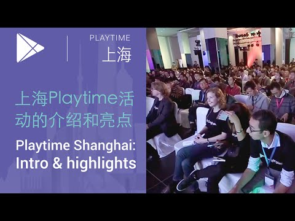

## 上海 PlayTime 大会活动亮点

  

** 视频发布时间**
 
> 2015年4月2日

** 视频介绍**

>  Playtime Shanghai event introduction & highlights (上海Playtime活动的介绍和亮点).

** 视频推介语 **

>  暂无，待补充。

### 译者信息

| 翻译 | 润稿 | 终审 | 原始链接 | 中文字幕 |  翻译流水号  |  加入字幕组  |
| -- | -- | -- | -- | -- |  -- | -- | -- |
| 程路 | 王琳 | ——| [ Youtube ]( https://www.youtube.com/watch?v=r86-P_HOyac )  |  已发布  | 1504060551 | [ 加入 GDG 字幕组 ]( {{ book.host }}/join_translator )  |

### 解说词中文版：

BILL LUAN: 各位来宾  大家早上好

活动很棒

这次活动太棒了

能有这么多中国的开发者参与  我们非常兴奋

我觉得这个活动非常好

真的非常开心

这是我第一次到上海来

看到如此众多的开发者参会  真的太棒了

开发者的激情着实令人叹服

会议的内容非常贴近开发者们

今天到场的开发者和公司

他们有非常大的兴趣

让自己的产品走向国际市场

我很支持他们这么做  我真的非常开心

Google 提供了大量的 API 

帮助你的应用开发

以及盈利  同时您也可以通过

中国的银行账户进行收款

我们非常激动的宣布  我们已经

为中国的开发者们打开了

一扇走向全球的大门

大家好

我是 Alan  我来自中国香港

我来自谷歌开发者社区（GDG）

我正在上海参加 Google 举办的 PlayTime 活动

通过 Google 的这些专家我学到了很多

他们教给了我们很多最新的

在 Play Store 上开发应用的消息

以及如何开发高质量的应用和游戏并上载到 Play 商店

他们给了我们非常多的统计数据

以及非常多的教程  以确保我们知道如何做

以及做什么

我在这里遇到很多我们未来可以一起合作的团队

这个会议太赞了

