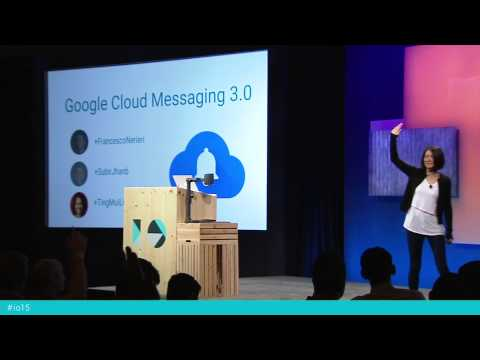

## Project Tango - Mobile 3D tracking and perception

** 视频发布时间**
 
> 2015年5月29日

** 视频介绍**

> The next big things from Google Cloud Messaging (GCM), simplifying your mobile messaging and notifications solution.

** 视频推介语 **

>  暂无，待补充。

### 译者信息

| 翻译 | 润稿 | 终审 | 原始链接 | 中文字幕 |  翻译流水号  |  加入字幕组  |
| -- | -- | -- | -- | -- |  -- | -- | -- |
| 虞高 | —— | —— | [ Youtube ]( https://www.youtube.com/watch?v=gJatfdattno )  |  [ Youtube ]( https://www.youtube.com/watch?v=ho1Ql0tYFRg ) | 1506120857 | [ 加入 GDG 字幕组 ]( http://beta.gfansub.com/join_translator )  |

### 解说词中文版：

嗨 大家好

大家怎么样

我是Francesco 站在这里我很兴奋

我和Ting Mui还有Subir一起，都来自Google云消息组

今天带来我们平台新版本的介绍

我们在2012年创立了GCM小组

使得你能有效及时的

通知你的用户重要的事情

为了这个 我们对于电池寿命

网络数据流量考虑的比较周全

从那时到现在我们做了很多工作

自从2012年到今天有60万

应用加入了我们的平台

每秒钟我们处理超过

从你们来的1.1百万请求

进行消息推送

并且我们帮你推送到超过15亿

的用户设备上

这些是很了不起的数据

我们来看看

60万的应用，每秒1.1百万的

请求 超过15亿的用户设备

你猜我们接下来要做什么

就单单今年 我们将处理超过25万亿的

来自你们的消息

并且随着我们接受到这个数据量的增长

我们很努力的工作来维持系统的规模

我们很专心的维护着系统平台

时至今日 为了处理一个

来自世界一端到世界另一端的消息

平均下来，如果设备在线的话

仅仅用时大约50毫秒

随着我们的技术革新

我们总是留心保持事物简单可靠

今天我们将看到一个全新的 简单的方式来

使用GCM 并且用一个更有效的方式

来注册你的服务

然而我们总是想让事情变的更好

这样你们能够专注于构建成功的应用

我们通过增加新的特性和API已经工具

来做到这些

举个例子 就像GCM 这让你们

通过用户的兴趣爱好垂直的定位

自己的用户群

而且还有一个诊断工具来让你

知晓你的所有消息推送发生了什么

只要它们是通过我们系统发出的

最终 我们希望推广GCM到各个地方

这样你就能和所有你的用户进行接触 无论他们身在何处

无论在什么时候 无论他们在使用什么设备

只用一种简单且有效的服务就行了

目前为止 GCM能够推送你的消息给网站

以及给你的iOS用户

这里最棒的部分就是

所有目前的你看到的一切都是免费的

所有我们今天要发布的也将是

免费的

谢谢

鼓掌

我很高兴的说时至今日

我们和很多开发者一起合作

如今 国家公共电台 Wattpad 以及Samba.me

他们都已经成功且有效的

跨平台的用上了我们的特性

你们稍后将看到他们在使用了GCM之后的感受

我们先看一下

GCM的基本特性是什么 

我们使得在你想要给你的应用发一条

消息推送的时候能成功发出

比如说 如果你正在写一个食物的应用

你想要推送给你的用户 告诉他们披萨已经在路上了

这时候你可以使用GCM

并且操作起来很简单

我们只需要从你那里知道两件事

首先 我们需要一个消息 在这里就是关于这个披萨的

其次我们要知道目标地址

也就是想要收到这条消息的设备所在地

如果你已经用过GCM了

你就会知道这里的地址指的是注册的账号

然而今天 我将介绍一种更有效的方式来

定制你的应用

首先我先要介绍设备编号(Instance ID)

简单解释就是机器的身份

这样他们就能交互

就像人们见面打招呼

用一句话概括 设备编号由两部分组成

一个是身份标识

这使得你能够精确的定位你指的是那个应用

举个例子 

在我的Nexus6上的这个食物应用 

它的身份标识就是固定的贯穿这个应用的生命周期

直到我之后把他从

手机上卸载

可以把它理解成是应用的用户名

第二部分就是安全令牌

如果还是用那个例子的话

可以理解成是那个应用的密码

当你觉得这个密码被盗了或者被修改了

只要删除原来的并且再生成一个新的就能

更改它

并且这个安全令牌就是你

通过GCM发送消息的东西

并且操作起来很简单

当我们的用户在设备上安装了这个食物应用

我们自动给你生成一个设备编号

你只需要调用IID.getToken()

你提供详细请求之后GCM会返回给你一个

安全令牌

现在既然我们已经有了设备编号以及安全令牌

我们可以称之为

注册密码

就像你之前做的 把它发送到服务器

这样你就获得了设备地址

现在你就能给这个特定的用户发送披萨

并且你还能做更多

现在你可以对那个设备上的应用发起询问

这台设备还在运行

比如你能得到应用名 如果在Android上 

你能得到那个包的名字

如果在iOS上你能得到那个bundle的ID号 如果在Chrome上能得到资源号(Origin)

并且你能够确认一下

你发送的消息的确是给你的那个应用

你还能得到你所指的

这个应用的版本号

你可能想知道你的用户所用的这个食物应用时什么版本的

或者关于他们设备的信息

他们最近一次使用它是在什么时候

他们用什么方式进行连接 WI-FI还是移动网络

以及证书状态

我们能反馈给你跑着你应用的这台设备能否被信任

它有没有被root

你能够基于这些信息

作出决策

今天你在我们的开发者网站上

可以阅读相关教程来上手 可以把它

作为一个单独的产品

或者和GCM一同使用

最棒的一点就是这些在Android Chrome 以及 iOS

上操作方法都是一样的

自从2012年以来 我们给越来越多的设备提供服务

我们最开始在Android手机 平板

穿戴式设备上进行

去年 我们在Chrome上的网页应用上部署了这个服务

如今 你可以在Chrome 或者 iOS上的网站都能这样访问

并且在这些平台上GCM跑起来都是一样的

我们来看一下Chrome上的网站

你要做的就是实现网站推送的API

在你的网站上调用JavaScript就能

反馈给你一个

我们之前提到的注册令牌

现在当你的服务器发送一个消息给那个注册令牌

Chrome会在浏览器上有所显示 就像这个例子

这个在Windows Mac Linux 以及Android上

都能运行

在Android设备上 这个通知会和

其他的消息一样显示

通知显示基于手机操作系统

当用户点击它的时候

我们会在移动设备上的Chrome浏览器上打开你的网站页面

对于iOS 这也是很简单三步

首先连接上APNS(苹果推送服务器)

然后你会得到一个APNS令牌

这样就和之前的步骤一样 调用IID.getToken 

这时候你可以加入一个可选的参数

就是你的APNS令牌 我们会反馈到哪个注册的

令牌上

你把它发送到服务器上

我能做的事情有三件

得到关于应用的信息 得到关于iOS设备信息

然后发送披萨信息到

那个iOS用户设备上

并且在iOS上 这个运行起来很方便

如果这是个后台应用

我们依靠APNS服务器来传递消息

但是用户越快地点击披萨应用的话

它就会在前台显示

这时 我们直接和GCM连接 这样你就能完全使用

这项服务了

如今你可以给iOS用户使用我们的所有API了

举个例子 上行消息

你可以打包1000个设备给一个消息请求

来进行消息广播 并且这些设备

可以是混有iOS Android Chrome

并且你可以用我们的云连接服务器

通过建立XMPP链接来传递消息流

你可以在我们的网站developers.google.com/cloud-messaging

上阅读所有这些 我们有一个单独的iOS小节

接下来我会邀请Subir上台

给我们深度讲解一下我们平台的特性

谢谢

掌声

感谢Francesco

很高兴能看到跨平台的GCM

现在我们知道有了设备分组消息

GCM可以给同一组的设备进行交互

我们先退一步讲

当你要给一个唯一的注册令牌发送推送的时候

GCM会给那个独有的设备发送消息

但是要给另一台设备发送消息的话

你不得不制定它的

注册令牌

这个在你想要定位单个用户的时候很管用

但是当你想把一个请求发送给

多个设备的时候呢

如果你想管理一组设备里的

你的通知推送呢

有了分组设备消息 GCM能够

把你的多个设备分组

并且同时与他们交互

就像一个注册令牌标记

一个单独的设备

对于一组设备 我们有一个通知的键

让我们看一下它是怎么工作的

就像通常的GCM流 你的设备注册了GCM

他们发送一个注册消息给你的服务器

之后 你的应用服务器

就能调用GCM来管理一个设备组

你可以选择性的创建一个新的设备组

或者在一个已有的小组里

添加或删除

GCM对于这些请求

会反馈给你一个通知键

这里有一个JSON请求的例子来显示如何创建一个

设备组

你需要发送给我们注册令牌

消息键的名字就是

你想要指定的那个设备组的名字

并且操作指明了你是要创建一个新的设备组

还是对一个已有的

设备组进行操作

作为回应 GCM会发回一个通知键

你的服务器要存储这个通知键

用来在今后定位你的设备群

那你如何给你的设备群发送消息呢

很简单

你要做的只是把你请求里面的两个参数设置给

这个通知键

下次 当你要给这个设备组进行消息推送的时候

GCM会给这个组里的设备都发送消息

你最多可以给一个组设定20个设备

一个经典的设备分组消息使用样例

就是把一个用户

的多台设备分在一个组

这样你的服务器就能用一个请求

和这个用户的所有设备进行交互

这是十分强大的功能

除了给设备推送消息以外

你的应用能给你的服务器进行消息上传

给一个设备群然后GCM会将它传递给其他

在这个小组里的所有设备

你可以用这个来告诉其他设备

一个通知已经在一台设备上进行处理了

并且可以选择取消剩余的推送

因为用户已经没必要再在其他设备上

再读一遍这个消息

从而提高用户体验

所以有了这个设备群 我们看到你可以怎样在GCM上对一个设备群

进行操作

但是如果你想要给大量设备

和对此感兴趣的用户发送一个

更新推送该怎么做呢

你还需要存储这个注册令牌

然后一个个进行交互吗

并不需要

我们有一个新的GCM平台特性

主题消息

有了主题消息 你可以给大量的设备发送

同样的更新消息

这个API能让你创建一个你选择的主题

选定这个主题的用户然后给他们进行更新推送

这里不需要追踪个体的订阅

你可以根据用户兴趣

构建一个更加私人化的消息推送策略

让我们来看看这是如何工作的

你可以把你的应用设置为一个主题

无论在什么时候 更多的设备可以订阅这个主题

之前 我们看到有getToken请求

来获得一个注册令牌

一旦你有了这个 给设备订阅主题

就非常简单

这只需要一行代码

就这样

你的用户就在这个订阅之下了

你的服务器就能给他们进行更新推送

你是怎么做的呢

也很简单

你可以在这里to的变量里写你的请求

这是你的主题名字

也就是订阅的用户

下次你的服务器发送一个更新的时候

它就能推送给所有的订阅的设备

现在 woman来考虑一个例子

还是那个我们之前讨论的

食物应用

加入你的用户们对一个旧金山的

啤酒节很感兴趣

嗯哼

你可以选择他们加入到主题里面的啤酒节

然后上传关于这个主题的更新

GCM会给所有的这个主题下的设备发送

消息推送

现在加入有个用户想要

搬离旧金山

尽管我们不想看他离开

但是他们很有可能不再对这里的啤酒节感兴趣了

现在你就可以把他们从那个主题里去掉

同样只需要一行代码就能从一个主题里面

去除一个用户

下次你有重要的啤酒节更新的时候

GCM就会给还在这个主题

里的设备进行推送

如今主题消息已经能够使用了

目前我们已经有了100万个主题

我们会给主题消息加入更多特性

所以还请继续关注

我们看到了有了设备分组以及主题消息以后

你可以把设备分组然后在其中

进行消息推送

很高兴的说目前这些特性已经能在

Android Chrome iOS 上用到了

当你发布新的消息的时候已经没有必要再去追踪

每个设备的类型了

我希望你能为用到这些特性而感到高兴

接下来我们有情Mui Ting上台讲一下

GCM的一些工具

谢谢

掌声

感谢Subir

嗨

我是Ting Mui GCM的项目经理

从Francesco和Subir的介绍中 我们看到了很多今天发布的激动人心的

新特性

我希望大家已经做好了开始写代码的准备

在此之前 我们来看一下在API之上我们还发布了什么

第一个问题

目前都有谁在使用GCM以及之后会有谁用

你进行推送的时候都有哪些状态变化

有人回答吗

应该更多才对哈

好吧

好消息是

今天我们发布了一个工具来让你们弄清楚

后台发生了什么

这是一个在Google Play 开发者控制台上的一个诊断工具

这样你就能诊断发送到Android Chrome 以及iOS设备上的

消息了

而且这很容易

你要做的只是输入一个注册令牌

就是之前介绍的作为应用身份表示

或者叫消息ID的那个

这个就是当你发送一个消息的时候

GCM返回的一个标识

我们来看一个例子

你看到的这个是Google Play开发者控制台

中的一个我们作为特定演示

开发的应用

你可以点击左侧的GCM诊断就是现在光标所在处

来开始

诊断过程

让我们看一下如果进入一个注册令牌会发生什么

这是一个注册令牌中的很长的字符串

它是给我的设备上这个特定应用的

当你输入了这个注册令牌到这个工具以后

你就能看到所有最近已经发送

到这台设备上

的消息

通过左侧的查看接受时间

你能够找到GCM是在何时收到的这条消息

以及所有这些消息的状态

这样我们就能看到确实有些消息

发生了碰撞以及有一条消息

已经被设备接收

这样能在看到一台设备上的所有消息

状态是很方便的

但是如果你想弄清楚具体没条

消息发生了什么呢

还是很简单

你可以在输入框里输入消息编号

而非之前的设备令牌

如果消息编号已经在列表中出现的话

你可以直接点击他们

我们来仔细看一下这些例子发生了什么

比如说这里第一条

显然 设备已经

收到了这条消息

我们看看能否找到

关于这条消息的有趣的信息

在这个工具里输入这条消息编号以后

你能看到的是这条消息的状态以及

这条消息

状态的变化时间

在这个具体的例子中 我们看看能收获什么

显然 这条消息在我的设备没有连接的时候被

传送到了GCM

但是一旦我的设备连上了网络 瞧

GCM向我的设备发送了消息

并且我的设备向GCM确认了消息被收到

这些是很有趣的细节

现在你也能够

知道具体发生了什么

我们来看另一个例子

这里还有很多

碰撞的消息

提示一下 碰撞的消息

指的是消息已经

被一个有着同样碰撞键的新的消息所代替

这点非常有用 这里的一个例子是

当你发送一个同步消息给你的应用

从而想让它去服务器

获取最新的信息的时候

我们来看一下这个第三条

发生碰撞的消息

和其他消息一样

我们看到这条在我设备断开连接的时候

被发送

它被一条新的消息所代替

我之所以喜欢这个工具是因为

当有消息发生碰撞的时候

这不仅仅告诉我这条消息发生了什么

以及它发生的时间

这个工具还能反映出在这条消息被

代替之后发生了什么

这会告诉你是哪条消息代替了现在这个

以及在所有这些有着同样碰撞键的消息中

哪一条是最重要的

如果我再往下滑动一些 在第一行我们能看到的是

我们当前看的

这条消息

意料之中

它发生了碰撞

实际上 这与第二条消息发生了碰撞

然后与第三条发生了碰撞

然而好消息是 你看

第三条消息成功地传达

并被我的设备接受

我们认为这个工具是一个对开发者非常有用

的用来查错的工具

如今你们都能用到它

来给推送到Android iOS 以及Chrome设备

上的推送消息差错

你可以最多同时查看30条消息编号或者一个

设备编号

最棒的地方就是这些数据能在你

发送消息之后几分钟内可查

早先我们宣布在iOS上部署GCM

我假设这里的观众

以前都用过GCM

今天除了发布一个新的诊断工具以外

我们把这项技术放在生产流水线上

目的就是能让开发者在几分钟内能配置好GCM

使你能够尽快享受

编程的乐趣

对于那些热衷于在iOS上使用GCM的用户

你同样能上传APNS证书

无论是产品还是开发证书

这样GCM能够代表你向iOS设备推送

从今天开始 你可以去developers.google.com/cloud-messaging 

来开始GCM服务

我们今天介绍了很多特性

我来做一个回顾

跨平台特性 允许开发者

一次性向Android iOS 以及Chrome

用户进行消息推送

话题消息 一个简单的方法让开发者

向终端用户发送定制化消息

从而提高终端用户的推送体验

反之这也能提高你的开发体验

诊断工具 这个给开发者排错的

简单工具

正如我们之前提到的 我们很高兴 

用一小撮工程师发布了GCM 

以及这些新的特性

我们想向你分享他们对于这个GCM的体验

是怎样的感觉

来自NPR One的体验 他们在iOS喝Android上用话题消息推送

这些能很方便的整合到他们平台

Wattpad 使用了我们的主题消息

他们能周期性地向用户推送提醒

Samba.me 他们能够专注于工程资源并且

在iOS上构建他们的产品

GCM的服务非常适合他们的用户

我们希望你能是下一个开始使用今天介绍的这些特性

的合作伙伴

最后 你也听闻我们之前说的

今天要公布的新的网站

developers.google.com/cloud-messaging 这上面有了

新的内容和一些简单的代码解释原有的和新的特性

在网站右上方的角落

还有一个发送反馈的按钮

我们希望进一步开发新特性

来更好的配合你的产品需求

请给我们留下反馈

告诉我们你的消息推送体验

能让我们做的更好

非常感谢

希望你们能和我们一样对于这些新特性

感到激动

我将邀请Francesco和Subir回到台上

回答大家的问题

掌声

观众： 我想这是最后一年你们公布

GCM将双向工作

也就是说一台设备能够向服务器发送消息

就像接收一样

去年我没听到关于这个的消息

但是我想刚才说的那些证实了

它存在是吗

想请你确认一下

去年我们发布了这个的beta版

现在它也在那里

这被称为云连接服务器

Francesco 之前在他的讲话里有提到

是的

你可以双向发送消息

好极了

谢谢

观众：目前我们之中

很多人已经给iOS设备用了APN

你能讲一下这里面的过渡吗

我是不是要上传近百万的用户令牌

给你们

然后更改我们的服务器设置

在我们要进行应用更新的时候安装一个GCM 工具包

我是这么理解的

是的

这还是挺简单的

你装个工具包 我们的GCM SDK

其实这就是一个iOS SDK的设备编号

在这个SDK中 我们会传输APNS令牌

之后你从我们这里收到了注册令牌

这些库函数都会替你搞定

你只需要把它放入你的服务器

然后你就能像Android一样使用

观众：明确一下 我是说

用户不需要进行更新吗

对于没有包含GCM SDK的iOS版本

有没有向下兼容性

嗯 包含GCM SDK的是

你的应用

并非是一个Apple设备

有些时候你需要设置为旧版本的应用

靠APNS来操作

而新版本的应用用

GCM来操作

了解了

观众：有没有办法通过你们的API或者类似的东西

获得消息的状态

还是只能依靠控制台

有的

现在我们将在Google Play上提供

开发者控制台

但是现在我们还有内容要考虑 我们之后会发邮件给你

好的

谢谢

你好

我想知道你们如何对应GCM开销和

APNS的开销 你们那里是怎么解决的

你们没办法完全支持

比如在iOS上 图像推送  或者一些类似于

小控件是吗

目前我们做的还非常简单

我们匹配他们的内容类型 比如说2kb的话

如我之前所说 你的应用前端将连上GCM

但是对你来说目前事情会很简单

你不用考虑前端

我们要传送的东西是在后台

所以我们降低到2kb

我们觉得这么大够了

但是我们仍然在等你们的反馈

如果你们觉得这是个没用的特性

我们可以做些调整提高更多的

传输类型大小和其他特性

明确一点

我们的确支持大多数Apple有的类型

内容传输 比如badges和消息

可以看一下我们的文档

嗯

这些API是这个系统的

一个结合 你可以把他们

全部利用起来

很棒

谢谢

你们对于传输消息的时间开销

有没有做一些提供服务保障

的工作 以及对于已经发送了的消息

有没有考虑

关闭消息流

嗯

这是很有趣且复杂的一部分

特别是在我们发送了一个消息并且

设备已经收到了它 这对网络的依赖性很大

他们在Wifi或者网络载体上

并且地理上依赖于这些载体

我们在这方面做了很多工作

来保障系统十分可靠

和有效

我之前提到过 对于服务器这边

我们能做的是控制环境让他变的有效

我们在合作企业和载体上都下了功夫

确保即使最后一英里效果也有保障

另一个问题是

你们对于出错的应用有没有

什么措施

能重复一下吗

调整发生错误行为的应用

比如发送了太多消息然而并没有

这么高的速率

嗯

我们一直专注于

确保电池寿命

这是我们一个主要的方面并且防止设备上出现大量垃圾消息

我们不操控这台

设备本身

我们在这方面做了很大改进

嗨

你提到了iOS客户端 当他们在后台的时候会

持续连接APNS

这在延时方面意味什么

是不是代表消息从GCM通过APNS然后

被客户端收到

当你的应用在后台的时候

我们不能打开一个连接

所以我们需要依赖于APNS服务器并且看它怎么操作

我们做了一些改进 这样当应用连接上之后

会发现有几条消息没有被传达

之后我们会继续推送

但是只要你的应用一直在后台

这个就和APNS一同工作

一旦设备确认他们收到了

这些消息

他们向GCM服务器确认

那还有没有别的办法可以确认

这个消息被传达

好问题 我们也的确有这么一个

新的特性

如果你用CCS来从设备上获得一个消息

你可以设定一个你要知道

这条消息传达的收据

我们称之为传达收据

在请求中 当你传达一个消息

你可以给我们信号说你要

这条消息的收据

然后你就能得到这条收据

棒极了

谢谢

酷

如果没有其他问题了 我们明天有一个沙盒环节

还有一部分问答环节

我们也将在这里回答一些线下问题

感谢大家

谢谢

掌声