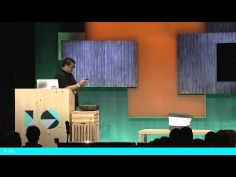

## Project Tango - Mobile 3D tracking and perception

** 视频发布时间**
 
> 2015年5月29日

** 视频介绍**

> Understanding where we are and what is around us shapes our behavior and our interactions with people and objects. Yet most mobile devices today assume that the boundaries of the world end at the boundaries of the screen. Project Tango is a platform integrating custom sensors and software that allow developers to explore new user experiences enabled by 3D tracking and perception. Applications include navigating through indoors spaces, measuring your environment, playing 3D games around your home, and being able to walk through immersive experiences. Come join us on this journey.

** 视频推介语 **

>  暂无，待补充。

### 译者信息

| 翻译 | 润稿 | 终审 | 原始链接 | 中文字幕 |  翻译流水号  |  加入字幕组  |
| -- | -- | -- | -- | -- |  -- | -- | -- |
| 田源 | —— | —— | [ Youtube ]( https://www.youtube.com/watch?v=iP9m9a2KEN4 )  |  [ Youtube ]( https://www.youtube.com/watch?v=Bm_JRufvb7I ) | 1506120857 | [ 加入 GDG 字幕组 ]( http://beta.gfansub.com/join_translator )  |

### 解说词中文版：

JOHNNY LEE:各位  早上好

很高兴来到这里

我叫Johnny Lee  很高兴能在这里为大家

提供一些Project Tango的最新情况

首先向对这个项目还不是特别了解的各位稍微介绍一下（项目初衷）

我们目前都面临这样一种情况

就是当我们将手机放到桌子上的时候

手机并不能识别他

周围的事物

它并不知道桌子的边界

或者屋子的区域范围

事实上  几乎所有它提供给我们

的信息都包含在了这个

大家所看到的小矩形里了

当我们在家里与家人一起玩耍时

或是与同事在单位一起工作时

或是在这样的大厅里听讲座

大伙都朝向一个方向时  或是和家人朋友一起共进晚餐时

手机设备都无法识别我们这些行为

然而我们的行为往往和我们所处的位置息息相关

我们的感情  我们所说的话  我们所分享的信息

所有这一些都和“哪”前后相关（位置信息是我们行为的主要依据）

所以与其将我们整个的日常行为蜷缩在这个极小的矩形里

我们更倾向Project Tango所要实现的  那就是

开发相关的硬件和软件技术

来帮助所有的人和事  

帮助他们准确了解

所处的环境

并不仅仅是GPS覆盖  WiFi覆盖

蓝牙信标  而是在任意建筑  任意控件

我们能去的每个地方  我们所用的设备和工具

能够理解我们所处的空间

所以去年我们推出了开发工具  

Project Tango平板电脑

同时这也是第一个通过带有传感器和软件

的移动设备来开始这段

奇妙的体验

它包含一个400万像素2微米摄像头

内置动作跟踪摄像头  一个深度检测

传感器

而且所有这些包含在Project Tango的传感器

同软件一起使得设备能够理解

设备的物理移动  同时识别

周围的环境

如果你真的看了  虽然我们大约一年以前发布了

这个平板  如果你真的看了GFX Bench的跑分

这个跑分工具在移动设备的

图形性能评测中特别流行  在Manhattan3.0测试中

Project Tango设备和基于ARM芯片的

设备性能相比  

依然遥遥领先

同时我们也很高兴的宣布  我们从去年已经

开始发售开发套件

目前大约有3000套已经在开发者手中用于

数百个应用开发了

在与NASA的合作中  我们的两台

原型设备

也用在了国际空间站中  它被装在一个

530磅（大约240.40公斤）重的Antares火箭

这样的协作关系

使得NASA的研究员能够利用Tango技术

在未来辅助机器人自主

驾驶空间站

所以如果你的设备具备这样的感知能力

会发生什么呢？

那么有一些领域

我们认为会比较有意思  其中一个就是

室内定位

想像一下我们的设备有一天不仅仅

能够将你带到一栋楼的正前门

并且能够将你引导向

你想去的那间

屋子的门口

在Google内部有一个项目

已经开始使用Tango设备探索为

视觉障碍的人在室内空间进行导航了

你也可以利用设备的跟踪和空间推理

将你的屋子变为一个

游戏空间

比如我可以在客厅造一个城堡

在卧室造一片森林

当然了  现在正在涌现一些新的领域

他们变得越来越热门

比如机器人  AR（Augmented Reality，增强现实）和VR（Virtual Reality, 虚拟现实）

这些在Tango中的3D跟踪功能都用到了

总结一下  Project Tango相关设备

和软件栈的核心技术

主要基于三大不同的

领域

第一个是动作跟踪  第二个

是区域学习  最后  是深度感知

动作跟踪实际上和计算机鼠标

很相似

所以想想一下你将鼠标放到桌子上

当你在平滑表面上移动它时

他会告诉你与之前你放置它的位置

的一个相对位置

Project Tango的设备也很相似

当你第一次打开程序时  它会

在启动的时候告诉你你与程序刚启动时到现在的

相关动作

不过它不受制于2D不同

它是真正的全3D

你可以操作X，Y，Z三维坐标  可以进行三维旋转

第二个主要概念是区域学习

想象一下如果你闭上眼睛

实际上你会产生一个意识层面的

Moscone的虚拟模型

而且你知道自己处于建筑的哪个位置

你大概了解屋子的大小

和你在屋子里的相对位置

这就是我所说的区域学习

所以当Project Tango设备进入到

一个之前到过的区域时  它会开始探索空间

并创建地图

并且如果它发现了一个之前识别过的地标的话

它就能在建筑物内定位

这就是所谓的区域学习

Project Tango设备所涉及的最后一个主要的概念

是深度感知

所以在Project Tango可适配设备中

我们添加了一个深度传感器

它通过红外线来测量空间中点与点之间的距离

使用这个传感器来检测环境中的地板  墙壁  家具

并且进一步是你的

程序或者游戏能够对用户的空间做出响应

在过去的一年里  我们对软件栈做了

许多改进

而这只是其中的一小部分

这些工作是通过和之前

赠送设备的合作伙伴

协作完成的  很感谢他们及时的反馈

这样我们能够

不断地向系统推送更新的特性

不过很抱歉  由于时间的原因

关于这个话题我们只能聊到这了

接下来  我会给大家

播放一段短片来演示一下刚才提到的

这些功能的实例

能不能把灯光调暗点？

谢谢

[播放音乐]

[鼓掌]

Johnny Lee:  是不是很酷炫

它们都是现在实时运行在平板开发工具的

真机上

其中一些视频内容是很早期开发的用来

在实验室验证概念的  所以很高兴

能在这里和大家分享这些实验结果

由于这些视频是现在实时进行的

所以我很希望能够为大家直播这些东西

那么让我们切换到平板电脑

棒极了

这里是一个透视屏幕

它的功能是展现“魔术帽子”所掩盖的内部活动

这是我我们从动作跟踪摄像头捕捉到的

原始画面

这是一个广角摄像机为我们提供

整个环境的画面

实际上我都能看到拿着设备的指头

而且你可以看到这些

颜色近似的绿点

它们代表光学计算机所做的处理

也就是说这些点表示

跟踪在摄像机中的没一幅画面

我们将这些数据同高集成度芯片里的

陀螺仪和加速器结合起来生成

右上角的图像

所以像其他移动设备一样  他们可以左右旋转

然后大家可以看到我的移动的反馈

但是Project Tango设备特别的地方在于

我可以带着他移动并且在屋子里

来回走动

所以如果我带着设备画个圈

它会以三维方式持续跟踪

我也可以走下台  

举着它简单来回走走

然后它会一直十分准确地

跟踪我的位置

那么我可以拔掉HDMI线

实际上我还连着这根线

所以大家仍然可以看到屏幕上的内容

这个可以让用户在整个

房子里走动或者在整栋楼里走动

并进行持续的三维跟踪

接下来我会利用动作跟踪功能

给大家一些简单的演示

是一个快速的测试演示

它也是想世界上的建筑应用

致敬

而我正在做的就是  呃。。。

这是个简单的方格平面

而且大家可以看到我在中间有个基础点

而我所需要做的就是移动设备

它会控制Unity内的虚拟摄像机

如果使用平板电脑  我可以对着地面

然后点击Add按钮  这样就可以放置一个模型

如果我继续添加更多的模型

就可以构建地基了

有几块就够了  足够放一个小房子

所以大家可以看到这个操作很自然

我所需要做的就是把它当作摄像机控制器

点开这个菜单

我就可以选择砖头  我可以把砖头在地上排列起来

像这样

而且我们仅仅是用平板对着它点击按钮而已

而且我可以很好的控制它

又快又准

那么我给窗户布置一些柱子

再添加一个屋顶

OK  已经搞定墙了

我再造一个木制屋顶

就这样。。。

那么仅仅几分钟时间

我就在屏幕中间  展台的中央早了

一个简单的小建筑物

而且我可以走到左边和右边  并且从不同的角度去

观察它

因为我具备六自由度跟踪

所以我可以直接进入

这个房子  像这样

[鼓掌]

那么选择石砖  

稍微装饰一下房子内部

之前我造过一个小房子

但是现在我没法完成所有细节

不过巧妙的地方在于这个建筑物的确处于

展台的中间

如果我走到这  在这

那么我可以造一个塔

而这些物体会处于实际物理空间的位置上

所以大家可以想象我可以有一个多人协作完成的房子

我可以和我的兄弟姐妹或者朋友

一起协作完成

并且我们可以像布置真实的物体一样在实际的物理空间里

创建这些虚拟的模型

我们所希望完成的目的

是希望通过Tango平板电脑

使得三维设计工作者们的工作

变得更加简便易行

Other World是一个我们合作过的

游戏开发团队  之前咨询过他们

是否愿意将一个基于Unity开发的游戏

移植到Tango平台

如果你用过SDK  你会发现它很简单

只需要几个小时的时间

你就可以将Unity游戏里的三维建筑

放到Tango里

在这个世界里我需要帮助

小船躲开敌人

而在普通的游戏中  你可以  通过普通的设备

要么点击屏幕在你所在的位置

进行旋转或者通过头戴式陀螺仪

进行旋转

但是由于我们具备六自由度跟踪

我可以来回走动  从不同的角度观察

这个星球

如果我到这个星球上面

我可以躲开晶体块  

并且如果形体朝我飞过来

我可以使飞船穿过这个空间

大约2到3英尺远

我也可以躲到后面  点击行星带

从星球上投掷小星体

这个仅用来演示如何将

六自由度输入添加到

游戏模块中

我们的开发者社区关心的另一件事情是

能否将真实事件的地理信息

添加到游戏引擎中

所以我们在Project Tango网站上

的示范代码中有一个应用程序

叫做Mesh Builder

而他所能够做到的就是利用深度传感器和

三维跟踪一起完成空间的

实时三维检测

我这有一个小桌子和篮子

大家可以看到  我可以在展台上走动

它在逐步构建网格

由于它是实时运行在Unity中的

所以我可以往上面扔球

它会自动实时更新物理反馈

不过这个篮子对这些球有点小了

我拿开它  换一个更大的

篮子在这

清空一下  重新扫描

大家能够看到现在有一个更大的篮子了

它正在逐步构建自己

那么现在我退后  可以玩篮球了

来吧

耶~

耶~

[鼓掌]

如果再进行一点点修饰

和游戏程序模型

你可以将这个桌子变成高原或者山顶

你也可以找朋友

在沙发上弄一堆靠枕

然后把它变成城堡

让你的游戏人物绕着家具跑

当我们最初实现这个的时候

我们把办公室的毛毯卷起来

把它们当作球的斜面

另外一个大家关注的

能够依靠传感器实现的简单的功能是

能够测量周围的环境 

所依靠的是Tango设备上的传感器

想象一下我们准备购置一个新桌子

或者要买一张新床放在这里

我们可以使用跟踪数据

和三维传感数据为我们提供一个

可视的卷尺

举个栗子  如果我想测量桌子的大小

就用十字心对准桌子  哎呀

我再试试

在下面试试

好吧

所以它为我们提供了环境中两点距离的

粗略计算

我所需要做的就是对准设备  就好像是瞄准镜一样

同时我能看到两个角落之间的距离

然后走到这里来  按一下按钮

这样我们就能得到桌子所占用空间的粗略值

另外一个很棒的事是

你不需要必须在平整的地面上

比如说我要找地方停货车

而货车里装满了家具

然后我就要决定能否通过这个间隙

我可以测量从这张桌子  从这个讲台到这堵墙

它会给我们一个空间中的测量值  就像那个一样

[鼓掌]

所以有很多专业的应用程序

大家可以用它们来

利用这个技术和功能

最后一个想给大家展示的是来自一个合作伙伴

叫做Invite

它们的工作专注于

产品形象设计

它们主要针对高端公寓大楼

制作类似车或者冰箱之类的模型

所以之前我们一起合作

然后完成了这个简单的汽车图形化工具

我需要朝着这个方向

这样我们就能在舞台上放一辆汽车

我把它拿起来  移动一下

这样它就碰不到桌子了

好~滴~

我可以绕着车走走

因为它是一台

全尺寸的汽车

所以尺寸不太符合舞台大小

所以我要利用软件的功能缩小汽车

走起

搞定

现在它只有玩具大小

我可以仔细观察了

可以好好看看车轮  我可以双击引擎盖

它会打开引擎

我可以靠近引擎

讨论它的不同的部件

空气滤网  气化器  引擎盖

很显然  你可以对模型进行个性化操作

比如把它涂成竞速红

或者午夜蓝

而且还可以继续改造车身

下面我会向大家展示车身上能够改造和设置的部分

现在我现在车顶  稍微升级一下  加个天窗

为了方便测量  我现在把它恢复到正常尺寸

这样我就能够进入到

汽车内部

由于舞台的面积太小

所以我直接从挡风玻璃这里穿过去

不过从这里我可以清晰看到汽车内部的仪表盘

方向盘和座椅

如果我想  我可以调整内饰的风格  

颜色等等

这是另外一个关于Unity一体化的

简单的例子

而且我们开始提高AR的显示质量

和图形拟合效果

重申一下  所有这些都是基于

动作跟踪的

并没有任何预先创建的地图

我们在任意环境下都可以完成它

包括你家里或者展厅或者零售区域

好滴  演示都在这

[鼓掌]

我们能回到笔记本屏幕吗

还有一些其它掩饰我不能在展台上进行

或者说很难在站台上演示

比如VR相关的东西

新闻和媒体已经对VR做了大量的宣传

而Project Tango所实现的六自由度跟踪和定位

对于VR来说十分有趣

所以我们在探索将平板电脑放置于大家的脸上

通过Durovis潜水头盔

Durovis是一个为不同手机设备制造

塑料外壳的合作商

这显然不是一个很经济的

应用形式

而且这些平板电脑也不是为VR设计的

它们的响应延迟很高  

并且渲染效果也比较一般

但是从传感器和跟踪的角度来看

它的工作效果还算不错

所有如果大家时间充足  大家可以出去到我们的沙箱区域

在那里大家可以在VR中体验整个村庄

你可以站在村庄的地面上观察

可以看到站在地面上的人们

并且可以观察周围物体

我们还完成了一个可以进行多人VR的原型

由于我们的设备全部是自己定制的

所以在相同空间的多人VR仅仅需要

接入WiFi网络并且

互相共享位置即可

更棒的是大家可以

带上头盔  在VR中可以看到彼此  

并且和其他人进行交流

嘴型会与你的交谈同步并发声

如果你在沙箱区域  你可能会看到

这个

这是我们和Hasbro一起合作的原型

他们具有这款NERF牌子的枪

他们的工作是在枪管上设计

一个三维底座

你仅需要安装一台Project Tango设备

它能够让你在屋子里

以第一人称的角度射击

你可以转身  从左往右射击敌人

你也可以移动  藏在盒子后面

玩起来很带劲

所以我建议大家去试试

所以我们很高兴也很自豪能有

大量的合作伙伴帮助我们一起

完善这个平台  无论是从软件还是从硬件

的角度

同时我们也希望这个网络社区里的

大家  在未来我们能够把大家加入到这个

列表里来

我们认为Project Tango设备会为电玩领域带来新的

游戏形式

我们可以将虚拟的物体放到真实的与大家相关的

物理空间里

我们可以引导你到你所感兴趣

的物体面前  

到你从来没有去过的空间

我们还可以帮你决定

当GPS不好用的时候

在游戏区域里如何移动

我们不仅能够创建三维模型

使你可以通过转头来进行观察

而且你能够站起来穿过它们

而且我认为这是个很有趣的维度

我们仅仅是作为社区

进行探索

显然  我们大家对于AR的出现和

发展都很关注

而三维跟踪和拟合对于提高用户体验来说

十分关键

而且当你将跟踪功能和

环境信息相结合的时候

你可以打破物理空间对你的限制

大家都知道机器人和无人机

我也特别感兴趣

之前还自己买了一个  但是刚到手不到半小时

就给摔了

所以搭载式的移动三维定位跟踪和三维感知

对于碰撞躲避和自动化

十分重要

所以我们也发现设备中的这些技术

和这个领域相关性很高

那么这就是我们的Project Tango开发套件

带有一个高性能的400万像素2微米摄像头

动作跟踪摄像头  内置深度传感器

Tegra K1处理器  128GB存储

和4GB内存  这样的配置和笔记本都不相上下

之前我们需要开发者在网站上提出申请

才能获得我们的设备

所以目前放出的设备很有限

但是我们很高兴在本周早些时候

发布了开启开发套件在美国购买渠道的消息

对于其它国家的购买渠道也会很快

发布

并且我们也很高兴宣布

最终的价格降为512刀

根据设备的各项细节

这是一个很有竞争力的价格点

为了庆祝设备的新功能

我们也推出了第一届软件开发比赛

这也是为促进软件开发和为平台添加更新的

内容

比赛总共有三个大类

你可以选择制作一个工具程序

比如测量  导航  房间扫描

或者物体扫描

我们针对AR和VR有对应的应用场景

当然了  我觉得游戏和娱乐方面的程序是最容易想到的

能在这个空间进行展示

的应用

对于每个领域的每个发展阶段  我们都准备了一定的资金

这些资金会呈指数增长

前16名将得到1024刀

在那之后胜出的4个原型作品

将得到2048刀

最后每个大类会产生一个应用程序胜出

将获得4096刀

一旦最终的程序提交了

我们还将设置一个用户驱动的在整个比赛范围内的大奖

共8192刀

整个算下来  这将是个总数达到95000刀

的比赛

而且我们希望这不是我们所举办的最后一届比赛

所以建议递交环节今天就会启动  对于截止日期

第一个截止日期  大家记住是6月25日

在这个日期之前提交项目建议

最后的APK提交要在9月23日之前

要咨询更多的信息关于如何参加比赛以及细节  

请访问我们的Project Tango Google+社区

页面

通过95000刀来支持应用开发社区

希望这能帮助我们培养并挖掘新的的合作伙伴

未来我们能和他们一起进行更深层次的合作

并建立更加紧密的合作

我们对于Project Tango的内部技术感到十分兴奋

也希望在未来它能像GPS一样无处不在

虽然我们也知道  在没有GPS之前

我们也能很好的使用手机

也能知道如何从住所到工作地点

我们也知道如何去餐馆

但是现在我们根本不会考虑买一部不带

导航功能的手机

所以我觉得  我们相信Project Tango

内部的技术未来也会产生

类似的感觉

但是我们同样明白  要像GPS一样无处不在

平板电脑是最好的实现形式

我会第一个承认一台7英寸的平板根本放不进

我的口袋

我们希望大家能随时

带着它

所以这也是为什么今天我们将很高兴的宣布一个新的

合作伙伴

那就是高通

高通目前是最大的智能手机芯片制造商

我们在过去的几个月里

和他们协作

将Project Tango加入到它们的

芯片集中

而这来自Raj Talluri  高通副总裁  的鼎力支持

他就坐在观众席

和大家打个招呼吧

[鼓掌]

谢谢

在今年早些时候我们见到了Raj

我们坐下来聊了聊Project Tango未来的发展

和我们的目标  还有移动计算未来的

前景

最后大家意见一致

我们认为计算机视觉  三维跟踪

将是新一代移动体验的必要组成部分

无论室内导航还是VR  AR  甚至是机器人

并且我们也意识到要真正达到

价格和性能的需求来满足

新的需求  需要相关技术团体开发

新的硬件和软件

而我们和高通的工程师进行了深度的交流

讨论关于通过修改移动开发平台  也叫做MDP

来植入Project Tango传感器

这是一个改装过的高通Sanpdragon 810 MDP(骁龙810处理器开发平台)

平台

我们将它与多个零部件组合起来  包括动作跟踪摄像头

基于声波飞行时间的新型的深度传感摄像头

--它来自于PMD Technologies--

一个RGB摄像头和时间戳陀螺仪和加速器

而你需要所有这些东西来支持

我们要在这些硬件上所实现的

软件功能体验

而这些MDP平台将为使用高通芯片

的设备制造商提供参考来加速

它们开发下一代

手机设备

所以同高通合作开发这些设备

我们不仅仅针对骁龙芯片集优化Project Tango软件

同时我们还推进在移动手机中使用的

应用比例

那么有一点很重要的需要记住的就是这些只是

工程研发作为参考的设计

未来不会进行大规模生产

那么目前为止你能够买到的最好的平台就是

Project Tango平板电脑

这些设备会送到OEM厂商  同时也会送到软件开发者手里

用来针对骁龙芯片

优化应用程序

能够建立这个合作关系我感到很高兴

因为我相信这将是个里程碑  未来这些技术会

被带到成千上万的移动用户

的口袋里

所以我们对未来充满了期待

所以今天  你可以购买一套Project Tango开发套件

并且下周就能开始编写程序了

我们期待大家在这个系统上开发的作品

明天我们将会看到促进相关应用的比赛

我们希望能

找到新的合作伙伴  并且未来进行更深度的合作

当然我们也继续在

软件和硬件方面追加投资

将这项技术延伸到更广的范围  包括手机和

更多种类的设备

这些是和投资相关的事宜

我们看到了技术发展令人兴奋

我们相信如果我们可以协同合作

将技术带给大家

未来会变得很棒

谢谢大家

[鼓掌]

看起来我们大约有六分钟提问时间

如果大家有问题的话

如果大家有问题可以

走到麦克风前

忘了说了  我们还在招聘

所以大家可以到我们的网站看看职位列表

开发套件和比赛信息可以在我们的

网站和Google+页面上找到

观众：Hi

关于动作跟踪API  你能

讲讲SDK返回位置的误差

和效果吗？

Johnny Lee: 好的

当系统运行正常的时候  误差是1%

所以如果行走100尺  我们大约误差1尺  

这是距离行进的一个功能

观众：好的

那么它是以百分比进行计算的

Johnny Lee:对

用百分比来说更加准确

比如如果你走了很长距离  它会改变

观众：谢谢

观众：你好

比赛向全球的开发者开放吗？

或者仅仅针对美国地区？

开放吗？

Johnny Lee: 是的

观众：谢谢

Johnny Lee: 哦

耶~

屏幕上显示高通设备正在沙箱区域

观众： 你好

之前演示了一个人骑自行车进入城市

并开始实时绘制

那么我如何处理在室外环境使用和

室内环境使用的情况呢

Johnny Lee: 动作跟踪摄像头

是一个可见光成像机  所以它在室内和室外工作都

没问题

位置跟踪和方向信息

仅仅用到这个摄像头和惯性传感器

所以室内和室外都不是问题

观众：所以它也能在室外实现物体检测  是吗？

Johnny Lee: 跟踪可以在室外进行

深度传感器会有点问题

有些深度传感器对于阳光的抵抗性好些

这取决于我们用到哪项技术

室外的深度检测运行效果会有所不同

观众： 好的

你也提到了在AR和虚拟现实方面

使用Tango平板

那么数据从传感器回到应用程序的

延迟有多大呢？

Johnny Lee: 负责VR图像

刷新的主传感器是

陀螺仪

随着你的头部运动  它会产生

最真实的  最真实的反馈

所以对于优化适当的硬件设备

VR设备中陀螺仪的差异性

不会很大

但是这些平板电脑所运行的都是原生Android

所以在这些设备上并未做任何延迟

优化

正如我提到的  这些设备延迟大约80毫秒

所以他们并未针对低延迟做任何

优化

观众：好吧  谢谢

观众：之前你展示了多人VR聊天的

截图

那么用户之间的相对位置是

如何确定的呢？

Johnny Lee: 好的

问得好

每个设备在启动的时候

都处于它自己的坐标结构

而对于已经存在的屋子的坐标系统我们会

创建一个区域描述文件

所以无论是通过网络

还是手动拷贝  只要所有机器都具备了

区域描述文件

所有的设备就能在启动的时候基本上处于同一个

屋子

观众： 那么它的工作机制是检测屋子里的特点

然后将屋子的布局对应到区域描述文件吗

还是说有其他方式

Johnny Lee: 对的

区域描述文件就是一个环境的可视化描述

它包含空间内的所有特点和对应

关系

也就是说它所描述的就是整个屋子

所以只要我们都共享同一个屋子的描述参考

我们就能将坐标系统自适应到

这个屋子的坐标系统中

观众：牛！  谢谢

Johnny Lee: 不谢

工作人员： 大家还能再提问一个问题

观众： 你好

有两个简单的问题

Johnny Lee: 您说

观众： 在很大的具有天花板的屋子里效果

怎么样呢？  就像这个屋子一样的

如果我们希望绘制它的地图  整个屋子

它的准确性怎么样呢？

Johnny Lee: 我觉得1%大概是

比较理想的误差了

所以你离物体越远

定位就越模糊

就像在这个展台上  由于整个屋子很空

我可以看到展台上的所有东西  

这样我的位置的误差

就从几毫米达到了几厘米

如果我走到走廊对着天花板

整个区域就会上升

不过如果你来回走动覆盖更多屋子的区域

Tango的精确度会越来越高

观众： 好吧

谢谢

第二个问题是

有没有可能将一个特定点对应到

地理坐标的经度/纬度上呢？

Johnny Lee: 可以

基于我们的室内定位理论

我们目前正在实现该功能  定位我们的区域描述

文件

但是这个功能需要其他的一些额外信息

比如我能得到这个屋子的初始点

但是屋子在地球上的初始点如何得到呢？

观众： 好吧

Johnny Lee: 所以我们所能用到的  当然了

还有GPS和WiFi  还有其它手动校准处理

大家可以想像一下

那时候会产生更多的区域描述文件

而且随着我们工作的深入

会有足够的基于GPS和WIFI节点

为我们提供完整的坐标系统

或者全球的坐标引用

观众： 比如我要定位一个窗户

然后给出窗户的经纬度坐标

然后我扫描房间的话

它会自动生成其他

窗户的经纬度

坐标吗

Johnny Lee: 是的

你能知道你和窗户之间的间隔距离对吧

观众： 对

Johnny Lee: 然后你可以将

窗户所在的坐标系统添加到你的数据集中

观众：好的  谢谢

Johnny Lee: 不谢

嗯嗯

好吧  非常感谢大家

希望大家都能体验我们的沙箱

