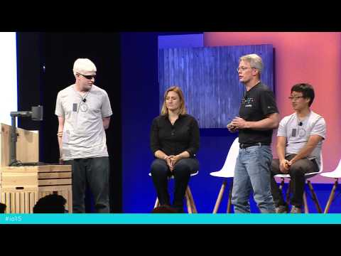

## Improve your Android app’s accessibility

** 视频发布时间**
 
> 2015年5月29日

** 视频介绍**

> When you improve your app's accessibility, you improve your product for everyone, including the billion people worldwide who live with a disability. This talk will introduce you to Android accessibility services and show how they make your app work in new ways for a wide range of users. YouÍll learn some accessibility best practices, and get introduced to new automated testing tools that bring accessibility into your existing app development workflow.

** 视频推介语 **

>  暂无，待补充。

### 译者信息

| 翻译 | 润稿 | 终审 | 原始链接 | 中文字幕 |  翻译流水号  |  加入字幕组  |
| -- | -- | -- | -- | -- |  -- | -- | -- |
| Alice | —— | —— | [ Youtube ]( https://www.youtube.com/watch?v=euEsfNR5Zw4 )  |  [ Youtube ]( https://www.youtube.com/watch?v=HWgnGP33e6o ) | 1506120864 | [ 加入 GDG 字幕组 ]( http://beta.gfansub.com/join_translator )  |

### 解说词中文版：

EVE ANDERSON: 大家下午好

我是Eve Anderson

我是Google研究应用可访问性的工程师团队的负责人

这里还有一些我的同事

软件工程师Phil Weaver

Hugh Oh, 和 Casey Burkhardt

同时 有一位十分特别的客人也来到了这里 他就是

全美盲人联合会的主席 Mark Riccobono

今天 我们在此跟你讨论如何改善你的应用的

可访问性 使其能更好的

为残疾人所使用

这是一个非常重要的话题 我很高兴你们能来到这

据国际健康组织估计

全球15%的人口

都存在着某种形式的残疾

这个数目已经超过了10亿

换句话说 也就是差不多是美国人口的三倍

比整个欧洲的

人口还要多

如果你的应用能被残疾人使用

你就能够授予这些人权利

帮助他们独立

帮助他们获取知识

更进一步 一个访问性良好的应用程序

对更多人有用处

所以在可访问性上做花功夫

最终会得到回报

现在为你们介绍Phil Weaver

然后Hugh Oh将演示范例

我们将为你展示Android平台上的

一些可访问性的功能 然后讨论

你的应用如何

使用这些功能

给你

PHIL WEAVER: 我是Phil Weaver

我是Google可访问性团队的一名软件工程师

正如Eve所说 研究可访问性的目的是

服务于世界上数以十亿计的

在某些方面有残障的人士

目前 十亿确实是非常多的人口

值得你为这些人动一下脑筋

这是可能做到的

我们很难做某一件事就可以帮助所有的10亿人口

没有什么通用的法则

但是我跟一些有残障的人士

建立了非常珍贵的联系 作为朋友

作为邻居 作为合作伙伴

我非常珍视这些联系

既是从职业的角度上 作为可访问性研究的合作伙伴

也是从生活的角度上 它给我的生活带来的改变

后者更为重要

我认为这些联系

时刻提醒着我们 如果我们不把那些残障人士

考虑在内的话 我们将失去什么

如果我们把更多人考虑在内

囊括越来越多的人

那会有多么大的潜力

我们通过可访问性研究想要真正实现的目的

是将人 工作场所 学校

融入到我们的设计中

我认为所谓的可访问性

就是对我们对用户以及对我们所设计的产品

所作出的假设的质疑 然后找到

一种更好的方法来设计

最终设计出适用于所有人的更好的产品

我所最珍贵的与有残障的人士的联系

就是跟我与我的儿子的联系

他出生时就有残疾

现在他6岁了

看着他一天天成长 使我

考虑了很多

我认为正确的信念

这也使我更加坚定的提倡

全纳性教育

作为家长 我对此感兴趣的原因是显而易见的

我希望他成长 并且习惯于生存在

他所成长的环境

希望他能融入大家

有趣的事情是

研究表明 使所有人

在一个教室中接受教育

是对每个人都有好处的 对他的同学们

也是这样

这使同学们能接触到更广阔的人群

这也使老师们在思考

关于学生的问题时更加的谨慎

然后这种教育的结果就会

是对每个人都有好处

有趣的是 软件开发也是如此

我猜我们这里的大多数人都使用自动补全功能

我反正是离不开这个功能

但是并不是所有人都知道这项功能

实际上是为残障人士发明的

以帮助他们更加高效的沟通

对于那些不能说话或者是打字的障碍人士来说

自动补全功能对他们有巨大的帮助

在20多年前 已经有了这种应用程序

人们写学术论文来论述

如何基于用户的需求

实现自动补全

现在 我们不会想到

这是一项可访问性的调整

我们每天都使用它

却不会去想到它的来源

我想这是一个很有趣的例子

我们可以得出结论

当我们质疑我们对用户做出的假设时

我们并不仅仅

帮助了我们最开始想要帮助的人

我们帮助了所有人

我们想到新的思路 新的设计 新的想法

新的产品种类

我们想谈谈你的应用

所以我们得从一个应用开始

我们要用的是Eve写的一款应用

这款应用是帮助每个人记住

PI的小数点之后的值 一个高大尚的目标

我们要做的是看这款应用是如何工作的

谈谈这款设计对用户所做的假设

然后来看看Android的可访问性功能

是如何减弱对这些假设的依赖的

看看一些应用可以遵循的

最佳方法

介绍一些测试工具 用于测试

其中的主要环节

她称这款软件为大象PI 因为大象

记忆力很好

这是一款自我测试的应用

它让你输入PI的值

当你输错时会提示你

Hugh会介绍这个应用 告诉你如何使用它

希望他对PI的了解给每个人留下深刻的印象

我们可以转给Hugh

HUGH OH: 大家好 我是Hugh

我是可访问性研究团队的软件工程师

我给大家演示大象PI这款软件

默认的行为

在底部有一个键盘

然后我进行输入 - 3.14159

值会显示在上方的文本框中

然后一旦我输入错误

它会告诉我正确的值

并把错误的数字标成红色

这就是错误的情况

这是学习PI的简单高效的方法

EVE ANDERSON: 好的 你可以回到幻灯片上来了

如果你们中的任何一个人得到一笔资金 你打算开发一款

帮助人们记忆PI值的应用

我猜你会用这一天剩下的时间

尝试换成做一些别的东西

幸运的是 显然你的投资人

正处于非理性的亢奋中

但是我们看到的只是默认的经验

并且做了很多的假设

如果你习惯了默认的经验

你可能并没有真正的思考

我们假设用户可以看到屏幕

我们假设用户可以

足够准确的触摸屏幕

他们可以读 他们可以理解

说明的意思 理解

他们接下来该怎么做

可能还有少部分人

我们假设他们想要知道

其他人对PI的记忆情况

但是这些假设 对于所有的用户来说 并不都是正确的

显然 这些假设对这个房间的某些人就是不正确的

可访问性并不能用于所有这些假设

这个可以通过

用户测试或者其他的什么来分析

希望在用户测试时也包括

残障人士作为测试员

但是 可访问性

可以解决一些假设

比如那些阻碍人们访问这个程序的部分

我们看看其中的一些

在Android中 我们有可访问性

服务

第一个我要演示的是语音反馈

它嵌入在Android系统中

是一款屏幕朗读器

屏幕朗读器可以去除

用户可以看见屏幕的假设

然而却带来了用户能够听见这个假设

语音反馈能够阅读屏幕的内容

在语音反馈的引导下 用户

进行他们需要的操作来使用设备

Hugh会演示如何通过语音反馈来使用PI应用

切换一下 谢谢

HUGH OH: 好的 我们使用同一个应用

让我们打开语音反馈

我来重新启动它

语音反馈：测试你自己

HUGH OH: 好的 接下来我要使用一个功能

叫做触摸搜索 它会把所有我用手指在屏幕上触碰到的内容

都读出来

让我移动到3

看看会发生什么

语音反馈：按键1

按键2

按键3

HUGH OH: 当我得到我想要选择的

键的位置 我双击一下

这样就相当于我点击了3键 跟刚才的演示一样

然后以此类推

语音反馈：按键点

按键1

HUGH OH: 现在让我们输入一个错误

看看会有什么发生

TALKBACK: 错误 应该是4

HUGH OH: 它通过语音的方式提醒我

我的输入错了

这就是语音反馈与大象PI应用的交互

PHIL WEAVER: 好的 让我们再来看幻灯片

这就是语音反馈

还有一个服务可以与语音反馈一同工作

叫做盲文反馈

这个用来取代用户可以

听到这个假设 但是带来了用户可以阅读盲文的假设

盲文反馈可以把所有语音反馈的内容

通过盲文显示

我们在这里不展示样例了

它是一种触觉的样例

如果你们对盲文反馈是如何工作的感兴趣

我们在google.org网站

欢迎你晚点

来谈论任何你感兴趣的话题

所以以上这些扩展了Android的用户群

另一个我们能做的是

减弱用户可以精确的触摸屏幕

这一假设的强度

我们通过按键访问来实现

它从Android开始时期的棒棒糖版本就已经嵌入了

只要有按键 就可以取代用户可以触摸屏幕

这一假设

这些按键可以是大的按键

就好像Hugh一会要演示的样例一样

或者是一些高科技技术 可以决定

使用者什么时候哪块肌肉运动了

所以这个可以在最大程度上减少我们对用户

可以控制设备的假设

现在Hugh就会通过一个按键

来控制PI应用

他会使用到一个叫做自动扫描的功能

可以每次在屏幕上高亮显示一个

可以点击的控件

然后 当移动到他想要点击的控件时

他会再一次点击按键

让我们转给Hugh

HUGH OH: 好 我们现在回到我们最初的应用

如你所看到的 我拿着一个全新的按钮

也就是按键

我只有一个按键

它既能完成开始自动扫描功能

从左上方开始 到右下方结束

逐行扫描

它还会选择你想要点击的控件

让我们看看它是怎么样工作的

我开始扫描了

它从左上方开始 扫描每个可点击的控件

我再按一下 这就好像我能触摸屏幕一般

然后我们可以测试出错

它也能够显示给你

有错误发生了

它的行为跟我们前面演示的一样

这就是按键访问是如何与大象PI应用交互的

PHIL WEAVER: 回到幻灯片这里

现在我们介绍了三个服务了 语音反馈

盲文反馈和开关访问 它们都能移除一些又带来一些

我们对用户做出的

他们如何与Android设备

进行交互的假设

现在 Android的一个优点是

它是个非常开放的平台

任何的开发者都可以写新的服务

采用全新的交换模式从而打破任何对用户的假设

以服务于更多的用户

理论上 每个用户都会有他们自己的

体验

这就好像是一种大量定制的方法

但是它是如何做到的呢

在很高的层次上讲 神奇之处发生在

Android的框架中

所以Android框架知道

屏幕上显示的是什么 什么被点击了

它在哪里 屏幕的边界在哪里

什么包含文本 诸如此类

它为每样出现在屏幕上的东东都建立了一个事件流

可访问性服务可以查询这个事件流

并关注不同的部分

所以开关访问服务

关注的是什么时候那些可以被点击的控件

在屏幕上被点击了

语音反馈和盲文反馈需要知道什么时候

活跃区域发生了改变

并把改变通知用户

好事情是应用本身并不知道

这些事件的发生

它不知道后台发生了什么

但是它可以做一些事情来支持它

它能做的其中一件事就是加入内容描述

我说过Android知道屏幕上显示的是什么

但是它不知道那是啥意思

所以如果我使用文本按键 而Eve可能会使用图形按键

而不是文本按键来输入PI的值

Android会知道这些是什么

因为他们是被标记过的

但是相反 我们需要的是这些漂亮的紫色的圆

这些图片

一旦我们使用图片来向用户说明信息

我们做了隐性的假设

他们可以看到图片

所以我们需要通过其他的方法

以保证意思能正确的被传达

这个主要是通过内容描述来实现

这些额外的文本 你可以加入到任何的控件中

被传到活跃的可访问服务中

所以我们每个按键都有内容描述 1 2

3 4 等等

注意它们的行为与描述要一致

语音反馈辅助完成的工作实际上是

一个按钮的工作

所以关于可访问性的一个大家都会犯的错误就是

忘记了为

图片加入内容描述

这时语音反馈会自动给它一个描述

对于不能看到屏幕的用户

就很难知道

这个按键是什么用途了

如果每个人都不做什么

而你为所有的图片加入了内容描述

来传达意思 那就能

帮助减少对所有的用户都能看到屏幕的假设的依赖

另一件事就是并不是在屏幕上的所有内容

都是同等重要的

有些可以就放在那里让用户

自己发掘 例如要做什么的指示

但是有些文本 例如Hugh在输入PI值时

出错了 他需要马上知道

你不希望输入之后

要滚动很久才能看到

你是对是错

然后再输入下一个数字

所以我们做了这个活跃区

活跃区意味着每当控件更新

Android在事件流中会产生一个事件

可访问性服务会关注它

我们把它标记为Polite 并不是因为我们想有礼貌

而是因为它不应该中断其他的行为

这是非常重要的信息

但是这不意味着我们要先停止其他的一切音频

播放 然后才告诉用户

PI的值错了

所以这只是我们为

使应用和语音反馈共同工作所做的一小部分

现在让我们把它破坏掉

我们进入这个Eve写的可访问性良好的应用

然后删除所有的内容描述

只留下一个按键7的描述 并在这里

加入一些冗余的文本

我们加上这是一个按钮的描述

我们会限制活跃区

为了更好的测量

然后Hugh会向你展示这个糟糕的体验

所以让我们切换到Hugh

HUGH OH: 好吧 看起来跟刚才一样

让我们听听这个程序现在是什么样的

让我们继续 打开语音反馈

语音反馈：测试你自己

HUGH OH: 然后我们打开所有

我们在按键7有一个冗余的描述

我们点击按键7

我来按一下1跟4键

让我们听听

语音反馈：按键96 没有标记

按键79 没有标记

按键按键7

HUGH OH：你看到服务

对一个没有标记的按键随机加入描述 但是像我所说的

我们不理解它的意思

然后按键按键7 有一个冗余的按键的音

让我们听听当有错误发生时的情况

现在就做

所以我输入两次

它显示有错误发生了

但是没有声音提示

这就是语音反馈与一个不支持可访问性的软件

的交互情况

PHIL WEAVER: 回到幻灯片

所以这些问题影响了

语音反馈的体验

但是开关访问对用户做出了不同的假设

所以它会被不同种类的可访问性的问题

所影响

我给你一个例子

为了建立Android的UI

我加入了一些LinearLayout （线性布局）

事实上至少有一个

是不需要的

在结尾的时候我加如一些其他的布局

为了让它看起来正确

好了之后 确认一下 OK

看起来足够好了

但是如果我们说所有的这些

都是可以被点击的 也就是我们使无关的控件在屏幕上可

被点击 然后我们告诉Android框架

做点什么

然后Android再告诉按键访问服务

按键访问服务需要保证

它把所有的选项都提供给用户

于是服务会展开这些额外的信息

我把他们叫做虚假的可点击控件

服务将信息提供给用户

这样会带来难以理解和慢速的体验

这样真的不是很好

让我们最后一次看看这个PI应用

采用开关控制这个坏掉的activity

转到Hugh

HUGH OH: 好 我们还是用那个应用

但是我们看看用按键访问的现象

这还是之前那个红色的单键

让我们开始自动扫描

如你所见 有很多的多余的轮廓线

显示给用户

并且没有理由的

将所有的或是指定行圈在了一起

如果没有用户想点击的信息的话

看起来这些也是可以这样做的

所以我继续让它结束自动扫描

我尝试着选择其中一个新的多余的

容器

让我们看看会发生什么

没有任何变化

用户会感到困惑这是为什么

首先 你必须对它们

进行逐一扫描

当你真的扫描完所有这些

那将是一种非常耗时的体验

这还仅仅是减慢了你的速度

这就是按键访问与

不具有可访问性的应用的交互

PHIL WEAVER: 好 回到幻灯片

看到这些问题之后 我们认识到

我们很有必要开始提供可访问性的服务

我们重复上述行为两次 从而

演示这些问题

但是你很难把这些问题分开

如果你使用的是默认的点击

屏幕和看屏幕

但是明显的他们对可访问性服务

有主要的影响

我已经演示了我们使用的代码

这是两个activity之间的区别

只是很小范围的代码变化

就可以大大改善应用的可访问性

保证这种代码集成在

源代码中是非常重要的

这是非常典型的代码改动范围

来实现程序的可访问性

但是它们很容易被忽略

开发者努力使自己的默认的

体验能够满足需求 有很多规则

以保证这种标记嵌入到应用中

并且一直存在在那里

问题很相似 为了保证

我们现在所作的改变

不会破坏我们上周的工作

所以测试可以保证可访问性的

正确性

让我们讨论一下测试

交给Casey 谢谢你的帮助

Hugh: Casey 会给我们演示我们正在开发的

一个非常酷的程序

CASEY BURKHARDT: 让我们看看Phil的麦克风

PHIL WEAVER:我们来演示如何

测试可访问性

我们打开语音反馈和开关访问

我们看到它们是怎么工作的

理论上 我们打开盲文反馈

理论上 我们找到所有开发人员所开发的

可访问性的服务

然后一个一个的测试它们就可以了

但是这很耗费时间

也很难大规模展开

我们无法在每次改变程序的时候

都这样做

而且我们必须要培训那些

将要做这些测试的测试人员关于每个服务

的知识

但是如果有程序可以

自己完成这些测试的话那会怎么样呢

有些兴趣 感兴趣

特别感兴趣？

Casey会给我们演示一个我们正在Google研究上进行的项目

这个项目可以完成

很多的自动化

CASEY BURKHARDT: 感谢 Phil

PHIL WEAVER: 转给Casey

CASEY BURKHARDT: 我是Casey Burkhardt

我是google可访问性研究团队

的软件工程师

我想要用快速和简单的方法

给你一个初期的印象 关于我们正在开发的这个帮助你

检测你的Android程序的

可访问性问题的程序

还是这个不能工作的activity

同一个自我测试应用 

我们已经故意引入了

一些可访问性的问题

基本上 之前你已经看到

这些问题是如何影响语音反馈

和按键访问的了

对于这个设备来说 唯一的不同就是我们

打开了Android的可访问性检查

它会在屏幕的右上角显示

一个悬浮的按键

如果我们点击这个按键

它会开始对前台的行为

进行可访问性评估

它将使用同语音反馈 盲文反馈或者按键访问

相同的API

给用户提供关于你的应用的

更多信息

除此之外 它还会寻找

关于可访问性方面的缺陷

所以如果你运行这个评估 

它会纵观应用的各个层次

然后我们可以看到都发现了哪些问题

会有一个结果界面弹出

就好像我们在之前发现的

在使用按键访问时的冗余的可点击的控件影响了

访问效率

我们也看到这里缺少了一组可播放的描述

这是由于我们在数字键中没有键入

内容描述

我们要回到程序 保证

我们提供合理的内容描述来修复它

最后 我们有重复的标签

这是由于我们在7键的内容描述后面

又加入了按键这一描述

导致的

我们能提早看到影响

现在我们在一个简单的行为中

检测出了所有的问题 我们只需要修正他们

PHIL WEAVER: 好的 我们回到幻灯片

感谢你的反馈 Casey

幸运的是 如果你看一下这个

我们已经有一个可以提供给你的修正过后的版本

CASEY BURKHARDT: 是的 我们把

内容描述加回来

移掉这个可点击的试图

这样就好了

PHIL WEAVER: 让我们继续看幻灯片

Casey已经觉得现在这个程序对他来讲足够好了

我很珍视这种反馈

这也是我们想看到的工作流程

开发者们想看到更加细节的 可执行的

快速的反馈 这样

他们可以以最小的改动 以保证完成

高品质的产品

我们很努力的为你们开发这款工具

尽管现在它还是人工测试的

每次当你改变程序 你都要

这样做一次

如果你的程序是非常大规模的程序

任何形式的人工测试都是十分难做到的

我们想要更早的发现问题

为了实现这一目标

我们希望进入到开发环节

我们把这个检测的核心部分

放到可访问性测试的

开源库中

我们已经把它集成到两个十分受欢迎的

框架中 Espresso和Robolectric

我会展示它在两个框架中是如何工作的

先说Espresso 

它是Android用户接口的一个测试框架

可访问性测试在昨天发布的Espresso 2.2 

的贡献软件区域已经可以找到

只是向你介绍些基本的Espresso的工作情况

如果你以前做过Android界面测试

你会发现它很多需要注意之处

你必须要了解

这个线程的功能

它通常以很多样板式的同步代码

作为结尾

如果你想进行一个简单的测试 比如

三点 在一个控件输入一些文字 点击一个按钮

保证文本被更新到另一个控件

这通常需要很大量的代码才能实现

Espresso 样板程序提供了外包程序

这样我们就可以

只需要写3行代码

就能完成上面的操作

在下午两点的时候 也就是这个话题结束后的不久

有一个时间段 

专门讨论espresso 

如果你对Espresso感兴趣

你可以到那边去签到

我们要用Espresso来测试PI应用

先不考虑测试可访问性

我们得到了我们想要的测试用例

我点击1键 它出现在了

数字区域

这就是这个测试的目的

测试通过

还有一件事我可以做

打开Espresso 2.2 我们加入一行代码

打开可访问性检查

这时我的测试用例没有通过

我看到了一堆错误

事实上 它检测了UI的每个部分

得到了跟刚刚Casey通过可访问性检测工具

所得到的一样的结果

但是这里我们发现这些问题

只是我们在进行其他测试时的

副作用

如果你已经在用Espresso 

你可以在你的类中加入一行代码

你就可以同时进行可访问性检查了

随着我们将我们想到的新的自动测试

的功能发布到测试库中

你会持续的得到更多的

可访问性检测

这就是Espresso

对于Robolectric 我们会谈的更多些

我总觉得解释Robolectric是如何工作的

有些难

我是在测试可访问性服务时发现了这一点

我需要插入一个Android框架类

到我写的类中

Android是不允许这样做的

但是Robolectric允许

你可以在典型的Java虚拟机上

运行Android所依赖的类

你可以根据你的需要

任意改变Android类的行为

从而使你的测试工作

他们拥有电子羊之梦 (电子羊是一部科幻小说）

我习惯了这种神奇的事情 因为Robolectric是没有结束的

我把Espresso的测试用例改写成Robolectric的

然后我使测试通过 但是只需要一行代码

这实际上是Java的一条注释

然后打开可访问性检查

我可以通过改变一个环境变量来实现

然后当我在Robolectric中点击1键时

它告诉我缺少一个内容描述

你注意到我并没有像

在Espresso中一样得到一个

完整的问题列表

这可能是因为除了没有结束

也没有完整的用户接口

所以它只能检测我们在Robolectric中实际

操作的行为

这些就是自动测试可访问性的

一些方法

你注意到我们没有

发现另一个关于可访问性的

非常重要的瑕疵

我们无法发现是否Hugh犯了错误

它只提供视觉上的反馈

所以它需要有人

参与其中

你需要让他知道什么是合理的

所以人工测试还是不可替代的标准

它能确定这种体验

对所有的用户是否合理

但是如果你通过自动检测工具

发现了那些简单的问题 比如缺少内容描述

有冗余的可点击的控件

控件太小以至于无法点击等

这样你就可以让测试人员有更多的时间

测试更高端的问题

已得到更多高端的反馈

我就是从这里开始的

你得到高端的反馈之后

检查可访问性

和测试程序的主要工作流程变得区别不是那么明显了

那么我们怎么修正这个问题呢

批判性思考可能会让你想到

如自动完成功能等

我认为你会得到更多额外的好处

如果你坚持在你的日常工作中

考虑到可访问性问题

而不是在最后的人工测试的时候才发现他们

所以我邀请你们把这些测试工具集成到

你们的软件开发过程

我们会继续开发这些工具

从而增强你的应用的可访问性 

帮助数以亿计的残障人士访问

你们所开发的伟大的产品

就这些 我把时间交还给Eve

EVE ANDERSON: 谢谢 Phil

全美盲人联合会

是Google的重要合作伙伴

在过去的几年中 我们合作

以改善Google的可访问性的产品

从全美盲人联合会

我们了解到他们的视角 他们的建议

以及通过他们与真正的盲人用户

取得联系

我现在要介绍Mark Riccobono

他是全美盲人联合会的主席

请他来给大家分享以下他的见解

Mark请

MARK RICCOBONO: 非常感谢 Eve

很感谢这次机会 从一个用户的角度

强调一些我们

所看到的问题

全美盲人联合会

知道失明不会发生在

你或你的未来

每天 我们提出盲人的希望

因为我们意识到低期望会在

盲人和我们的梦想之间形成阻碍

我们知道失明并没有阻碍到你

但是当技术发明并没有考虑到

盲人时 它就会

形成阻碍 从而使我们无法实现我们的梦想

现在 从我们的经验中 我们知道

当你开始意识到前景 尽管希望很小

你就有可能得到更多的成就

所以我们开始提出希望

作为用户 我们想要这么做

在全美盲人联合会中的一个

好的例子是

四年前 我们努力

建立了一个工程师团队

他们制造了一辆盲人可以驾驶的车

回到这点 

让我分享一些其他的想法

当你的应用拥有所有用户都可访问的可访问性时

会有很多的好处

除了已经被分享过的好处 扩展一些

我们发现我们在用户设计

和性能属性上进行改革

我们为所有用户开发更高效的使用性

有时在某些没有想到的问题上 

我们可以得到更具有创造性的解决方案

我们看到花费降低了 因为我们

不需要回头再改装它们

像前面指出的一样

为残障人士所发明的

往往会成为主流的发明

在历史上为了帮助盲人的例子有

打字机

它是为了帮助盲人写字而发明的

长寿唱片 它是为了通过音频的方式给盲人

提供更多的信息 当然还有

桌面扫描仪 现在它非常的盛行

而最初他只是通过视觉特性识别文字

从而使盲人能够得到更多信息

我在这里 问你你是否愿意接受挑战

首先 在你的应用中 

为尽量多的人提供可访问性

然后 运用你的智慧

为残障人士发明更多的产品

一些针对盲人的产品的例子有

增强版的室内导航

它在这个会议上已经为我们提供了帮助

自动图片描述和采用3D技术自动建立

可触摸的图片

再往大的方面想 难道我们不能

为盲人发明非视觉的感知媒介

使盲人可以得到信息 这样我们就能通过它开飞机了

我邀请你们加入Google和

全美盲人联合会所组成的团队

迎接挑战 创意无限

联合起来 在用户的参与下 我们可以把我们的梦想

转变成现实

这是我4年前在代托纳

开车的视频

EVE ANDERSON: Mark 谢谢你鼓舞人心的演讲

我希望你们每个人都能够迎接挑战

如Mark所说

谈到挑战 如果你错过了这个消息 我来重复一下

这个星期早期时候 google.org宣布 承诺提供2亿美元

的补助经费给Google最有影响力

具有挑战意识的残疾人

通过挑战 我们会找出并支持

那些为残障人士的可访问而努力的非营利性组织

从而提高残障人士能访问的可能性

我们在寻找来自于非营利性机构的好的想法

他们代码中采用的优秀的技术以及可扩展性

来为全世界的残障人士提供福利

我希望你们每个人都了解更多

关于Google的可访问性的努力 以及访问google.com/accessibility

了解你要如何使你自己的应用

实现更加良好的访问性

在你的应用中使用

Android自带的可访问性服务

请关注我们

在今天剩下的时间里 我们都会在这

我们会呆在可访问性实验室中

就在这层的google.org 沙箱

现在是提问时间

谢谢

在中间有个话筒

好 这位女士

听众: 你好

我有一个关于语音反馈的问题

有时 语音反馈以一种我不希望的方式

把内容读出来 这很不同

所以我想知道你们有没有对每个版本的语音反馈

提供文档 就好像Android操作系统的

不同版本的文档一样

我们通过阅读了解

为什么它的行为与期望的不一致

CASEY BURKHARDT: 当然

在每个版本的Android中

语音反馈确实有所不同

某种程度上 我们在support.google.com网站上

有这些文档

我们可以做一些改进

把各个版本的Android上的不同点

呈现的更加清楚

谢谢你的反馈

我将把这个反馈传达给团队

听众: 那些测试工具看起来不错

我想知道是否有一些

关于可访问性的反馈可以放到

编译的过程中

在编译的时候

你就能发现问题 而不需要

等到测试的阶段

PHIL WEAVER: 这个已经在Android

代码检查的时候加入了一些

我们会看看还有什么可以做的

Android代码检查会为你检查

内容描述是否完整

例如 如果你丢了一个

你就会遇到代码检查错误

但是有一点 如果你是一个非常复杂的应用

你需要在运行时自动改变内容描述

你需要在开始时把内容描述设成null

这是为了告诉代码检查器

我知道要设这个 不需要提醒

这样你就没有办法检查

还有一种方法是在运行的时候检查

我感谢你的反馈

我们确实是希望在

不同的阶段提供反馈 这样我们就会从更多的角度

抓到问题

听众: 两点

首先 我能背PI的100位

所以如果你需要测试员 我就是你们要找的人

第二 按键访问

如何在可以无限滚动的环境下工作 例如facebook？

它会一直往下么？

PHIL WEAVER: 处理滚动事件

你可以通过选择滚动控件来

上下滚动

对于Facebook 我认为确实会一直滚动

你可以得到一直滚动的效果

但是每次只能滚动一屏

如果用户希望一直滚动 可以一直点滚动

如果他想选择

已经显示在屏幕上的某一项

就可以选择它

听众: Google有支持

无线脑电波控制器作为输入的服务么

身体残疾的人士需要这个

EVE ANDERSON: 这是个好问题

我认为这是个成熟的研究领域

我认为在技术上 我们已经对

捕捉脑电波信号做出了改进

但是我们目前没有在这个领域有任何服务

听众: 你提到过可访问性检查已经在Espresso上

支持了

你所演示的那个可访问性检查

已经有了对么

CASEY BURKHARDT: 我们只是演示了

可访问性检查的一个早期的样板

在这个IO会议上

非常抱歉 我们

还没有发布它

但是请在Google可访问性的Twitter上关注我们

我们会在twitter上

分享更多的关于这个检测的开发运作

EVE ANDERSON: 由于时间问题 只能再问一个问题了

听众：我为盲人科技研究所

做了很多工作

他们那里的Android用户希望我帮他们提出两个性能的要求

屏幕闪动和通过手势支持语音反馈的

开启和关闭

我知道它现在可以暂停 但是我们需要的是关闭它

以及通过手势的方式

这两个性能有列在未来的计划中么？

EVE ANDERSON: 你要做这个么 Casey？

CASEY BURKHARDT: 当然

其实如何简单的实时

开启和关闭语音反馈

已经完成了一部分

在语音反馈的4.2.0版中 通过长时间同时按两个声音键

持续一两秒钟

就能实现语音反馈的开和关了

两个方向都可以了

所以如果语音反馈在运行 我可以长按这两个键

关闭它 同样的方式还可以把它打开

关于屏幕闪烁 我们已经收到

很多关于这方面的要求

我们保证把这个反馈带回给

语音反馈组

听众：非常感谢

EVE ANDERSON: 不好意思

这是我们这个环节

最后一个问题了

但是我们在今天接下来的时间都在这

在google.org沙箱的可访问部门

所以你可以来找我们讨论 看样例

给我们你们的建议和反馈

谢谢大家

