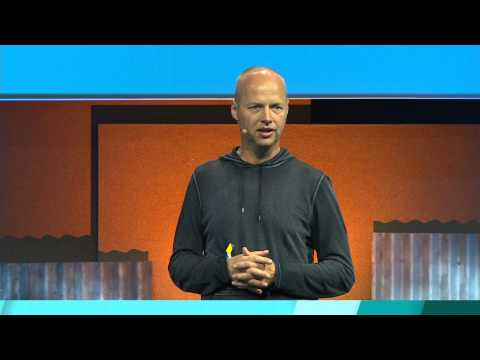

## Democratizing Education

** 视频发布时间**
 
> 2015年5月29日

** 视频介绍**

> In the next 10 years, the world's population will grow to 8 billion people of which the majority will be in developing regions. Traditional universities will not be able to keep up with this demand and employers will struggle to find the best talent. With a predicted 5 billion people online by 2025, online education could be the answer to giving billions of people access to affordable, lifelong learning. This session will highlight a new approach to education developed by Google and Udacity, share data on early field results and introduce new credentials that could change the way we view education in our lifetime.

** 视频推介语 **

>  暂无，待补充。

### 译者信息

| 翻译 | 润稿 | 终审 | 原始链接 | 中文字幕 |  翻译流水号  |  加入字幕组  |
| -- | -- | -- | -- | -- |  -- | -- | -- |
| 段威 | —— | —— | [ Youtube ]( https://www.youtube.com/watch?v=898S7o9UnPA )  |  [ Youtube ]( https://www.youtube.com/watch?v=kryWFBtFSkM ) | 1506120868 | [ 加入 GDG 字幕组 ]( http://beta.gfansub.com/join_translator )  |

### 解说词中文版：

很高兴今天下午

看到你们所有人

如果你认真看过高级副总裁Sundar的演讲

在他所有的发布中

有很小的一块

是关于教育的

Sundar宣布了一个我们称之为“微学位”

针对Android开发的在线教育项目

也意味着在座的每一个人

不论是否Android开发者

还是想成为Google的合作伙伴

现在都有机会向最顶尖的Android开发者

学习到是如何提升技术的

我们剪辑了一段视频

现在给大家看看

我之所以成为一名Android开发者

是因为其平台的庞大覆盖量

你用Android开发的东西

受众将会是全世界的用户

实际上  下一代的十亿新网民

联入互联网的第一次

都会是通过一台移动设备

既然有那么多的消费前沿科技的人们

那我觉得去做一个

科技的弄潮者就非常有意思

每个人都有独特的经验能力

并基于它们来找出

自己圈子里的难题

最后用科技来解决它

我一直觉得这里孕育着

巨大的机遇促使人们去

创造一些好东西

你能构思出一些还没有的东西

然后直接去把它们打造出来

在我看来没有什么比这更有成就感了

现在报名Udacity和Google的“微学位”项目

踏出成为一名Android开发者的第一步

这个项目第一位完成的人

也是最应该感谢的人

就坐在第一排

Peter  可以站起来下吗

这就是Peter Lubbers

组建了一支出色的谷歌团队给每个人

带来不止是知识和信息的全方位教育

并且还和我的创业公司Udacity

一起尝试变革教育

先让我们倒回去几年

给你们讲讲我们是怎么开始的

大约四年前  我忙于运作Google X实验室

研发自动驾驶汽车

能记录血糖水平的隐形眼镜

放飞在平流层的气球

与此同时有个演讲就在说这个Loon项目

还有其他诸如谷歌眼镜的事情

这时候听了Peter Norvig关于教育一个半小时的发言

让我想在斯坦福开设一个在线课程

我空闲的时间在斯坦福教书

是一门进阶的人工智能课程

和Sal Khan等一些我倾佩的人一起

我们决定把它开放给全世界

而不只是斯坦福的学生

我们基于以下几个原因

那时候  大学被大众炮轰

它们已经以平均7.5%的速度

连续30年涨了学费

国家正面临一张超过1兆亿的巨额账单

回流的投资似乎

也不会对大学教育有半点支持

也是Peter和我打算免费上线这门课的时候

竟然无意间触发了一项运动

它叫做大规模开放在线课堂  简称MOOC

很多其他公司都跟上来了

包括EdX，Coursera，iversity

尽管我们对如今上网能接触的

海量信息非常兴奋

对你们而言也一样

从图书馆延伸到Google

空间扩大了10万倍

甚至亿万倍

可是在教育上  却只有很少人

能接受到全球范围内最好的教育

长话短说  注册这门课的

学生数量非常惊人

短时间内攀升到16万人

最后2万3千人完成

这可是一门人工智能的本科课程

世上可没有这么多的人对AI这么感冒

我们有一支1950人的志愿译者队伍

将课程翻译成适用于195个国家的44种语言

使其成为大学历史上

有史以来最大的课程

并且  教出来的学生比我

50辈子在斯坦福里教的还要多

所有的花费  包括制作学习系统

录制所有的视频和训练

付给服务商的费用

折算下来是平均每名学生0.6美元

与此相比  斯坦福一年的学费是5万美元

更让我惊讶的是

线上学生和我在斯坦福学生的排名

大家知道  考入斯坦福的学生都经历了

激烈的筛选过程

为了入学  你必须极其聪明  正当年轻

有够格的SAT成绩  惊艳的履历

所有这些

即便如此  每年也只有小几千的孩子

得以入学  他们显然都是

这星球上最聪明的孩子

然而  当我们拿出相同的作业和测验时

排名前412的线上学生

和前200名的斯坦福学生

一起竞争的结果却是

斯坦福的学生都排在后面

课程慢慢进行下去  我想读给大家听

开始有学生像这样给我写信

我直接从第三段开始

“我正远程从阿富汗地区学习课程

而且经常网络不好

电力也不好

网络还会屏蔽YouTube

过去几天我都在纷飞的炮火和瓦砾之下

避开那些非法的哨站

从交火的区域撤出到中立的飞机场

直到它们慢慢平息

我只有一小时的网络良好时间

让我完成作业

还能得到一个还不错的分数

这就是我正常的一周生活“

这不是一个典型的斯坦福学生

这是一位勇敢的士兵

正在为退伍后的生活做准备

这位女士一周工作40小时还多

是两个孩子的单身妈妈

小的才七个月大

她没有丁点的空闲时间

完全是挤海绵来学习课程

来享受一点成就感

“在第五次作业要交的时候

一大波混乱的事情朝我袭来”

总而言之就是宝宝病了

还有些人无家可归

生活举步维艰

“我为什么讲了一大堆的私事

因为11月13号  我放弃了

我对自己说无论如何

我都不能继续学下去了

还花了那么多时间  把其他的事情

都抛在一边

然后周一早上我打开邮箱

看到你周六发给我的笔记

我傻傻地看了一会

叹了口气  告诉自己不能现在放弃

我做了期中测验  也完成了课程”

后来  她不知情  我把故事放进邮件里

发给了每个学生  接近4万人

然后收到了几乎所有的回复

没全部读完

但是仍然有那么一刻

我好好在斯坦福静下来想了想

我教了那么多条件好的孩子们

恰恰忽略了其他世界里

可能更加需要我的人们

像那个抚养孩子的单身妈妈

打算重入社会  她还不是个例

这里还有个让我感动到哭的视频

大家好

我叫Melody Bliss  

很早就在上斯坦福的人工智能入门课程

由Sebastian Thrun和Peter Norvig教授

来讲解

我还是一位身患隐疾的女性

每周要去做三次透析

即使如此  我还是在当地一家公司

做一名全职的系统工程师

正因为如此  我来上课时

就知道我能支配的时间少得可怜

这让我在课堂上很不安

只要一到那些日子

要去做透析等治疗

我甚至连看一小段视频都会很吃力

可是教授们展现出来的激情

自始至终都感染着鼓舞着我

让我也拿出同样的精神来

讲义测验可以帮我

明白什么是对的  吃透课件  

要是你觉得还没有完全领会

也可以回去复习

直到突然灵光一闪

我最喜欢这门课的地方

是它给了我一些新思路

可以用在正从事的工作中

做一些人工智能的实践

这是我参加过的最棒的课程

我会非常珍视

这段充实的学习时光

所以我推荐大家  如果正在考虑报名这门课

不要犹豫

它改变了我的生活  我相信也会改变

你们的

谢谢

我现在看还是很感动

已经看过很多遍了

从这件事开始我意识到

这里有个使命是

我们社会没有做好的

教育资源可不是均匀配置的

我们的教育体系不对

没能顾及到所有人

是时候我觉得做出点变化来了

于是我们创立了Udacity

源自英文单词“audacity”

只有一个目标就是让教育民主化

我们觉得如果你送人们一条鱼

他们只能做上一次的晚餐

但是如果你教会他们如何捕鱼

他们终生不再担心果腹

我们认为教育是最本真的东西

应该是被写入宪法的基本人权

解放现有教育的模式

谢谢

尝试全球化遇到的第一个问题就是

要思考传播的形式

线下的教室空间就那么大

所以我们要登陆Android移动端和网页端

因为时至今日

已有37亿的网民在线

我们要把重心放在国际学生的身上

我现在展示出这张图片

是因为Google已发起了一个项目

把6门其领衔的课程翻译成阿拉伯语

也在埃及落地了职业规划中心

还给那里的学生提供2000份的奖学金

我为什么对这个项目特别关心

是因为尤其在阿拉伯世界

那里的年轻人机会太少

由声誉好的Google牵头来进行艺术指导的话

我们可能就给年轻人提供了

一条成为西方社会创造者的途径

这样说不定会改变这片土地的

处境

援引我朋友Thomas Friedman的话

他是纽约时报的一名专栏作家

最近来我公司时说

如果有更好的教育

那么这些国家的人民

就更加没理由去参与恐怖主义

为了全球化  Google和Udacity

一起合作了很久

我们三年前就开始了

学生们可以注册课程

我们有一个“道具收费”的产品  容我稍后解释

已有90万的同学来注册学习

不是所有人都完成了

我们的标准课程包括

教大家HTML开发  游戏开发

Android端的应用开发等等

这才刚刚开始

加上昨天和今天的发布

我们新增了认证证书

还有我马上会

提到的“微学位”

接下来我们要做的是让课程变得有趣

对我来说  和500个其他学生坐在一起

看一位上了年纪的教授在讲台上

反复讲一成不变的内容一点都不有趣

上大学是为了那么多的乐趣

这显然不算其中一个

所以我们希望学习是趣味的

我们想利用互联网让它尽可能吸引人

我们意识到的一件事是

在线下的教室里

你不得不和所有人

在同一时间有同样的想法

也跟现在我和在座的大家的情况是一码事

而在线上的世界里

人们都有自己的学习节奏

这表示说你可以把教育做得

更有互动性

你可以给学生很长的时间

你可以把任务设置为一个视频游戏

这样做就是为了教出一些东西

下面我要展示一些同学的项目

总数很多很多

也都是非常有趣的项目

我挑出了图形课上的这两个

这两个学生之前没有过任何

图形化编程的经验

我们叫这个音乐轮盘

看看

这位学生第一次学习图形化的课程

就决定开发一个有趣的应用

他自然是一个音乐爱好者

我先选上我喜欢的作曲家

你们可以先猜猜

看着图形将会听到什么

这首来自Franz Liszt

第二个我拿出来的项目

学生之前也没学过图形化

加载要等一小会

还不够完善  可这是一个通过捕捉头部动作

来行进的城市驾驶项目

现在我坐在车内  一切正常的话

只要我激活了摄像头  然后左右摆动头部

这辆车会根据头部动作来移动

我玩不太好

这也是我研发自动驾驶汽车的原因之一

因为我是一个糟糕的司机

我惊喜地发现同学们都在

开发出这样让人惊艳的应用

啊噢

要撞了

让我们还是回到演讲

这让我们觉得做实际项目比讲课效果要好

你只要去尝试开发出一点东西就好

但是要让项目运行良好

能做出成品就需要反馈  我们需要帮手

于是我们开始招聘

招人很难

我们在Udacity招了很多的人

给所有的项目打分

这时候公司也上线了“微学位”

开始极其迅速地增长

粗略估计达到每周5%的速度

我们招人速度跟不上  项目质量也随之下滑

要像大学一样花了两周才评分完毕

自然收到学生的抱怨说

他们为两周的延迟还每月付费

我们是在占他们便宜

这促使我们仿照Uber创始人Travis的做法

像Airbnb等公司一样

以此来支撑公司的全球化

我们不仅要让学习民主化

还要让课程助教和代码评审也民主化

我们打造了一个全球化的代码评审系统

正在打造一个全球化的导师系统

全世界的人们现在

获取到这些项目就和Uber的司机们

拿到一个乘车请求一样方便

打分非常的快  马上就会反馈

给学生们

学生们再给打分的质量进行评估

以此我们再视打分者的工作情况

和工作量给予相应的报酬

我们两三个月前才刚刚上线

现在全球范围内大约已有

350个打分的评审

很赞是不是

他们多半一天完成项目的打分

很多甚至在一小时内

只要在GitHub上把你的代码提交给我们

在一小时内你就会收到

详尽的反馈

任何大学里的人都会很惊讶

觉得这怎么可能

这些人能挣钱

挣不少钱

有些人甚至比我都多

我们全球最好的代码评审

月收入超过11000美元

他在南非  把这个当成业余工作周末做

和我们一起要比

他的正式工作还要挣得多

我放上这张图表来对比

典型美国社会的补习班老师的薪水

真的少得可怜

全球化带来的收入提升的空间

真的相当可观

如果推倒大学的门槛

向全世界开放

就可以打造一个有益于学习者

和帮助他们学习的生态

我们还发现大学所没有的机会是

我们可以研究我们的学生

当我们发布一个新视频新测验

一般而言  我们有1000名的学生

我们能即时获取

这些人学习过程的数据

这只是一张表

图形化了学生的进度情况

横轴是时间  竖轴是进度

非常惊人

大部分大学生都是一条直线

因为被迫如此

你想学快一点还不行

很惊讶地看到有些学生不眠不休

来尽可能快地完成课程

还有个学生为我们写了篇博客

定义这种现象里

和我们一起学习的感觉叫“醉心学习”

我非常同意这种说法因为就该是这样的

第六步

对我而言意义非凡的一步

我们想把数据都关联起来

这也是我今天来的原因

和Peter的团队一起共事的缘由

像Android这样快速增长的生态

拥有超过10亿以上的用户

更应该注重

教育资料的时效性

这往往很难做到

要么就是拣重要的资源来讲

我敢说没人在此时此刻

能于这个国家里任何一所大学

或者世界的其他地方找到更好的课程

可能有极少数  而且总体来讲

学院派接纳新兴科技的态度

十分怠慢

而且在Facebook和Twitter等公司

你从大学毕业后

入职还要接受再培训

才能跟得上前沿技术

这不是大学里教得不好

只是东西不同

因为我们要做就做最前沿

这次发布会宣布的内容

已经是“微学位”里的新的一员

所以我们和Google

以及其他合作伙伴一同

为每个人带来了最顶尖的教育

当然最后还是要落脚在工作上

受教育后的一个核心产出

就是能被雇用

于是才有这个叫作“微学位”的新生物

之前没有过

没有认证

也没有证书

大学不会这么干

这要比大学学位小很多

幸好没有法律

禁止发明新学位

我们就这么去做了

上线了

总而言之  它们大概6个月长

也可以更快

原则上你一周就可以上完

也可以很慢

我们希望是能做到掌握

而不是大家走马观花

你要是一周花个十几小时

循序渐进地学习

大概半年完成  也可能要九个月

我们上线了iOS开发  前端开发

网页全栈开发  数据分析

昨天刚发布Android开发

同时正在准备Google领衔的

三个“微学位”项目

创业课程  云端开发  网页进阶开发

我尤其高兴的是创业课程的发布

因为科技界以外的人们

也可从中受益

全世界的人都可以

如果你有关注到在希腊和西班牙

年轻人的失业率已经超过50%

那如果我们引导他们来互联网创业

他们以后这辈子

可能就不愁生计了

我们有很多学成后找到工作的例子

右边的Kelly是一个Googler

曾经是一个商业分析师

现在是Google的全栈工程师

一直留在那里

中间的Vicky从一个商业分析实习生

变成一个数据工程师

一个高尔夫球手

用他自己的话来说是常常入不敷出

他成了一个全栈工程师

还有想重返职场的妈妈们

甚至有成为软件工程师的前海鲜经理

我一直相信这里孕育着远大的前景

教育刚出现的时候

人们觉得一生受一次教育足矣

而现在每个人的职业生涯千差万别

Google带给人们的是

从这里到那里  变换职业

当个高中教师  甚至进入Google工作

下面是我们的一些学生

嗨

我叫Dennis Shen

叫我Den就好

我的名字是Maarten

我的名字是Febria

大家好

我的名字是Evgenii

来自索契

我是Dan Stormont

我是Jessa

一个来自菲律宾的软件工程师

我的名字是Genhady

我27岁

我一直想有一个学位

可不能离开家

现行的教育制度

我觉得离衰亡不远了

我决定转行成为一个程序员

我都不记得在网上学习多久了

你重定义了我的可能性

我对短时间内能学到那么多东西

感到非常兴奋

写代码是我的菜

我非常享受

社区很赞

大家都互相帮助

提出问题

也回答问题

我总是能找到看待事物

不一样的角度

这是我村里的一个日常问题

我正尝试解决它

每天都发现新东西

生活在变化

到课程完结的时候  我可以自己

开发Android应用了

我认为未来的教育会是线上学习

我在创业公司任职Java工程师

我在我的大学组织Google开发者

和女性科技从业者的社区

你要么继续

循规蹈矩地工作

要么跟上社会的现代化

我热爱编程  开发过一些应用

我生活得很好  有个一岁的漂亮女儿

现在更加有动力

想让我的家人过上更好的生活

每一门课都在我的工作中应用到

让我更加靠近自己的创业梦

这就是我的故事

那他们花了多少钱学习呢

为了保持民主化教育

和让所有人都能受益到的初心

我们一开始让所有打造的内容

统统免费上线

就跟免费的电子书一样

我必须要赞扬Google

Sundar昨天在他的演讲里提到

将有400万美元的注资

来支持Android“微学位”

所包含的一切

课程  训练和项目等等  甚至更多

然而  作为一家创业公司

完完全全免费是不健康的

其实我们是“道具收费”的商业模式

我们的服务要付给全球代码评审的钱

当然都来自我们的学生

我们对需要反馈和认证的学生

每人每月收200美元的学费

钱也不少  但比起你在这个国家里

任何一所大学里要交的会少得多

这个月我们吹响号角更进一步

如果学生完成了课程

可以要求返还一半的学费

谢谢

谢谢

我们这么做是希望学生们

能一路学到底

可以激励每个学生说

挣回自己的钱

Udacity的奖学金由AT&T和Google等赞助

多达5000种给有需要的学生

还有之前我提到的

给埃及学生的2000份

全奖

借此机会希望更多的埃及学生来读课程

很多人不知道的是在埃及

学计算机的女性比例很高

这也是我们的目标之一

那就是给计算机科学领域带来多样化

而不仅仅只有男性  而且还是我这样的中年

谢谢

最后值得一提的是

Laszlo Bock和他在Google的团队

准备在11月办一场峰会

这才是项目背后

真正的重头戏

Android开发的“微学位”

可不是入门级的轻松课程

它是非常严格的训练

能够帮你达到Gogole雇佣

软件工程师的水准

并且前50名最优秀的学员

会被全程免费地邀请到11月的Google训练营

见到很多的Google员工  包括HR

和他们谈谈职业生涯

近距离感受Google

我觉得Laszlo和Peter值得

我们为他们喝彩

因为他们搭建的这个舞台

再一次给普通学生提供了机会

就像之前能击败斯坦福的学生一样

在开始问答环节之前

我想和大家分享一个视频

我们自己制作的  我看了很多遍

这是我们的一位教授

来自布朗大学和乔治亚理工的好同事

以这样一个你意想不到的方式

和你见面

我开始放啦

这也是Udacity课堂的一部分

这就是那位教授

你有一些数据

需要找到用来预测的规则

还要一个适用你情况的西塔值

这是贝尔曼的诅咒

辨识器需要去

好的

可以上网去观看

这堂课有两个老师

另一个人说他不能唱

我们让他干点别的

看一下

棘手的是

现在要找到一个正确的假设

你一旦掉以轻心

就会被困在欠拟合状态

就像经历恐怖电影一样  卡在了local minima

好的

提问吧

拿下话筒

请往前一点

谢谢

我不是要提问

我只是想感谢你

原来女孩也可以学好编程

因为七个月前

我还完全不懂编程

我现在的创业产品已经有12000的用户

同时也在一个社区

帮助7到11岁的女孩子学习编程

非常感谢你

谢谢你

也谢谢你

请造访我们

实话说你的情况正是

让我做现在的事情的动因之一

谢谢

我是一名数据工程师

基本是从自学开始

我丈夫任职的公司

愿意给我个机会

我心里也明白

这块领域值得耕耘  因为很少人专注于此

我想问是因为

我圈子里的不少女性总是问我

我是怎么进入数据开发领域的

要做哪些准备

那请问你们有没有计划

发布与此相关的课程

或者我先给你来提个醒

我们有一门MongDB相关的课程

几门和Cloudera公司合作的数据分析课程

还有一些是和Salsforce公司合作

还没有“微学位”

很希望能有一个

对于硅谷大部分公司

成熟且需求量大的技术

我们或多或少都会知道其重要性

对于这些请求  我们会考虑

也会来探讨下可行性

比如市场有多大

学生是哪些群体

然后再敲定一门课程

一定要是前沿尖端

我们当然会快马加鞭

继续围绕编程打造

更多的内容和“微学位”

我们非常乐意接受提议

我的邮箱是thrun@udacity.com和thrun@stanford.edu

给我发邮件  好吗

谢谢

你的项目已经很成熟

我很好奇  你有没有别的打算

鉴于大部分的课程都是科技相关

以后会不会有不完全是科学技术

的课程出来

是的

我们之所有专注于科技

是我们认为应该去挑选

被反正验证而不是没厘清的东西

科技同样是当前最缺少从业者的领域之一

考虑到目前我们

打造的创业课程“微学位”

我们其实已经往外延伸一点点了

但它仍然还是部分基于技术

因为一个创业者多半还是很熟悉

网站域名移动互联网什么的

尽管只是很粗浅地知道而已

只要公司继续发展下去

我们会看向相关的领域

哲学和艺术史我们可能

永远都不会去做

即便要做也会非常不一样

我要做的话也是要这样的程度

比如Facebook或者Google这样的科技公司

愿意雇佣人文课程的学生才行

因为我觉得科技领域

缺乏人文性的思考

目前的教育在我来看

一直是把它们分很开

归咎于雇主的需求在别处

Udacity要保证的是就业

我们希望学员找到工作

进而成为社会的一份子

谢谢

好的  那边的

嗨

你在科技领域是一个引领者

做的事情在过去几年大幅度的爆发

我所知道的很多人

在EdX  Coursera和Udacity上学习

并且很大程度上改变了他们的人生

你如何看待譬如

可汗学院这样的在线教育

它们的未来

现在的在线教育已经

有了不同的细分区域

那在未来它们会融合还是继续各自发展

又或者会出现新的情况

当前的在线教育

还在一场巨大的实验当中

真心地讲特别美妙

会成什么样还有待时间来验证

可以看到很多公司

着力于此  尝试去创新

寻找着正确的模式

对我不言自明的其一是  50年以后

教育会如Larry Page所说

发展成像刷个牙一样短时但重复的事情

其二  传统国民教育里

从孩童时期到受教育时期

再从工作时期到退休时期的形式会过时

我们会是终生学习者  以上的事情融合在一起

这也就意味着教育何时何地

都能进行  通过手机  手表或者其他设备

生活会异常忙碌

这也是我们这些公司

最近的状态

其三  教育会非常的开放

对每个人都民主化

我们再也不能将它封闭

我觉得这个国家

有那么好的教育

全世界最好的教育

却没人能学简直是犯罪

基本没有人能进来学

这样的教育能兴盛起来

是通过把学生进行分门别类的排他性

没有一点的包容性

所以我认为50年后的教育

会是一直伴随我们的东西

会更想去学点东西

多过无聊去看场电影

学习一门技艺来提升工作

让自己更聪明

至于到时候的具体情况谁知道呢

我是说我和我的公司在花时间

尝试以最大的努力去重定义一切

从基础的认证体系

到视频的质量再到学习的体验

比我们公司能脱颖而出

更大的意义在于只要有人

能打破现存的教育体系就够了

请说

有些统计显示这些

在线课程完成率很低

是这样吗

如果是  那“微学位”的情况

是不是会好点

对的

大规模在线课程经常

会被挑毛病的地方就是

其一般的完成率在2%和5%之间

我们的情况也一致

而对于付费的学生来言

他们的完成率会高点

因为成本高点

并且  我们发现提供了更完善的服务后

比如指导服务和反馈等

我们能再把完成率拉高一点

手头现在没有确切的数字

我自己的一门课

数字有点夸张

不适用于公司的情况

但我教了一门驱动自动驾驶汽车的课

作为一门有关机器人的开放MOOC

最后收获了2.3%的完成率

在Udacity有一门乔治亚理工的课程

是关于嵌入式的工程

让我们收获了90%多的完成率

我觉得我们通常的完成率在50%左右

原因有很多

其中之一就是

我们的“微学位”没有门槛

人们就是来看看

很多人可能就不适合

所选择的“微学位”

Android的“微学位”现在有了一点门槛

你先要进行一点自测

但总的来说  50%的完成率要远远好过3%

我们非常在意的一件事情是

每一个参入的人

一起把数字提高到100%

我们对教育的期望

不仅仅是学好课本的尖子生

还有落在后头的学生

所以去看看Udacity

你也许会报一门“微学位”的课程

然后给我们建议来让它变得更好

嗨

我是Rasha

我正在Udacity攻读前端的“微学位”

而且还在Udacity的竞赛中

赢得了一些赞助

说回来  我一直在跟进Udacity

只要上好了课程就可以

开发出一些有用的东西

这样到课程结束的时候

就自然很有成就感

我想问的是  既然你提到了和埃及的合作

为什么是那个国家

有没有其他本地化的计划

比如说  面向阿拉伯世界呢

对

埃及的热心人士完成了阿拉伯语的翻译

这样一来学生们即使英语不够好

也能有基本的体验

并且上完课程

Google把他们的课程

翻译成了10种语言

其他的课程也是1到10种语言不等

本地化显然是走向全球的重要一部分

在印度我们也做了很多工作

那里的学生已经开始大量使用英文

我们也有在中国开设办公室的计划

这个夏天能覆盖到中国的学生

我特别关心埃及

Google和埃及政府

关系不错

埃及政府非常想提升国民的水平

这些背景因素综合在了一起

但对我们而言作为平台

面向的范围远不止埃及

是面向整个非洲

和更多的人  所有人

更希望是能帮助到

那些没能有机会成为社会高效生产者

的人们

非常好

谢谢

感谢你的所作所为

我是加州理工州立大学的教授

我教计算机科学和Android开发

某种意义上  我就是你们要取代的人

不过没关系

我们还在招人

我们离你不远

我们薪水不错

你们可能付得更高

我对现在发生的事情很兴奋

对你所说的感同身受

对一个教授而言非常难

去跟上科技的发展

我不是总教Android开发

我教授很多门课

也许一年一学期才能教上一次

所以这也是一个挑战

你怎么看待对内容的整合

还是说这根本不算什么

我们是不是可以从不同的视角来完善

你会介意我把你的内容

用来充实我的课程吗  以及类似的事情

所有我们的内容

你想用多少就用多少

就算你要以此收费

也请自己收着

我真得很惊讶在San Luis Obisop

竟然还有Android课程

在全国都很少

能教授Android都值得赞誉

非常棒

为什么不简单是因为

大部分的教授终其一生

都在钻研自己的博士论文

包括我在斯坦福的情况

像Android发展这么神速的事物

一般都会被学院无视

这样一来  学生们毕业了

却缺乏他们应有的技能

比如能在入职Google的第一天

干点实事儿

事实上我们的内容早已经

被很多的大学和高中

广泛的采用

可汗学院也开设小学

我的儿子正在上  这所学校也用Udacity的课程

这些不到10岁的孩子们

让我完全想不到地学习Udacity的基因组学课程

我们的目标就是触及尽可能多的人群

乐于收到反馈

所以说  如果你的课堂用到

我们的内容  还觉得比较有用

请给我们反馈

给我们说说你们如何运用

造访我们

我们的目标是  好像没声音了

最后一个问题吧  照顾到

那边的那位

很有意思  我想问的恰恰是

大学的教授和管理者们

对在线课堂有什么反应

所以你可能回答了我的问题

那从你的角度  你的同事们

对此有何反应

他们是否觉得有必要

改变传统的大学教育

或者至少改变传授的内容

跟上最新的科技浪潮

如果你去那些传统学院里

找到教职工说

我们可以用0.6美元达到你们收5万学费的效果

那你这是在自讨没趣

你去Google一下大概一年半以前我的名字

那时候我们和当地的一所大学

旧金山州立学院一起想把学费

降到它今天10%的水平

会发现一些工会组织对我有意见

另外的话

有一天  我拿到一份纽约时报周末版

我甚至不用翻开第一页

在头版上  他们把我做的事定义为瞎扑腾

金融时报形容我们

没有在真正地做事

我觉得外界的反应其实很有趣

总是说要取代大学

可根本没有发生  是因为

我们之间的受众人群完全不同

我们的受众主要是年轻的

中年的和高龄的那些

不是上大学年纪的开发者

为什么会这样

是总会有旺盛的求知欲

一代人之前  雇佣都是终身制

而今天  一份工作平均持续4.6年

根据劳工部的数据来看

未来  可能会不到一年

Airbnb和Uber的特设员工

甚至还不到这么长

我认为现在的年轻人

非常清楚要能站领域的浪尖

才能让自己安心

而不满足于有了一个大学的学位

就一成不变了

也就是说我们和大学受众的交集

从这个层面上讲基本为零

这能平息一下争议

我们要覆盖的人群

是现有大学不会去覆盖的人群

现存的大学多半接受

17到24岁的人  而且教的很好

去大学读书没什么不好

去斯坦福又或者San Luis Obispo

的州立理工也没什么不好

我们要做的是接收

目前被教学体系

排挤在外的大量人群

很高兴分享  感谢大家

最后为Peter Lubbers喝下彩

请站起来下  感谢他和团队在Google

所做的工作

