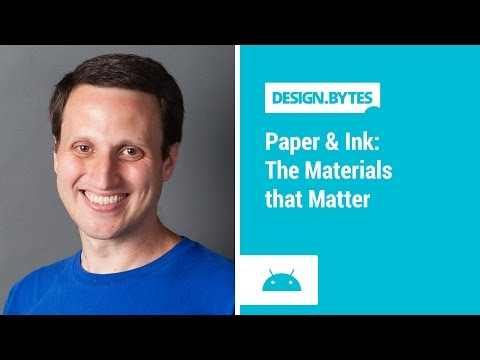

## DesignBytes: Paper and Ink: The Materials that Matter

 

** 视频发布时间**
 
> 2014年9月12日

** 视频介绍**

>  Join Rich Fulcher to learn about the materials of material design. See how virtual paper and ink form the foundation of your tactile user interface and master the rules that govern their behaviour.

** 视频推介语 **

>  暂无，待补充。

### 译者信息

| 翻译 | 润稿 | 终审 | 原始链接 | 中文字幕 |  翻译流水号  |  加入字幕组  |
| -- | -- | -- | -- | -- |  -- | -- | -- |
| 周亿 | -- | ——| [ Youtube ]( https://www.youtube.com/watch?v=YaG_ljfzeUw )  |  已发布  | 1505050793 | [ 加入 GDG 字幕组 ]( {{ book.host }}/join_translator )  |

### 解说词中文版：

嗨  我是Rich Fulcher

Google Android系统设计团队的设计师兼经理

今年的谷歌I/O大会上

我们向大家展现了Material Design

一种新的视觉语言  以排印  范围  颜色

以及位置来创造出一种大胆新奇的图形界面

个人来说  最让我激动得就是Material Design

是怎样给印刷设计分类并将其运用到生活中的

物质通过用户的手指或鼠标的点击触碰  吸收能量

并将力量转化成为有生命力的东西

今天  我就要讨论一下纸墨理论上的这些

虚拟物质是怎样在现实生活中战胜实体而大放异彩的

一款应用的每个像素就像一张纸上的一个油墨点

纸本身没有颜色  但油墨是有各种颜色的

油墨的颜才是可以让内容显示出来的原因

不管你应用的属性是一张图片

或者甚至是一个正在播放的视频

其展现出来的内容就是像

油墨颜色一样的多姿多彩纸张的宽度无限

高度无边  可以有X轴  Y轴

正因为如此  纸张可以满足任何播放需求

你看不到纸张的边缘线

不过它也有可能缩小成纽扣大小甚至

不会大于鼠标48个每英寸点数或标准的鼠标目标范围

然而  油墨没有任何类似于以上的限制

其大小任意  适用于任何纸张

你也可以实践一下  看看是不是酱紫

对于每英寸鼠标点数的厚度

纸张有一个固定的1 dpi绝对限制

相当于一张重35磅的纸  也就是一叠轻卡片的重量

当你增加油墨  不会改变那个厚度

它不像那种涂料  那种一层一层垒上去

厚度则会越来越大

这种纸本身永远只有1 dpi厚  不会变成0

它是一张全息图

而且  不是虚拟的而是物质的

对于系统来说  这种触感是非常重要的

就形状来说  希望纸张是一个圆角矩形

不管你说它是矩形

正方形或者是一个圆

它就是一个千真万确的圆角矩形

它不必是一个三角形

也不是一个类似星星的凹形

也不是应用图标那样的形状

不过我们也说了  既然油墨没有此类限制

它可以是任何形状  也可以按你意愿改变

以上说的都是些基本的原则

但是所有这些物质到底是怎么

在一个复杂的结构中存活并移动的呢

我们就需要来说一下关于深度的问题了

也就是涉及到Z轴的问题

每一个设备都有一个物理上的Z-深度

就拿一个手持设备来说事儿吧

Z-深度指的就是你手持设备的正反面之间的距离

由于深度控制着纸张的变化

所以纸张必须要配合设备深度而设置

它不愿意翻页  因为如果它想的话

纸张就要开始移动了

它就会狠狠地抵在设备前面的玻璃屏上

或者撞在后壳的金属盖上就是因为前后盖的位置

你不能执行这样的操作

因为这是为设备内部设计的

就在那些前回插槽中间

这就是为什么我们也不能将其翻页的原因

如果纸张有褶皱  也是因为其位置位于Z轴

现在纸张到用户手里的时候都已经是正方形了

就像我在摄像机前后移动一样

在用户眼里  纸张也是这样动的

现在两张纸稍微交叠的时候

纸张就会投出一个阴影  就像酱紫

前面那张的前面有一个迷糊的影子

后面也没有全部投影上去

所以后面那张纸就会有阴影

我们就像这样  将纸弄成正方形

我们要确定这个阴影不是像那种油墨画在纸张上的感觉

而是打印在纸上的感觉

它之所以这样  是因为物理上的关系

是因为系统给你的光照模型

我们有张立体的的纸

当用户拿到它  并触碰到它但永远不能穿过纸张按到它

就像是建立某种联系

但是我们现在确实有好几种方式能够回应用户的要求

一种就是在用户接近纸张的时候

纸则会主动地接触用户

所以就会有很多玻璃幻觉  你的指尖碰到玻璃

然后  纸张则会向前去触碰你的手指完成请求

你可以想象一下你的手指正在慢慢的向下碰到水的表面

你的手指离水面越来越近  近到可以看到手指的倒影

然后两个手指便碰到一起了

油墨的回应方式就像是水面的涟漪  当我触碰到水表面

手指一动  我顿时感觉到一圈一圈水波围绕了手指

我们在处理油墨时  就像是在与它做这种交流

而这种交流不仅仅是与纸张

而是与一些指尖碰触到的特殊的元素  油墨元素

现在运动的重点则全部放在了建立

与强调重要元素的可持续性上纸张

可以任意穿过X  Y  Z三轴间

我们沿着X轴移动

它便沿着Y轴运动  又或者是Z轴

现在物质能做的远远不止运动

这种神奇的经历来源于物质的可变形性

来源于它们不拘泥于枯燥物理定律的随性

所以纸张能够改变它在X和Y轴的尺寸

墨水是自由的  并非和纸一样有尺寸的限制

所以你可以像一张纸一样做一些改变

也可以像墨水一样不改变其尺寸

只是利用新的广阔空间进行回流

或者你可以像墨水一样以相同的速率扩散

或者  你使那保持纸张的尺寸不变

然后滴一滴墨水在上面观察它的扩散或缩小

它们都是完全不受约束的

如今纸张的宽和长改变成是可以改变成不同尺寸的

你没没必要把它们弄得对称  它们也可以不对称

而且当我们做一些转变时  那就变得非常重要

我们强烈推荐这样做

所以在这个例子中可以看出

看起来高的物体只是因为感觉被制作得高大了些

看起来宽的也是因为这样

而为什么不对称的物体这么重要呢

其实它可以让使用者明白改变尺寸和

保持尺寸不变是不同的

况且还有Z轴的变化

如果我改变Z轴的尺寸  随着长度以相同速度增长

就会成为一种对称的规模

将X和Y轴改变成不对称的尺寸  我们要让用户知道

如果想使得纸张对称的话

就得相应地改变Z轴上的尺寸是可以的

这种变化就像它们收到了不同的信号而做出的改变

纸张可以在形状之间做一些改变

就像我们之前谈论过的可以增长或缩短的圆角矩形

也和一些X突变纸一样有类似的特点

纸张可以撕开也可以重拼起来

那些材料可以粘合在一起

可以再生  也可以重新连接

是造纸还是毁纸在于你是让它如何运动的

纸张以完全不同的方式进入或退出

他们之间是各自独立的

目前有三种情况

第一种情况是在适当的地方创建或者销毁一张纸

第二种情况是纸张以一种方式进入  以另一种方式退出

第三种情况是将纸张复印成另一张

那么就会有一张复印的纸

另一张被复印出来的纸与原来的纸缝合就变成一张纸了

那么纸张之间又是如何粘合在一起的呢

有两种方法可以做到

第一种是缝合线

当两张纸被制造成有相同的边距时就可以用缝合线

他们必须有共同的一条边

而当纸张用缝合线粘合时  它们是同时发生移动的

它们相连在一起  所以它们可以成为一体来共同移动

另一种是阶梯状

当两张纸有不同的Z轴时

重叠的部分正是我们谈论过的阴影

那么我们就可以制造出一个阶梯的形状

而这两张纸之间却没有任何联系的

所以它们可以独立地移动

我们通常所见的阶梯就是工具栏

工具栏底下有一张更大的纸张是可以滑动的

这些是纸张的一些变体

你可以用这工具开始  其它的纸用缝合线粘合在一起

在Z轴上就出现一个阶梯状  因为它需要向下移动

所以它就可以构成一个空间

或者你可以把顺序颠倒  它可以先在Z轴上向后弯曲

然后其它的纸张再折叠上来覆盖它

或最后你可以把它们用缝合线粘合起来

另一张纸可以先折叠成阶梯状

然后再撕掉  就会出现另一张纸

当一张纸处于工具栏上方时

那么你就不能用使用以上的任何操作

工具栏可能包含于一张纸中

你得先确定这些方法操作是作用于哪一个上

最后谈到工具栏  就像任何的一张纸一样

它们可以改变尺寸

它们刚开始可能很长  如果把它们卷起来得话

它们就会变短  反之  你可以将卷起来的重新打开

那样它们就会由短变长

你需要记住的是最好是让工具栏在卷起来与

舒展开的两个位置之间伸展自如

为了不让它在中间卡住

你得确定将它折叠成面积小的一边或者另一边面积稍大

在纸张中另外的签名元素是浮动操作按钮

我们把它称为FAB法则

如果相关纸张的内容之间有一条缝合线

那么FAB法则跨越那条缝然后将它们粘合在一起

如果相关纸张之间是用阶梯状连接起来的

那么就会有一边向Z轴改变

现在  你没必要介入FAB法则  那只是一个跨点

而不是一条缝合线或者阶梯状

它有可能只在一张纸出现  恰当地躲藏在一个角落里

也有可能在纸张的任何地方出现

为了使得FAB法则出现而

人为地创造一条缝合线或者阶梯状

这种错误的方式是需要避免的

那些缝合线与阶梯状应与那些

纸质材料在结构上存在着一定的内部联系

更不用说一个装饰用的点

如果你想了解更多信的息  你可以先看看我们的指南

如果你点击链接www.google.com/design

或specifically/spec

你会看到关于Material Design的指南

而且你也会理解纸张到底是如何设计的

还有大量的信息等着您去下载观看

比如  粘合标签纸  模板

图标  还有如何设置字体等等

感谢收看

希望您在Material Design方面找到许多乐趣

