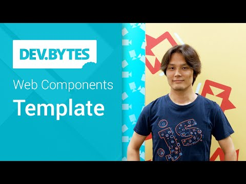

## DevBytes: Web Components - Template

** 视频发布时间**
 
> 2014年10月2日

** 视频介绍**

> Web Components are a set of technologies that changes the way you develop web apps entirely. By making components scoped and reusable in standardized way, your web development will step up to the next level. In this video, you will learn how to work with Template.

** 视频推介语 **

>  暂无，待补充。

### 译者信息

| 翻译 | 润稿 | 终审 | 原始链接 | 中文字幕 |  翻译流水号  |  加入字幕组  |
| -- | -- | -- | -- | -- |  -- | -- | -- |
| 隆斯朝 | Alice | —— | [ Youtube ]( https://www.youtube.com/watch?v=qC5xK6H0GlQ )  |  [ Youtube ]( https://www.youtube.com/watch?v=qC5xK6H0GlQ ) | 1505040789 | [ 加入 GDG 字幕组 ]( http://www.gfansub.com/join_translator )  |

### 解说词中文版：

EIJI KITAMURA: 使用

可重用的 Web 组件 可以使您建立一个很棒的网站

但是怎样构建一个 web 组件呢

我是 Eiji 我现在将

给你介绍模板元素

模板化的想法并不是一件新事物

从服务器端开始

模板就已是一种广泛使用的技术 用于在HTML内分配变量

设置条件和定义重复内容

在浏览器方面 各种库类使用JavaScript

也做了类似的尝试

比如 Handlebars.js，Underscore.js，AngularJS 等等很多

他们都很好  但是

这些库所采取的办法可能有缺陷

在这个示例中  该模板实际上

是一个div标签 隐藏在了 CSS中

这种方法的一个缺点是

浏览器会在这些资源还没有被使用的时候

就从模板的里面获取资源 

比如这个图形元素

这是在浪费资源和性能

另一种方法是用Script标签

存储模板内容

这种方法的缺点是这个模板

将被通过内部 HTML 转换为 DOM 元素

如果不进行充分的检查

它可能会引入跨站点脚本漏洞

模板元素可以解决这些问题

模板允许您声明解析为 HTML 的片段

但不会在运行时被使用

只有当你需要使用它们的时候才会被实例化

模板元素本身不会呈现自己的内容

不会获取任何资源 比如脚本  样式或图像资源

也不会解释其内部的脚本

当前模板元素

已经被 Chrome  Firefox 和 Opera 浏览器所支持

预计Safari 会在第8版上支持模板元素

但你们也知道事情变化很快

所以请关注 chromestatus.com

要检测模板标签的可用性

看一下在窗口对象中是否有HTML模板元素

对于不支持的浏览器  您可以使用 platform.js

它是网页元素填充物的集合

是填充物库（polyfills library）的一部分

它将自动检测模板元素的可用性

并在需要时使用它

向 HTML 中添加您自己的模板真的非常简单

只需要用模板标签把模板标记包起来即可

这将使您的标记无效

因此，如果将不再呈现在页上直到你阻止它

您需要编写一些 JavaScript 来阻止模板

通过使用 document.importNode

可以创建一个模板内容的副本

注意设置第二个参数为真使它进行深拷贝

一旦你创建好了副本

您可以在任何地方添加它

在继续之前你应该注意到

模板本身是标记的一个容器

你可能希望有一些像占位符  重复语句或条件语句的东西

但他们不是标准模板元素的一部分

如果你想要使用这些高级的功能

我建议您使用 web 组件框架

比如 Polymer 或 X-Tag

所以  这就是模板元素

想要学习模板元素的更多细节

请阅读 Eric Bidelman 写的 HTML5 Rocks

感谢观看

下集再见

