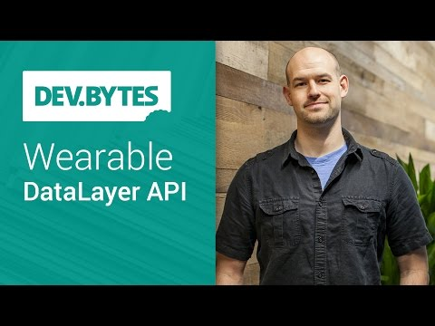

## DevBytes: Wearable DataLayer API

** 视频发布时间**
 
> 2014年9月30日

** 视频介绍**

> Wearables are here, and extending your user experience to wear devices is the first step in your wearable strategy. The new DataLayer Apis for Android make it quick and easy to sync events, data, and images between your handheld and wearable device.

** 视频推介语 **

>  暂无，待补充。

### 译者信息

| 翻译 | 润稿 | 终审 | 原始链接 | 中文字幕 |  翻译流水号  |  加入字幕组  |
| -- | -- | -- | -- | -- |  -- | -- | -- |
| Martin | 伍文其 | —— | [ Youtube ]( https://www.youtube.com/watch?v=2zReOOEUP18 )  |  [ Youtube ]( https://www.youtube.com/watch?v=2zReOOEUP18 ) | 1505050792 | [ 加入 GDG 字幕组 ]( http://www.gfansub.com/join_translator )  |

### 解说词中文版：

COLT MCANLIS: 随着外界的大量手持设备

现在是最好的时机来扩展你的用户

手持体验到穿戴设备上了

我是Colt McAnlis

手持设备和穿戴设备交流的第一步

始于可穿戴数据层 API

它的核心是  数据层API允许你的手持设备

和穿戴设备在任何时间自动同步

当数据发送变化

很酷的是  所有繁重的任务

像蓝牙协议和数据传输

都会在其之下处理

解放你并可以去处理更重要的事

这个过程的工作原理是允许设备

担当数据发送者  数据接收者  或者两者都是

发送方设备创建一块被同步的数据

一旦数据发生改变就会被发送到接收方

接收方设备  相反的  监听数据更改

提供一个回调函数来提醒APP

当某些东西更新的时候

核心对象在设备间传送

被称为DataItem 

提供了在设备上高效的数据存储

能够在手持设备和穿戴设备间自动同步

在基础上  DataItem由一个负载对象组成

它将持有真实的数据  而路径对象则是为

DataItem扮演唯一的标识字符串

这对数据接收方很重要

为了知道某些特定的数据块是否真正被更新了

DataItem对于在手持设备和穿戴设备之间

来回发送小批量的数据很有优势

举个例子  用穿戴设备传感器

来收集心率信息然后通过用户的

手机发送  这将会与过去14周的

传感器数据交叉引用

然后提供结果图到手表上来显示

作为当前的限制  DataItem对象的负载

是设计于处理小量数据的  大概100K左右吧

如果你想让这些更强大

你需要一个asset对象附加到DataItem上

这允许你通过蓝牙传输发送大块的

二进制数据  像图片

举个例子  假如手持设备APP

下载了一张图片  调整了大小并把它发送到

穿戴设备来显示

手持设备在过程中处理了所有繁重的工作

然后穿戴设备用来显示工作的简单结果

关于asset对象酷的地方在于他们处理了数据的缓存

以防止数据重传和节省蓝牙带宽

意思是这里只能有一个asset对象的实例被缓存

如果你尝试多次发送它

它将不会浪费带宽和电源

简单地说  数据层 API

同时提供了信息 API

这是用于做普通任务的API  像告诉你的穿戴设备

开启一个Activity  或者是告诉手机

切歌

默认地  这些消息通常是

远程过程调用的性质

也就是说  一旦它们被发送

消息是否被收到将无从考证

如果你想要发送一些更复杂的东西  你可以设置这些消息

工作在  请求/回应  模型里

连接的一方将发送

一条消息到另一个设备  其中  反过来  接收方将做一些工作

然后进行响应  反过来  和这些响应

最酷的用例是你将要看到的

为了开始  请翻阅API页面

这里将包含所有你需要开始同步设备的信息

同时别忘记查看Android Developer主页

以获得更多有用的建议和技巧

拥有这个更强大的数据 API

你将有新的机会使你的设备能够

用新的  有趣的方式在一起工作

我的名字是Colt McAnlis

现在  去创建更好的APP吧

