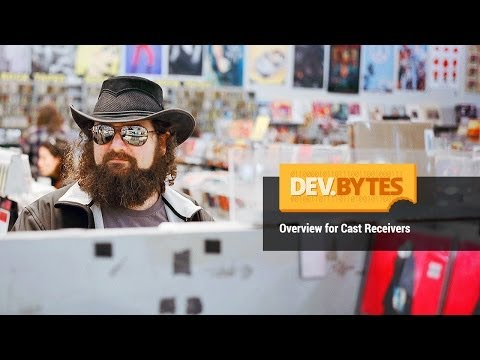

## DevBytes: Overview for Google Cast Receivers

** 视频发布时间**
 
> 2014年2月5日

** 视频介绍**

> Learn about Cast Receiver application development. This video provides an overview of how Cast Receiver applications work and how to begin developing Cast applications.

** 视频推介语 **

>  暂无，待补充。

### 译者信息

| 翻译 | 润稿 | 终审 | 原始链接 | 中文字幕 |  翻译流水号  |  加入字幕组  |
| -- | -- | -- | -- | -- |  -- | -- | -- |
| Wallace4ever | Martin | —— | [ Youtube ]( https://www.youtube.com/watch?v=clhnfUMuhN8 )  |  [ Youtube ]( https://www.youtube.com/watch?v=hN0aH_1leAM ) | 1504180664 | [ 加入 GDG 字幕组 ]( {{ book.host }}/join_translator )  |

### 解说词中文版：

嗨

我的名字叫Krispy

我是一个提倡铸造开发团队的关系的开发人员

在这个DevBytes视频中我将讨论

关于Google Cast电视棒的内容和

开发内容如何与接收设备协同工作

对于这个视频  我假设你已经

熟悉了开发人员控制台

如果没有的话  请查看开发人员控制台文档

现在  让我们看看什么是接收方应用程序

接收应用程序只是个单页的HTML5应用程序

它从一个网络URL加载

并在一个特殊版本的Chrome浏览器上运行

接收方应用程序运行在接收方设备上

例如Chrome Cast电视棒

如Button  links和alert这样的元素

由于没有鼠标或键盘设备可用

就将被禁用

所有与接收方应用程序关联的交互行为

都通过发送方应用产生的消息

为了说明这个交互模型

让我们看看一个接收方应用程序是如何启动的

情况是这样的

当一个发送方运行的应用程序

在发送方设备如手机  平板电脑或电脑上运行时

它告诉一个接收方设备  它需要启动一个应用程序

要启动的应用程序是什么取决于

当请求使用接收方设备时发送方提供的应用程序ID

接收方设备将查找使用谷歌服务并且

加载相应的接收方应用程序ID

的应用程序

一旦接收方应用程序被加载

它可以从已连接的发送程序中开始

处理信息

作为一名开发人员  您可以选择

涉及到接收方应用程序发起的一个发送者的类型

一个应用程序ID是一个你在Cast开发者控制台上

注册的接收程序的

惟一的ID

你可以在cast.google.com/publish上注册一个应用程序ID

这里有三种类型的接收方应用程序

其中两者需要使用开发者控制台

来注册 剩下的一个则不需要

不需要的那个被称为Default Media Receiver

它做的只是播放简单的媒体

没有样式  没有自定义界面  而且没有应用程序ID

没有办法改变它的行为

Styled Media Receiver应用程序

则需要注册并允许一些自定义

这是为了简单的媒体播放

比前者多了一些功能

Custom Receivers是一种

需要注册的并且为了高级媒体播放器或者

像游戏这样的其它形式的TV应用而开发的应用

一个Styled Media Receiver允许发送方的应用程序

在Cast设备上播放媒体而不需要

创建您自己的自定义接收方应用程序

您可以自定义Styled Media Receiver的颜色

通过在注册过程中提供自己的CSS来进行计划和品牌推广

Styled Media Receiver是一个伟大的方式

来开始构建Google Cast应用

使用Styled Media Receiver意味着

开发人员可以集中精力于发送方应用

间的交互而不需要构建一个定制的接收器

创建一个Styled Media Receiver

与通过Cast开发者控制台注册一个应

用程序ID一样容易

Styled Media Receiver是应用

不需要利用高级媒体功能时最好的选择

例如自适应流媒体播放功能 DRM 还有

内嵌字幕或者身份验证等功能

Custom Receiver应用程序是

如果你想要去控制

您的应用程序的行为的各个方面时的最好选择

使用Custom Receivers  你可以支持协议的名称空间

而不仅仅是媒体  并且你可以为用户构建丰富的体验

你对演示以及交互等等有着完全的控制权

使用GoogleCast接收器SDK

您可以构建一个HTML5应用程序

将各种发生在Cast接收信息系统内的活动接在一起

并且在简单的媒体播放之上

构建复杂的行为

Cast Receiver API为开发人员提供

建立针对电视空间丰富的应用程序的方法

你可以利用媒体播放器的库来

建立使用自适应流媒体的应用程序

就像HLS  MPEG DASH  smooth streaming等等

他们还可以处理身份验证问题并使用DRM

为了在开发时加载接收方应用到

Cast设备上  注册你希望在Cast

开发人员控制台使用的接收方设备

对于一个未发布的接收方应用程序

只有注册的设备才

能够装载接收方应用程序

而且 在开发过程中 接收方设备

需要公开其序列号

可以使用Chrome Cast设置应用程序来启用这项功能

只需在检查更新时

简单地选择设备并启用发送序列号

当你发布你的应用程序时

任何接收设备都可以加载应用程序

现在我已经介绍了一些基本的为开发做准备的设置

让我们来看一些代码

在几行代码中  一个非常基本的自定义接收应用

可以被构建起来以播放简单的媒体

首先我们加载接收器的API

然后我们确保我们有一个视频元素以及一些媒体元素

以用于回放视频  音乐  等等

一旦窗口已经开始载入  它就会确定媒体元素

并创建一个媒体处理器以处理与发送方的

通讯和各种媒体事件

然后获取接收处理器的一个实例

该实例负责与Google Cast系统间的通讯

并命令系统启动  这让接收器知道

应用程序已被加载并已准备好处理发送消息

在这里  您可以建立额外的应用程序逻辑

如果你这么做了  你可能想知道如何调试接收器的代码

值得庆幸的是  调试接收器的应用程序是非常简单的

您可以连接到设备调试器

只需通过打开电脑上的Chrome内注册过的接收器

并前往在端口9222上的接收机设备的IP地址

你可以使用Chrome设置应用程序得到

接收器上的IP地址

调试器具备完整的DOM操作和JavaScript控制台支持

要在会话之间保持日志  请点击在右下角的齿轮图标

并勾选旁边的复选框  即

在导航时保存日志

我们很兴奋地看到你用Google Cast开发的程序

为了能让你继续下去  我们提供了大量的资源

你会发现更多的关于谷歌SDK的细节

请访问developers.google.com/cast

设计检查表将在很长的一段时间内指导你

创建很棒的第二屏幕应用程序

你可以找到发送方示例和接收应用程序示例

在github.com/googlecast.

把你的问题用Stack Overflow上传并用Google-cast标记

在未来的DevBytes的节目中  我们将更深入

了解每个平台准备的发送方SDK和接收方SDK

在Google +上加入谷歌开发者社区  你可以得到

专业指导并分享你的经验

现在是由你去创造很棒的Google Cast应用

的最佳时机了

祝使用愉快

