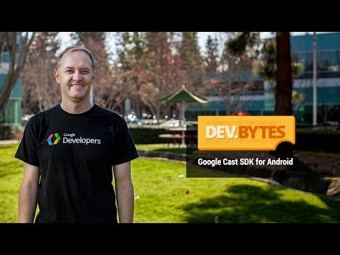

## DevBytes: Google Cast SDK for Android

** 视频发布时间**
 
> 2014年2月13日

** 视频介绍**

> Learn how to cast content from Android apps to Google Cast receiver devices such as Chromecast. This video gives an introduction on how to build Google Cast sender applications for Android using the Google Cast SDK.

** 视频推介语 **

>  暂无，待补充。

### 译者信息

| 翻译 | 润稿 | 终审 | 原始链接 | 中文字幕 |  翻译流水号  |  加入字幕组  |
| -- | -- | -- | -- | -- |  -- | -- | -- |
| xin.zhang | 葛佳恒 | —— | [ Youtube ]( https://www.youtube.com/watch?v=qEeNwIoXkhM )  |  [ Youtube ]( https://www.youtube.com/watch?v=k-RMmgbgxXc ) | 1504180666 | [ 加入 GDG 字幕组 ]( {{ book.host }}/join_translator )  |

### 解说词中文版：

大家好  我是Leon Nicholls

我是Google Cast的一名开发大使

我将会告诉你关于Google Cast SDK for Android的一些信息

Google Cast SDK支持Android iOS

以及桌面版的Chrome平台

针对这些平台开发的应用程序都能

与任何Google Cast设备进行交互  比如Chromecast

Google Cast sender端

是指运行在移动设备或笔记本上的应用程序

receiver端是指一个HTML应用程序

它运行在Chromecast或其他Google Case receiver设备上

Google Case SDK的发行版

是为Cast应用程序的开发者们提供的公共API

从现在开始  开发者们通过使用

新的Google Cast SDK开发者控制台

来控制Cast应用程序的发布流程

Google Cast SDK现在是Android的Google Play服务的一部分

并且将在所有的Cast应用程序之间共享

让我们来看看一个Cast sender应用的典型生命周期

当sender程序启动后  Cast设备

需要在本地网络被发现

一旦用户选择了一个设备  sender程序

将会连接这个设备并启动receiver程序

然后sender程序创建一个消息通道

到receiver程序  以用来发送和接收消息

用户也可以从这些设备上断开连接

使应用程序支持Cast的第一步操作是添加一个Cast按钮

有三个选择  MediaRouter ActionBar提供者（MediaRouteActionProvider）

MediaRouter按钮（MediaRouteButton）  或自定义按钮

我们建议使用提供者因为它是最简单的集成

Cast按钮需要添加到ActionBar的菜单中

或者是activity布局资源文件中

创建一个MeidaRouter选择器的优点是

它会下拉显示

仅仅可以运行你的应用的Cast设备

选择器是当这个activity启动时附加到Cast按钮上的

这里有个例子展示了

在ActionBar上添加一个Cast按钮是多么的简单

只需在你的菜单XML文件中使用MediaRouter ActionBar提供者

就可以了

其他的集成Cast按钮的方式

可以在MediaRouter支持库的文档中找到

在activity启动时  sender程序需要

通过添加一个回调函数来告诉MediaRouter

开始搜索Cast设备

当用户从Cast菜单选择了一个设备时

MediaRouter会通知到应用

告诉大家一条最佳实践  当不再需要搜索设备的时候

移除回调函数  以节约电池的使用

这里有个例子是关于如何为MediaRouter添加一个回调函数

以启动设备搜索的

用户选择的设备是从回调数据中提取的

现在sender程序知道用户选择了哪个Cast设备

启动receiver程序涉及到几个步骤

sender程序需要使用GoogleAPIClient

连接到Google Play服务

之后程序使用Cast.CastAPI

启动receiver程序  其中会使用到从开发者控制台中

获得的应用程序ID

一旦这个receiver程序启动后

sender程序就可以对receiver创建一个多媒体消息管道或

自定义消息管道

应用需要处理多个关于

应用和管道的状态的回调函数

这里有个例子是关于当sender程序已经连接到

Google Play服务后是如何启动receiver程序的

结果回调函数需要以启动状态和

应用程序元数据作为参数进行调用

注意在Cast应用程序的整个生命周期

都使用相同的异步调用模型

为了在receiver端播放媒体  sender程序

需要创建一个具有媒体流数据URL的MediaInfo实例

然后RemoteMediaPlayer

被用来在receiver端加载这些媒体流数据

之后sender程序使用RemoteMediaPlayer

接受诸如播放和暂停等命令

sender程序需要在播放时

处理关于媒体状态的回调函数

最后  让我们看一个例子

关于如何为视频流创建一个MediaInfo实例

视频流在receiver端使用

RemoteMediaPlayer实例来加载

结果回调方法是通过load()方法的返回状态来调用的

你可以在developers.google.com/cast

获取关于Google Cast SDK的更多详细信息

同样重要的是要看一下Cast Design Checklist

这里有一些应用的设计原则

我们也开源了一些示例Cast应用程序

你可以用来作为参考

如果你有任何关于开发的问题  请在StackOverflow上贴出来吧

欢迎在Google+上加入我们的Google Cast开发者社区

