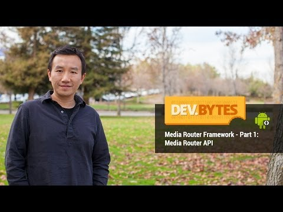

## DevBytes: Media Router Framework - Part 1 - Media Router API

** 视频发布时间**
 
> 2014年2月18日

** 视频介绍**

> In Part 2, we'll cover how media consumption device manufacturers can enable media route support on Android. Stay tuned.

** 视频推介语 **

>  暂无，待补充。

### 译者信息

| 翻译 | 润稿 | 终审 | 原始链接 | 中文字幕 |  翻译流水号  |  加入字幕组  |
| -- | -- | -- | -- | -- |  -- | -- | -- |
| 任皓 | Uucky | -- | [ Youtube ]( https://www.youtube.com/watch?v=_NGB10uN6OI )  |  [ Youtube ]( https://www.youtube.com/watch?v=RlcOeIgk0G0 ) | 1504180667 | [ 加入 GDG 字幕组 ]( http://www.gfansub.com/join_translator )  |

### 解说词中文版：

大家好  我叫Fred Chung  Google开发者的授课老师

这是DevByte系列两集中的第一集

来介绍支持库中的Android媒体路由框架

如今  在平板和智能手机上享受视频和音乐已经非常普遍了

如今 在平板和智能手机上播放视频和音乐已经非常普遍了

例如 在家里

可能你会用一些外置音箱

或者支持Wi-Fi的显示器  来欣赏你个人媒体库里的内容

Android为应用（app）提供了一个灵活的媒体路由框架

使它们能够在外置播放设备上投送（cast）媒体内容

在本节内容  我们将会讨论媒体路由

这是应用的媒体层

用来把媒体内容投送到支持的设备上

这种投到设备上的路径叫做媒体路由

在上层  媒体路由提供了很多API

用来生成投送按钮、发现和选择媒体路由

用来生成投送按钮、发现和选择媒体路由

[?预读?]路由的能力 以及

基于 Intent 的协议控制的远程播放

在下一段中  我们会讨论媒体路由提供者

在下一段中  我们会讨论媒体路由提供者

那是个封装了Android和外加媒体设备间的底层通信的组件  

那是个封装了Android和外加媒体设备间的底层通信的组件

设备厂家可以实现他们自己的MRP（媒体路由提供者）

使其在Android上作为媒体路由

例如Chromecast (谷歌电视棒)就在Google Cast SDK中

实现了一个媒体路由提供者让应用程序使用

使用这种架构  程序基本上

和媒体路由的底层传输功能解耦了

使用这种架构  程序基本上和媒体路由的底层传输功能解耦了

现在我们来看一些实现细节

但是在开始之前  我想说明的是

我们现在所说的媒体路由框架位于支持类库中

那就意味着它兼容Android 2.1及以上系统

那就意味着它兼容Android 2.1及以上系统

同时不要把媒体路由框架和在Android框架中的媒体路由搞混了

同时不要把媒体路由框架和在Android框架中的媒体路由搞混了

初始化媒体路由时

用户会点击投送（Cast）按钮

一般显示在ActionBar上

通过按钮  用户可以选择一个播放器  断开连接  控制远程播放等

通过按钮  用户可以选择一个播放器  断开连接  控制远程播放等

通过按钮  用户可以选择一个播放器  断开连接  控制远程播放等

在ActionBar中添加Cast按钮可以通过

添加动作提供者手动项  它指向媒体路由动作提供者类

添加动作提供者手动项  它指向媒体路由动作提供者类

然后  在菜单初始化的代码中

把动作提供者菜单项  关联到一个媒体路由选择器对象上

把动作提供者菜单项  关联到一个媒体路由选择器对象上

路由选择器本质上是一个筛选媒体路由的Filter（筛选器）

应用程序能指定媒体路由的类别

然后自动选择可用的播放器

这个框架利用选择器  可以只给用户展示合适的播放途径

这个框架利用选择器  可以只给用户展示合适的播放途径

例如  如果一个应用请求视频流功能

系统就不会给用户提供音频媒体路由

有很多预定义的类别

包括远程控制、音频流和视频流

当然  定制的类型也能被MRP定义

现在我们来看下媒体路由对象的初始化

该对象维护了媒体路由的整个状态

当你引用了一个单个媒体路由对象时

你要注册媒体路由回调  它会提供媒体路由变化的事件

你要注册媒体路由回调  它会提供媒体路由变化的事件

例如路由选择  自定义  调节音量

你可以通过API指南了解更多细节

这段代码中  特定的回调标志

会使系统立刻搜索可用的媒体路由

时刻记着  路由搜索可能包含网络调用

因此当应用搜索完路由之后  一定别忘了删除回调

因此当应用搜索完路由之后  一定别忘了删除回调

因此当应用搜索完路由之后  别忘了删除回调

还有一点需要注意  如果你使用Fragment的话

用Media Route Discovery也可以

Fragment为回调注册给出了同样的钩子（hook）

一旦用户选了一个媒体播放器

应用可以在终端上远程控制播放

指令都是异步的

所以要考虑到媒体终端可能是远程的

媒体路由框架定义了

基于intent协议实现的基础播放控制

例如播放  暂停  或者跳至

你可以在媒体控制的Intent类中  找到想要的动作和附加参数的定义

你可以在媒体控制的Intent类中  找到想要的动作和附加参数的定义

这段代码展示了基础的远程播放指令  首先  他用类别值里

这段代码展示了基础的远程播放指令  首先  他用类别值里

合适的动作构造了一个Intent和媒体的 [URI]

合适的动作构造了一个Intent和媒体的 [URI]

然后检查选择的路由是否能处理那个请求

最后启动Intent

通过异步回调  框架会反馈出结果

通过异步回调  框架会反馈出结果

还有一个很好的实践

不过不在这段代码里

那就是  如果远程播放不可用

你的程序应该切换回本地播放

好  今天我们主要从应用程序投送（cast）的角度

介绍了媒体路由的概况

大家有空可以看看这方面的文档和例子

也可以持续关注媒体路由提供者方面的视频

感谢大家观看 祝各位投的开心