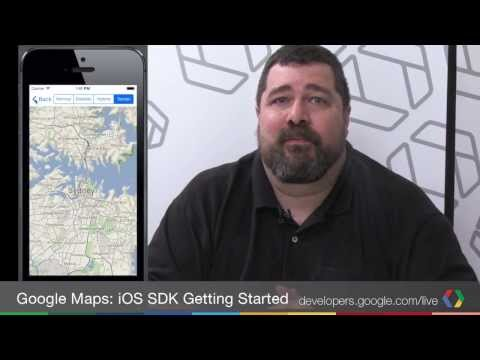

## Getting started with the Google Maps SDK for iOS, Part 1

** 视频发布时间**
 
> 2013年9月30日

** 视频介绍**

> This is the first in a three part series that walks you through getting set-up on the Google Maps SDKforiOS(http://goo.gl/8n3lV). The series covers:1) Setting up your development environment2) Getting and testing an API key3) Creating your first application

** 视频推介语 **

>  暂无，待补充。

### 译者信息

| 翻译 | 润稿 | 终审 | 原始链接 | 中文字幕 |  翻译流水号  |  加入字幕组  |
| -- | -- | -- | -- | -- |  -- | -- | -- |
| wang7x | 虞高 | —— | [ Youtube ]( https://www.youtube.com/watch?v=1oKxLHRY9uU )  |  [ Youtube ]( https://www.youtube.com/watch?v=XTfq9517nIY ) | 1504270757 | [ 加入 GDG 字幕组 ]( {{ book.host }}/join_translator )  |

### 解说词中文版：

大家好  我是Mano Marks

这是本系列的第一集

向你展示如何使用Google Map SDK for iOS

在本集中  我们来看看要开发第一个地图应用

你需要做些什么准备工作

我们将会讲到如何下载SDK  注册API key

以及设置好开发环境

第一步  从developers.google.com网站下载

最新版本的SDK

在本页下面有链接  你现在就可以点击它

一旦你下载完成SDK后  解压压缩包到一个文件夹

你需要记住文件夹的位置

例如解压到你专门放开发方面内容的文件夹

接着  你需要一个应用程序使用的API key

通过这个key可以授权你的应用使用Google Maps SDK

如果没有这个key的话  应用就不能下载地图数据

要想注册API key  需要前往Google API console

你可以通过点击这个链接访问

在API console中  可以选择一个已有的项目

或者创建新项目

如果想要创建新项目  下拉项目清单(project list)并且选择

新建(Create)  然后输入一个项目名

一旦你选定了项目  选择服务(Services)

滚动屏幕找到Google Maps SDK for iOS

确认它已经开启

接下来  点击API访问(API Access)

滚动屏幕并且点击创建新iOS秘钥(Create New iOS Key)按钮

输入你想要关联到这个key的bundle identifier

iOS使用bundle identifier来识别你的应用

如果想要了解更多关于bundle identifier的信息  

看看Apple文档库的这个链接

为了学习本视频后续的内容  

添加com.example.SDKDemos到你的bundle identifier中

之后你可以随时回到这一步添加更多的bundle identifier

最后  让我们测试是否一切正常

对于用Objective-C语言开发iOS应用

人们使用多种不同的开发环境

在这个例子中  我们假定你使用Mac上的Xcode

确保你安装了最新版本的Xcode和最新版本的iOS SDK

如果你需要安装设置Xcode和iOS SDK  请查看

Apple的入门指南

完成安装设置后  打开之前你下载的Google Maps SDK for iOS

所在的文件夹

在这个文件夹中  你会看到一个叫做Google

Maps SDK Demos的文件夹

进入这个文件夹

在文件夹中  你会看到我们的Google Maps SDK Demos 

Xcode项目文件

双击它打开项目

选择SDKDemoAPIKey.h文件

去API console找到你的key

复制粘贴key到这个API key字符串中

这样做能够授权你应用中所有的demo使用你的API key

选择一个模拟器然后点击运行(Run)

如果选择了iPad模拟器  你会

看到一个左上角带有示例按钮的地图

如果选择了iPhone模拟器  你会看到

一个示例选项的列表

选择其中一个示例就会看到地图

如果应用运行了但是看不到地图  回到上面的步骤

检查key是否设置正确了

如果一切都工作正常  可以探索看看示例的内容

这样会让你更了解SDK的功能

