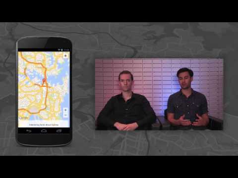

## Maps Live: New Features in the Google Maps Mobile APIs for Android and iOS

** 视频发布时间**
 
> 2013年9月20日

** 视频介绍**

> Google Maps API Team members Daniel Schramm and Chris Broadfoot discuss exciting new cross platform features in the Google Maps Android API v2 (http://goo.gl/5k18Es) and the Google Maps SDK for iOS (http://goo.gl/r2c2e). New to the latest versions are map padding, marker rotation, and flat markers.

** 视频推介语 **

>  暂无，待补充。

### 译者信息

| 翻译 | 润稿 | 终审 | 原始链接 | 中文字幕 |  翻译流水号  |  加入字幕组  |
| -- | -- | -- | -- | -- |  -- | -- | -- |
| 段威 | 高冰 | ——| [ Youtube ]( https://www.youtube.com/watch?v=VYvt0gpeFW4&list=PLOU2XLYxmsIKkdC4GCZp3JGrY4ctWHnHo&index=15 )  |  [ Youtube ]( https://www.youtube.com/watch?v=LKpA85wMuG8&index=6&list=PLvivLNHqjoowK2IZ9j_NYIucUrGgdiDrT ) | 1504300777 | [ 加入 GDG 字幕组 ]( {{ book.host }}/join_translator )  |

### 解说词中文版：

嗨

我是Chris Broadfoot

来自Google地图开发者关系团队

我是Daniel Schramm

在Google地图移动端API项目里担任产品经理助理

不久前  我们在iOS和Android平台上

均发布了地图API的更新

今天我们在视频里讲一下

这次更新里的3个新特性

Map Padding  Marker Rotation和Flat Markers

首先  我们看下Map Padding

有了Map Padding  你就可以把一些基本操作移进地图中来

同时还能在地图padding区域添加覆盖物

比如可以添加一个透明菜单条或者侧边栏

Map Padding的值可以随时动态变化

比如当侧边栏在地图上出现或者消失时

地图会把各方向map padding的值考虑进去

通过缩放将标记重新定位到地图中央位置

省去了手动计算的麻烦

下一个我们要讲的是

Flat Markers（扁平标记）

它是一类新设计的标记  不管从哪个方向看过去

它总是被平放在地图上显示

这与其他标记不同

当地图旋转时  扁平标记会始终贴在地图上

这两类标记都可以绕着

其定位点进行旋转

这样你就可以做出一些有趣的扁平标记

例如  它可以像指南针一样固定在地图上

始终朝着一个方向

以上两点结合一下

就能带来很棒的用户体验

举个例子  我们现在播放一段GPS导航路线

标记代表着用户所处的实时位置和方向

并且会在地图上实时刷新

以上就是一些跨平台的特性

今天我们就讲到这吧

如果想要学习平台各自的特性

请翻看我们发布的文档

也别忘了将Google Maps API

添加到你的Google+圈子

谢谢观看  我们下次见

回见

