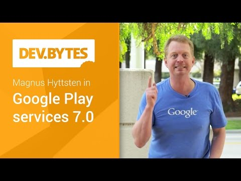

## Google Play Services 7.0

** 视频发布时间**
 
> 2015年3月19日

** 视频介绍**

> Google Play services 7.0 is here, enabling you to Build Better Apps! Magnus Hyttsten introduces the new release, where we've added the Places API, and made enhancements to Location and Google Fit. This release also makes it possible to remote control your Android TV through the new Nearby Connections API.

** 视频推介语 **

>  暂无，待补充。

### 译者信息

| 翻译 | 润稿 | 终审 | 原始链接 | 中文字幕 |  翻译流水号  |  加入字幕组  |
| -- | -- | -- | -- | -- |  -- | -- | -- |
| 贺晓赫 | 伍文其 | —— | [ Youtube ]( https://www.youtube.com/watch?v=F0Kh_RnSM0w )  |  [ Youtube ]( https://www.youtube.com/watch?v=uzGcJTM3dc4&list=PLvivLNHqjooz0jg-8ShYbWz4BERNNNR6Q&index=7 ) | 1503200437 | [ 加入 GDG 字幕组 ]( http://www.gfansub.com/join_translator )  |

### 解说词中文版：

MAGNUS HYTTSEN：你想开发更好的APP吗

如果是这样的话，那么你就找对地方了

因为，现在我们非常自豪地推出Google Play Services 7.0

而这正是Google Play Services的意义

使您能够开发更好的Apps

在此版本中 我们开发了许多新的功能

一个全新的API

让我们一起来一探究竟吧

让我们先从定位，定位和定位说起

我的意思是，还有什么比在移动环境中定位更基本的功能

Google Now VOICE：也许还有连通性吧

MAGNUS HYTTSEN：好吧 你说的对极了

不过，定位功能一直都是很重要的

你想知道你的朋友们在哪

附近有什么好玩的东西

或者只是追踪你自己身在何处

这就是Fused Location Provider的用武之地

Fused Location Provider可以从许多不同来源的信息中

识别位置

比如GPS，Wi-Fi网络信息 或你连接到的

手机网络等

但是 如何才能在设备上打开你的应用程序

检测和确认该定位设置呢

如果没有启用，又该如何打开他们呢

好吧 到现在为止 我们还没有切入正题

不过，现在让我们言归正传

如果必要的话 你可以现在确认一下定位

设置将会成功请求一个给定的位置

而且如果有 可能的改进

你可以显示一个触摸控制器 - 

就像你看到的 - 对于用户来说

无需离开APP就可以改变设置

对于APP，以及用户来说都是好消息

例如 当谷歌地图在设置对话框中

添加定位功能 对于处于良好定位状态的用户来说

那将是巨大的进步

因此 这是很重要的东西

我们跟大家带来了--没错

我们设计了一个新的API

让我们用热烈的掌声欢迎API

[掌声]

Places API使用谷歌Places Database和Business Database

来确定一个位置所包含的

所需信息

举例来说 如果这是我目前所在位置的经纬度

那么Places API可以

确定我在拍摄这个视频的时候

其实在Googleplex的48楼

那么，如何才能将这些添加到的APP呢

嗯，首先，Places API有一个内置的选择器

用户可以选择自己的当前位置

然后 你的APP就可以获取到关于这个位置的所有的相关信息

例如：姓名，地址，电话号码，网站，

甚至更多

不过 这还不是全部

您也可以通过getCurrent Places的编程方法

查询用户当前位置的API

通过getCurrent方法

用户在特别的地方使用addPlace的方法

也可以向大家报告

所以说，Places--一个伟大的新API

将会是打开世界进入现实生活中的项目

并且 关于API的更多细节

我们已经有了一个独立的DevByte，所以

一定要查看这个视频的结尾推荐。

现在再说一下Google Fit

在此版本中 我们把单个健身API

分成六个不同的API常数

为什么呢

因为这样谷歌的APP

特别是在后台运行的APP

会显著减少对存储器的占用

并且对你想测量和记录健身数据类型

完全没有限制

所以 我们增加了两个数据类型 也就是--

体内脂肪和睡眠

搞什么飞机

哎，别搞恶作剧

新幻灯片，新幻灯片

[呼]

[低吼]

这些都是Google Fit在此版本中的提高

所以去那里，创造伟大的健身APP吧

还有 别忘了我们添加了邻近连接API

如果你的APP可以用作让安卓设备

连接到安卓电视的遥控器

例如，玩游戏时

那就是Google Play Services的7.0版本

请记住，你只要你使用Google Play Services

就可以创建更好的APP

现在该你去那里创建

那些伟大的APP啦

最后，不要忘了把这些告诉我们哦

