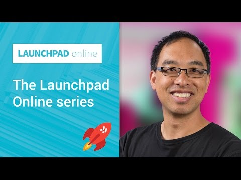

## The Launchpad Online series

** 视频发布时间**
 
> 2014年11月13日

** 视频介绍**

> What is the Launchpad Online series? It's a set of videos geared to get you, your idea, your startup, or your enterprise onboard building with Google APIs. This episode introduces the series, what viewers should expect, and it also includes a brief introduction to the Startup Launch program and Launchpad events where your'll find some of the content from this series.

** 视频推介语 **

>  暂无，待补充。

### 译者信息

| 翻译 | 润稿 | 终审 | 原始链接 | 中文字幕 |  翻译流水号  |  加入字幕组  |
| -- | -- | -- | -- | -- |  -- | -- | -- |
| 韩淼 | 苏楚霖 | —— | [ Youtube ]( https://www.youtube.com/watch?v=CbgyI3ueznU )  |  [ Youtube ]( https://www.youtube.com/watch?v=BRM4h6iTN-0 ) | 1503190427 | [ 加入 GDG 字幕组 ]( http://www.gfansub.com/join_translator )  |

### 解说词中文版：

大家好 我是Wesley Chun

Google的工程师与开发爱好者

今天的问题是

你是否希望

将Google技术整合到你创业或者企业应用里

好吧  Startup  Launch是一个项目

它在所有的阶段提供创业平台 

资源  在线内容  指导  培训

去帮助你实现你的想法

创建新项目  发展你的用户基础

Launchpad是一个一周项目对创业初期来说

专注于UI设计  项目策划

营销和商业发展

但并不是每个人都会把它与Launchpad项目结合  这就是我们这视频的目的了

Launchpad在线面向广大爱好者

创业者甚至大型企业提供了协助

培养成功路上所需技能的视频

由于技术通常会是解决方法的核心

因此我们会主要关注Google开发工具和API

他们是什么

好的  在过去的几年

我们创建网页和移动应用

你都可能用过它们  比如说搜索引擎  YouTube  或者是一个或多个Google应用

像Gmail或者是Google Docs

然而  当我的同事们为提供这样的工具

感到高兴时  我们却不可能

足够快速的创建有用的工具

严肃来说  不能  那是事实

因此我们做了下一件极好的事情

使我们的一些技术

能够被你们使用  包括你能看到的

开发者工具和API

并且我们不断加入新的特征和API

你可以用它来干什么呢

你可以帮助你的用户找到

哪里可以连接到Google Maps  当他们正使用你的应用

去找一些吃和玩的地方时

你可以给你的用户提供一些功能

去在他们的Google Drive上编辑文本或图形文件

再或者也许 你希望允许用户

可以从他们的智能手机上拿到视频

并且自动下载  这样用户可以容易的

与朋友和家人分享  不需要用手机或者相机

发送到电脑  YouTube或者电子邮件

噢  顺便说一下  你可以在一个应用中使用多个API

比如说上传这些视频到YouTube和Google Drive

这可能是你会做的一点事情

创建一个应用而不需要重建轮子  

无论是适合于移动手机 网页 或者都适合

但是怎样开始使用Google API呢

一些开发者已经告诉我们

学习我们的API并不总是那么容易

或者没有足够的文档或者工作范例

除了包含了像设计与布局的技巧

我很高兴向你们介绍Launchpad在线的视频系列

为开发者解决这些具体问题

每一集介绍或演示

如何使用一个具体Google API的特色或者是开发工具

使你能快速掌握

噢  还有一件事  在这个系列友好的开始时

我们非常希望你成为一个开发者

意味着你需要会编代码不管JavaScript还是Python

如果你对编程不熟悉

这儿有很多MOOC  具有大量的开放在线视频课程

教你如何学习编程

一旦你通过实践得到一些经验

我们会在这帮助实现你的创意

现在是你的时间

在Google Developers主页上搜索我们的API

或者在这个界面上点开链接看这个系列的其他视频

我是Wesley Chun  我期待

你加入这个冒险

通过我们的API和开发者工具

学习利用Google技术

希望我们会在Launchpad在线上看到你

或者看到你的Launchpad事件

