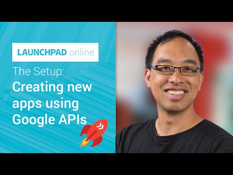

## The Setup: Creating new apps using Google APIs

** 视频发布时间**
 
> 2014年11年13日

** 视频介绍**

> For developers new to Google APIs, this episode shows you how to setup a new app ("project") in the Google Developers Console and how to obtain the credentials necessary to use our APIs with.

** 视频推介语 **

>  暂无，待补充。

### 译者信息

| 翻译 | 润稿 | 终审 | 原始链接 | 中文字幕 |  翻译流水号  |  加入字幕组  |
| -- | -- | -- | -- | -- |  -- | -- | -- |
| 高冰 | 虞高 | —— | [ Youtube ]( https://www.youtube.com/watch?v=DYAwYxVs2TI )  |  [ Youtube ]( https://www.youtube.com/watch?v=KkAJsJWVj6g ) | 1503190428 | [ 加入 GDG 字幕组 ]( http://www.gfansub.com/join_translator )  |

### 解说词中文版：

大家好  我是Wesley Chun

Google工程师兼布道师

如果你想在你的app里加入Google提供的技术支持

从本集视频看起是再好不过的了

在本视频里  我们会讲到在开发程序时

调用Google API的详细步骤

首先  Google Developer Tools到底是什么呢

在上一集中

噢  要是你还没看过可以点击左上角的视频链接

在上一集中  谈到了大家对Google搜索或者Youtube相关工具的使用已经再熟悉不过了

但是你能想象自己去创建一套

Google地图或者Google云端硬盘吗

我们当然做不出来

但你可以通过使用我们提供好的API

和我们的开源开发者工具为自己所用

这样就没有必要再重复造轮子了

那我现在就向大家展示一下这个入门是有多轻松

你将会学到怎样在开发者控制台（英文Developer Console 也叫DevConsole）

上面创建一个项目  怎样让API能够为你所用

最后  你将会学到

怎样获得调用Google API的凭证

不论你是想获取授权的数据还是调用一个简单

的API key来访问公共数据  我们都会涉及到

在接下来的几集视频中

我会写一个Pyhton脚本程序  并让它能够获得调用Google API的凭证

这个示例代码适用于所有的程序

调用多少API都是一个道理  所用语言的不同也不会造成什么影响

另外  如果你不读取需要授权才能访问的数据

请求代码会更少

你的代码在任何场合下都可以获得Google服务

不论是在网页还是手机应用中

或者是在云端服务器中都是没问题的

因为在这些平台上获取的方式都极其的类似

全部的工作就是在浏览器的后台中部署好即可

让我们在电脑上实际操作一下吧

那好  我要开始了

如果想让你的程序能够调用Google API

或者使用到Google的云服务  你必须时要先登录开发者控制台

才可以

打开浏览器  输入console.developers.google.com

如果之前没有登录就要先输入账号和密码

如果你还没有Google账户

那就点击登录框下面创建账户的链接

新建一个Google账户吧

登录成功之后

就会进入了控制台的主页

上面展示了你创建过的所有工程

如果你还没有创建项目  别担心

这些空白很快就会被填上

要想去填补这些空白  我们需要做三件事

第一  创建一个新项目

第二  开启你的项目中所要用到的API

第三  创建并下载相应的凭证

首先让我们点击这个蓝色的按钮Create Project

来创建一个新项目

你需要输入两条信息

一个是项目名称  该名称只在你的控制台内有效

如果你不喜欢现在起的名字  以后随时都可以进行更改

另外一个是你要为你的项目创建项目ID

该ID是你项目的唯一标识

能够和系统中所有的其他项目区分开

正因如此  这个ID一经创建就就不能再变

所以现在就起一个好点的名字吧

为了方便起见  Google会自动生成一个随机ID

可以看到我这里就随机生成了一个

如果你不喜欢  可以自己输入一个还未被使用过的ID

或者点击这里的刷新按钮

Google就会再随机生成一个新的ID

确认信息无误后  点击Create按钮

Google数据中心就会精雕细琢

为你开辟出一个全新的项目

这个过程大约会花费半分钟左右的时间

项目创建之后  页面会跳转到

新项目的控制面板

现在就暂停视频去动手创建一个自己的项目吧

当项目创建成功并看到了控制面板页

继续回来观看也为时不晚

好啦  我们的项目已经成功创建了

现在我们在Overview选项打开的页面中

本着大道至简的原则  我们的项目只有一个侧边栏

对于移动端或者云服务程序项目

同样也会有这样的一个界面

那我就继续向下展示了

接下来  让我们来开启API

是的  就是点击控制面板里的这个Enable an API按钮

页面会跳转到API服务页面

在这你可以开启你要用到的API

可以看到一些Google云服务的功能已经

默认开启

如果你对使用这些服务不感兴趣

在右边的开关可以随时进行关闭

现在就让我们来找一找我们想要开启的API吧

比如  你想调用Google云端硬盘的API

向下拖到相应位置  点击打开开关即可

在这呢

再比如  如果想调用YouTube data API

再将页面向下拖动  找到相对应的API选项

采取同样的操作即可打开它

选好你要调用的API之后

重新回到页面顶部

确保它们都已经打开了  就像这样

接下来让我们来创建自己的凭证

点击一下左侧的链接

在这个页面上  由OAuth开放授权和公共API 存取这两部分组成

这两部分我都会去创建

对于Google云端硬盘  你应该要知道

云端硬盘里的文件和文件夹就是你的用户数据

也就是说你的程序需要被授权

才可以访问这些数据

点击Create New Client ID按钮

会弹出来一个对话框  你需要确认程序的类型

既然我们是要编写一个简单的脚本程序

它不是网页端程序（通过浏览器存取数据）

后台也不需要自动调用Google服务  如果需要调用的话就选择Service Account选项

我们的程序属于已安装的应用程序  那就选中这个选项吧

既然不是网页程序和已安装好的手机应用

只是一段脚本程序

那我们就选择Other吧

点击Create Client ID来创建你的OAuth凭证

最后一步  点击这里的Download JSON按钮

点击之后会下载凭证

它能使程序在调用Google服务时获得授权

我建议将此文件下载到

程序所存放的文件夹下

就像我做的这样

这一部分就做完了

再回到我们凭证页面

来看第二部分

可以看到这里的意思是创建一个简单的公共API存取

也就是说会创建一个API key

在进行一些只读操作时会用到它

例如在搜索YouTube视频时

在这种情况下  有一个API key就足够了

这里用不到授权

点击Create New Key按钮

跟刚才一样  我们的代码是几行脚本

不是网页程序和手机应用

所以严格来讲  这属于服务器程序  所以我们选第一个

这里可以设定允许使用的IP段

如果想跳过此步  点击Create

嗖的一下  API key就出现了

API key是一个字符串  可以直接复制它

粘贴到你的代码里  拿它做测试也是信手拈来

显而易见的是  这种方式实际上并不安全

如果你打算将此方法应用于正式产品的开发中

一定要确保该API key被放到了牢靠的数据库中

或者非明文的地方

不管怎样  你现在已经有授权过的公共API key了

视频中说列的任务已经全部完成了

剩下的工作就要靠你自己了

好啦  现在你已经拥有自己的项目了

可以开始编写代码了

在下一集里  我会跟你一起看一看

调用Google API时常用的安全措施

那今天就到这里吧

记得观看下集时把你的代码也带过来

我是Google的Wesley Chun

下期在线Launchpad  我们再见

