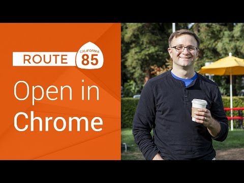

## Route 85: OpenInChrome on iOS, Part 1

** 视频发布时间**
 
> 2014年12月18日

** 视频介绍**

> Learn how to open a web link in Chrome on iOS! Follow along with this series of screencasts, where we explain how URL schemes work and demonstrate how iOS uses them to open up specific applications. Then, you create your own app to open up a web page in both Safari and Chrome.Route 85 playlist: https://goo.gl/iR6GQiSubscribe to the Google Developers channel here: http://goo.gl/mQyv5L

** 视频推介语 **

>  暂无，待补充。

### 译者信息

| 翻译 | 润稿 | 终审 | 原始链接 | 中文字幕 |  翻译流水号  |  加入字幕组  |
| -- | -- | -- | -- | -- |  -- | -- | -- |
| 鲁登科 | 周亿、程路 | —— | [ Youtube ]( https://www.youtube.com/watch?v=GtQK7lGb158 )  |  [ Youtube ]( https://www.youtube.com/watch?v=GtQK7lGb158 ) | 1501120023 | [ 加入 GDG 字幕组 ]( {{ book.host }}/join_translator )  |

### 解说词中文版：

欢迎来到我们Route 85系列视频的第一期

我们的视频是为iOS开发者量身定做的

你们闻到了吗

新事物的味道

太棒了

可能你已经知道多年以前  Chrome浏览器

就已经有iOS版本了

但是不能选择你的默认浏览器

因此如果你使用iOS

并且和我一样是的Chrome常客

你可能在chrome上有一堆标签

那是因为你每天都用的浏览器

但是你也有一些页面是在Safari浏览器上打开的

因为当你点击另一个应用程序上的链接时

它会打开自己的默认浏览器

但是在这里我要向你展示一些东西

看看这些

我在这里使用我喜爱的Twitter客户端Tweetbot

如果你没有见过那么这是我强烈推荐的

这里是Colt McAnlis的日志

中的一个链接

当我点击它的时候它会如你预料的在Safari上打开

现在让我们返回Tweetbot

进入我的偏好设置

你会注意到这儿的一个设置选项

是修改我的默认浏览器

其中一个选项就是Chrome

我们选择这个

让我们回到之前的页面

看看当我点击这个相同的链接会发生什么

现在它是在Chrome上打开的

还有其他的24个我已经打开的标签

我打开过很多标签页

顺带一提  这也给我带来很多其他的便利

如果你的Chrome浏览器为你保存过

某些网站的登陆信息的话  比如桌面版浏览器

我就能够方便地登陆而不用输入密码

如果你看一下Chrome的设置选项

你会发现这边我启用了  减少流量消耗

的功能  这样一来

如果我用移动网络浏览网页时

他会减少页面大小来减少流量消耗

它当然如果这个页面显示的是另一种语言

Chrome会帮我将它翻译过来

当然  如果我想在电脑上看这篇文章的话

我可以把这个页面加入书签

这样就可以在电脑浏览器上看到了哈

但是我认为其中最方便的地方

尤其是对我们这些应用程序开发者而言

就是Chrome上这些好使的后退按钮

当我点击它们时会立刻返回我的Tweetbot应用程序

上次浏览的地方

因此我可以继续查看我的Twitter消息

那么这个软件是怎么做到的呢

尽管我没有看过它们的源代码

但是这个功能  我有一个比较好的解决方案

这里使用了iOS中叫做URL Schemes的技术

也就是当你打开一个URL时

就像画面上的这样

iOS会检索分号前的这一小段文字

它决定了应该打开哪个程序

来处理剩下的URL

例如在第一个例子中

mailto会打开iOS的邮件程序

同样的  tel会打开拨号键盘

HTTP或HTTPS会打开Safari浏览器

一种很特殊的情况是iOS会把任以

maps.apple.com开头的链接直接用

Apple's Maps打开  作为第三方开发者我们不能

修改应用程序打开邮件  网站  或者是电话的URL Schemes

但是我们可以声明我们自己的Schemes

我们可以声明一个URL Schemes

以我们应用程序声明的字符串作为开头

当用户尝试打开

此类URL时  我们的程序就会被打开

系统会传递URL给appDelegate方法进行处理

我们可以创建一个应用程序

并声明这程序使用foo做标识

事实上  我们之后会教你怎么实现这些

现在我们需要知道的一个重点是

Google Chrome和Maps

和许多其他的第三方应用

已经申请了他们自己的URL方案

你可以利用这些

在Chrome上直接打开一个URL

让我们看看怎么做

我们从设计一个简单的程序开始

录视频的时候  Swift和Xcode 6还在测试

所以我使用的是Objective-C和Xcode 5

如果你们有很多人都感兴趣

我也可以在Swift上重复这些步骤

防止掉节操

这里我准备建立一个新工程

选择单视图应用程序Single View Application

把它命名为OpeninChromeExample

因为我从一开始就很喜欢这名字

为了简单起见  选择iPhone程序

随便找个喜欢的地方保存

现在  让我们打开storyboard

我要添加一个按钮  叫做

叫做打开一个网站Open a web page

居中

好了  看看这个程序

漂亮吗

这东西太美了

真的

这里我得打开我的辅助编辑器

按住control把按钮拖进源代码中

创建一个新的Action命名为openWebPageWasPressed

现在我要声明一个NSURL

将其命名为googleURL

等于NSURL URLWithString

这我们使用https://www.google.com

如果你对Google主页感到视觉疲劳

你可以随便用一个你喜欢的网页代替它

然后我要使用UIApplication sharedApplication

调用openURL我要使用这打开googleURL

好了

没问题  让我们保存一下

当我运行这个程序并点击这个按钮时

好了  它会在Safari上打开Google主页

这是因为我尝试打开的URL

是以https开头

iOS自动使用Safari浏览器打开

让我们回到程序上

在主编辑器上编辑ViewController.m

让我们看看当我用googlechrome

代替https的时候会发生什么

当我运行这些并且点击这个按钮

啊 什么也没发生

这是因为我是在模拟器运行

这上面我没安装Chrome

现在这也是我应该考虑到的一种情况

假设用户没有安装Chrome

那么我们就应该使用Safari

随后我们再讨论

现在我们先停止这个程序

我要从模拟器切换

到我iPhone真机上运行

现在如果你点击这个按钮

我们可以看见  没错

我的URL在Chrome上打开了

欧耶

坦白讲  这是最基本

你需要做的事情  就是把http替换成

googlechrome  那么https换成啥呢

我想应该是googlechromes来通过加密协议打开

瞧  你所有的链接现在都在Chrome上打开

在未安装Chrome的模拟器上

我们的应用程序的运行情况是啥呢

很明显当我点击按钮时没任何反应

这是很糟糕的用户体验

最起码  我应该检查这种情况

然后Safari上打开这个链接

想实现这个功能很简单

UIApplications除了有openURL这个方法之外

它还有一个Bool返回值的canOpenURL方法

就是通过系统判断一下

看看是否有应用程序

可以响应这种URL Scheme

因此我回到按钮处理方法

我准备建两个URL

第一个命名为mySafariURL

这儿用NSURL URLWithstring

这里我们只使用简单的HTTPS作为URL Scheme

将这一个变量重命名为chromeURL

并且这里我们使用googlechromes URL Scheme

接下来我会进行判断

如果能够使用chrome打开

那么就用chrome打开

否则 我们使用默认 我想是退一步

使用Safari

这次的应用程序应该在

在模拟器上会正常运行

我点击一下网页打开按钮

它在Safari上打开了Google主页面

并且当我选择真机编译的时候

当我点击这个按钮

它的确就在Chrome上打开了

很赞啊有木有

但我还是想探索一下

那些我们还不知道的功能

就是那个对我们开发者都很有用的

能够在Chrome上添加一个小巧的返回按钮

让用户返回你的应用程序

这看起来仅仅是一个小的细节

但是点击直接返回你的应用程序

就相当于双击home键

从多任务中选择你的应用程序返回

这让我有更加顺滑的体验

下节课  我会教你如何去做的

紫薇别肘

