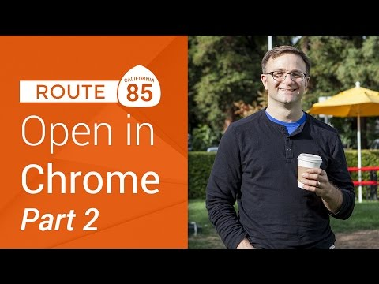

## Route 85: OpenInChrome on iOS, Part 2

** 视频发布时间**
 
> 2014年12月18日

** 视频介绍**

> Using the x-callback-url format. In part 2 of this screencast series, we show you how to use the x-callback-url standard within iOS to create a back button in Chrome that points back to your application.

** 视频推介语 **

>  暂无，待补充。

### 译者信息

| 翻译 | 润稿 | 终审 | 原始链接 | 中文字幕 |  翻译流水号  |  加入字幕组  |
| -- | -- | -- | -- | -- |  -- | -- | -- |
| 鲁登科 | 周亿、程路 | —— | [ Youtube ]( https://www.youtube.com/watch?v=BbJSwGlUUv4 )  |  [ Youtube ]( https://www.youtube.com/watch?v=BbJSwGlUUv4 ) | 1501120024 | [ 加入 GDG 字幕组 ]( http://www.gfansub.com/join_translator )  |

### 解说词中文版：

欢迎回到Route85  我们的节目是为iOS开发者打造的

因为我们同样喜爱你们

本期视频是关于如何在iOS设备上用Chrome浏览器

打开网页系列视频的第二个部分

在以前的视频中我曾向你展示过

如何检测用户是否安装了Chrome和如何打开Chrome浏览器

但是这里我要探索另一个我们目前不知道的功能

这可能是对程序员来说非常重要的功能

在Chrome上添加一个小返回按钮让用户可以返回应用程序

我知道它看起只是个很小的功能

但是只通过一个点击回到你应用程序上而不需要Multitasker

这是很炫的

现在Chrome已经在利用这种在iOS开发界被称作

x-callback-url的新兴技术来实现这个功能

这是一个应用程序间有双向通信的约定

你基本要做的是建立一个自定义方案

告诉目标应用的你自己的应用是什么

这样当用户在目标应用中做完他们需要做完的事

目标应用能够通过自定义方案打开一个新的URL返回之前的应用

整个过程其实是非常灵巧

那么它实际上是什么样子的呢

来看看我们的Google Chrome URL吧

就是这个

这是非常基础的

但是现在我并不让它打开www.google.com

我要让它打开x-callback-url

基本上就是给Google Chrome一个信号  嘿

我要给你一些x回调协议的信息  这样你做完工作之后就能返回我这了

在那之后  我要添加一个方法  然后传递一个URL参数叫做url

也就是我们要访问的那个  或者更准确的说  URL编码版本

最终你会得到一些像这样的东西

现在如果我打开这个URL 它也会生效

我们现在就在我们的示例应用程序上试试

现在我要回到了OpenInChromeExample程序上

和SafariURL和ChromeURL一样

我要声明一个新的URL并将其命名为callbackURL

看上去和chrome那个相当类似

但是我这的string是googlechromes

后面我的host 我要使用x-callback-url

执行动作是打开 然后输入url=https://www.google.com

现在 只剩下一小部分工作 因为我需要 啊

xcode 我知道我需要一个分号 因为我只需要修改这三个字符	

让我们来修改一下

这应该是%3A%2F%2F

有没有人知道Xcode是否会自动进行URL转义

如果有的话记得在评论中告诉我

最后 我要确保我将这的ChromeURL换成了callbackURL

如果我的URL编写正确的话我觉得它一定很棒

会吗

我们来将它修改一下

选择编辑范围为所有

将这个改为URL

这样更好了

现在我可以在我的设备上运行它了

当我点击这个按钮时  我们可以看见我的URL在Chrome中打开

但是现在任然没有返回按钮指向你的应用程序

这是因为我们还没有告诉Chrome任何关于这个访问它的程序的信息

为了实现这个功能我们需要注册我们自己的URL方案

像Chrome声明它打开任何以googlechrome开始的URL方案一样

我们也可以为我们的示例应用程序声明自定义URL方案

我们现在就做

我们回到Xcode

我们打开工程文件然后查看生成目标

在信息栏下底部位置  有一个URL types选项

这是我们的程序可以声明URL方案的地方

我们展开这里

这里现在并没有任何方案

我们可以点加号添加一个

这里的标识符是可读版本的URL方案

我知道的大多数开发者应该会在这里捆绑ID

我想我也可以这么做

因此填上com.google.openinchromeexample

当然你可以用任何对适合你组织的ID代替com.google

这里的URL方案 就是分号之前的目标程序 我们要声明的URL方案

这应该是唯一的 不能重复

如果你的程序和Chrome或者Google Maps一样被很多第三方程序调用

你也可以考虑使用应用名或者稍加变换

但是你如果真的只是像我们一样只需要告诉目标应用

自己的URL方案而不指望很多的第三方软件开发者知道

那么我认为最保险的捆绑ID 省时间

所以我们这样填写comgoogleopeninchromeexample

我得确保我的拼写正确

看起来不错

我将它复制一下  因为等会会用到

现在我们已经声明任何以comgoogleopeninchromeexample:

开头的URL会在此程序中打开

我们既然已经搞定了 可以回到我们的callback URL上了

现在我要打开ViewController.m

这里就是我们的callback URL

我们要对它做些修改

我换一行继续写因为这句太长了

首先我们要做的是添加&x-source=My App argument

这是我们应用程序的可读版本名

在Chrome中它会使用这个值来决定在后退按钮中显示什么文本

同样 我们要进行URL转义

我要用%20代替它

下一步我要添加一句x-success

x-callback是当用户完成他们想要做的事情之后

我们的目标程序尝试正常跳转回应用时打开的URL

要注意的是在Chrome中它会使用这个URL

不管你是否已经打开这个页面或者是否得到404结果或者是其他情况

始终是作为一个可用值

这个参数的值我们应该用指向应用程序的URL  也就是我们的自定义方案

幸好我刚刚复制了

我将它粘贴在这里

就是comgoogleopeninchromeexample

末尾会有一个冒号

再次提醒冒号这里需要转义

要它改为%3A

现在我们的URL看起来很长

又是x-source又是x-success

让我们尝试运行看看会发生什么

我现在点击这个按钮

看这儿

它在Chrome打开了

现在这里有了返回按钮

这个标题是My App  和我们在资源中定义的相同

当我们点击它的时候 它就会回到我们的应用程序

太酷了

如果你发现你的Chrome上并没有一个返回按钮

最常见的原因是你添加的x-success和

你在URL类型中URL方案不一样

Chrome会执行它自己的[UIApplicaton canOpenURL]

来决定是否在首栏显示按钮

如果你的x-success参数和URL参数不匹配

它会说不  我无法打开那个URL

那么它就不显示这个按钮

让我们回顾一下这个复杂的URL

开头的googlechrome URL方案是要求打开Chrome浏览器的

x-callback URL告诉Chrome这是x-callback类型的URL

open加上之后的URL参数告诉Chrome实际应该打开哪个页面

当x-success参数告诉Chrome操作完成之后

应该打开什么URL方案

最终x-source参数告诉Chrome在小按钮中显示什么

虽然这些都很棒

但是我们还没有完成

事实上我们之前所做的  如果Chrome版本非常的老 根本不会生效

虽然这种情况看起来不太可能  但它真的会发生 

让我们面对现实

我们的代码看起来可能有些混乱  甚至会混乱我们以前的成果

但是不要担心

我们会在下节课中解决这些问题

继续观看吧

