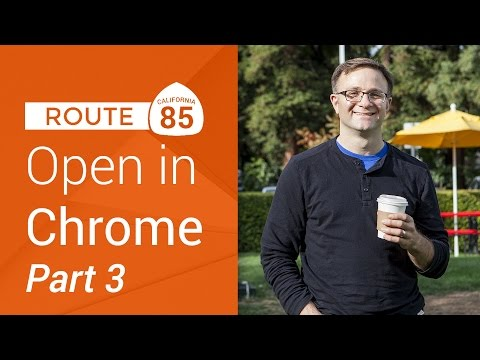

## Route 85: OpenInChrome on iOS, Part 3

** 视频发布时间**
 
> 2014年12月18日

** 视频介绍**

> Detecting old versions of Chrome. In part 3 of this series, we show you how to detect if the version of Chrome installed on the user's iOS device can support the x-callback-url format. And then we use the OpenInChrome open source class to make your life easier.Route 85 Playlist here: http://www.youtube.com/playlist?list=...Subscribe to the Google Developers channel here: http://goo.gl/mQyv5L

** 视频推介语 **

>  暂无，待补充。

### 译者信息

| 翻译 | 润稿 | 终审 | 原始链接 | 中文字幕 |  翻译流水号  |  加入字幕组  |
| -- | -- | -- | -- | -- |  -- | -- | -- |
| 鲁登科 | 周亿 | -- | [ Youtube ]( https://www.youtube.com/watch?v=Oi2xHZnmZow )  |  [ Youtube ]( https://www.youtube.com/watch?v=Oi2xHZnmZow ) | 1501120025 | [ 加入 GDG 字幕组 ]( http://www.gfansub.com/join_translator )  |

### 解说词中文版：

欢迎回到我们的Route 85

这是iOS开发者的求知旅行

在那里我们为着伟大的方向而永不停息

今天是我们系列的第三部分

将继续探索在iOS设备上用Chrome打开链接

现在我们回到上次该继续的地方

也许你没有看上次的视频

我们可以在应用程序中直接用Chrome打开一个链接

并且在Chrome中添加一个按钮

利用x-callback URL返回

到我们的应用程序上

但是这里有一个小问题

事实上如果你的Chrome版本非常老的话

比如说超过两年没有更新过

当你尝试打开这个URL时  它就不起作用了

Chrome以前不支持添加x-callback URL

在2012年十一月之后才有此功能

但是由于这个URL仍然是始于Google Chrome方案的

我们的[UIApplication canOpenURL]

方法会返回true或者yes

只有你的Chrome浏览器是老版本的

接收到这个URL才不会处理

那么我们有没有办法看看我们的Chrome的版本是否够新

能不能处理这个x-callback URL呢

有吗

铛  铛  铛

我们可以看看Chrome的开发团队是怎么做的

我感觉他们的办法非常好

它们添加了一个第三方的URL方案

叫做googlechrome-x-callback

他们是在支持x-callback URL的同时添加这个方案的

这意味着你检查

你的Chrome是否支持x-callback URL

只需要看看它是否可以打开以googlechrome-x-callback开头的URL

如果不能打开也没关系

你只需要还原到基本的Google Chrome URL就行了

如果能打开 那就直接使用这整个URL

我们回到示例程序中

实际尝试这些

现在回到ViewController.m文件

我这里要做的是

对callback URL做些修改

将googlechrome-s开头的URL

改为googlechrome-x-callback

这行快写完了

所以把它移到另一行

好了

现我有三个可用的URL

现在版本的Chrome有我的call back URL

我的基础Chrome URL相当于老版本的Chrome

还有简单的Safari URL

现在我们先回到if语句这里

首先我要检查看看

我能不能打开callback URL

如果可以的话我就可以知道我的Chrome版本

支持x-callback URL方案

因此就可以处理这个URL

帮助我回到我的应用程序

如果不可以的话  我需要添加另外一个判断

好吧  最低要求

你也要能打开chromeURL

如果是的话  我就知道我安装的是另一个版本的Chrome

虽然依然是旧版本的

这样我还是能够用[UIApplication sharApplication]

打开chromeURL

如果你不打开任何一个

那我就知道我没有安装Chrome

我就只能使用Safari了

好了

如果我们再在我的装置运行这个程序

我们可以看到当我们点击这个按钮时会回到Chrome上

Chrome上有按钮指向我的应用程序

那意味着我们是使用的是x-callback版本的URL

而不是Chrome上基础的那一个

这是因为我的Chrome版本

不是两年前的版本

我不能在非常老版本的Chrome上做示范

我也不知道哪里去下载老版本

但是我认为你应该相信我

这样能行

这样是不错  但是我把我的代码从一两行

扩展到了

什么  12行

我们在处理中手动做了一大堆的URL转义

看起来我得将这个逻辑抽象出来

到一个单独的类或者什么的

很幸运的是

Google已经帮我们完成了这些

所以看看下一个

访问GitHub.com/GoogleChrome/OpenInChrome

上的OpenChrome GitHub页面

现在你可以任意下载这些文件

你可以下载ZIP或者直接复制保存到本地

我现在只准备下载ZIP文件

当它下载好了之后我打开它

这里我们要用到的两个文件

是OpenInChromeController.h文件

和OpenInChromeController.m文件

现在我直接拖动这两个文件

到我Xcode的项目中

选择是  复制这些文件

如果你愿意你也可以看看这些文件

如果你是一直跟着课程到现在

你会发现这些代码和你的看起来非常像

它们只是比我们的示例代码更复杂

和严谨一些

所以  去看看吧

你可以查看最重要的头文件

基本上都是这个类的接口

你可以发现它基本是一个单例

我们有一个很好的Bool型方法IsChromeInstalled

我们可以用Chrome打开URL

也可以打开callback URL

回到我们的ViewController

编辑我们按钮的功能函数

基本我们就可以删除这些

我们的努力成果  再见

我要在这里重新定义两个URL

第一个URL是我实际想打开的

命名为pageToOpen等于[NSURL URLWithString]

这只写一个简单的老版的URL

打开的是www.google.com

然后添加我们的第二个URL  也就是callback URL

这应该是googleOpenInChromeExample

同样的  不要忘了末尾的分号

显然要和你的程序相符

现在代码打开它就容易多了

首先  让我们导入

我要添加一个if语句

是说OpenInChromeController

sharedInstance isChromeInstalled  如果是这样

我们让它在Chrome中打开

打开只需要调用

这个URL参数是

你想要打开的页面地址

withCallbackURL就使用callbackURL

createNewTab这个可能不需要

因此我在这里填上No

这格式看起来不错

否则 用户没有安装Chrome

因此我们让它在Safari中打开链接

使用原来的[UIApplication sharedApplication]

openURL方法

这样OpenInChromeController帮我把

从原始URL转换成x-callback URL还有转义等

所有的繁重工作都做了

我们到controller这里

我们要在这里添加一个NSLog声明

显示结束时它实际上试图打开哪个URL

所以在这里我们要添加一个刚刚说的NSLog

输出I am attempting to open

我们就可以查看[ChromeURL absolute string]

我们可以运行来试试

和之前一样  一个按钮

我可以通过点击它进入Chrome

并且这里有一个返回按钮

可以带我回到应用程序上

我们回到我们的控制台上

看看这里发生了些什么

我们可以看到 它把在我们简单的URL

转换到复杂的x-callback URL

这样在Chrome上打开时就会有一个返回按钮

我们停止运行

现在  你可以看到我们复杂的逻辑

转换成了普通的方法

实际应用中 你可以在用户打开应用程序时

判断用户是否安装了Chrome

如果他们已经安装了Chrome

当用户点击链接的时候

你可以弹出一个警报或这是执行一个动作

让他们选择默认浏览器

保存信息在NSUserDefaults中

之后就不用再选择

然后你可以写一个简单的

openURLsInPreferredBrowser方法

使用适当的调用去打开URL

这样就行了

这样就有了一个应用程序

会使用用户自定义的浏览器打开链接

不管浏览器是什么

如果你好奇iOS 8的发展

是否使这个过时了

答案当然是否定的

iOS 8支持大量的扩展

我觉得URL方案的许多用例

或许会被其他扩展更好的解决

但是打开网页的方式目前还不是其中之一

现在我们已经基本

实现了主要的目标

向你展示了怎么在iOS设备用Chrome打开链接

但是我们能用x-callback URL做更多

让我们看看怎么利用

从Chrome返回我们应用的链接吧

下节课中我会告诉你怎么做

所以不要走开