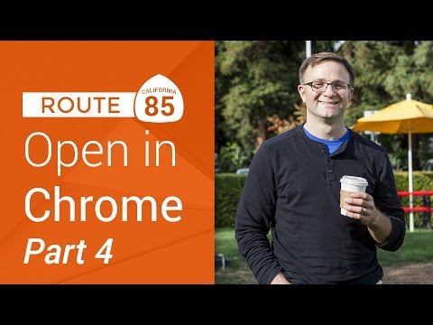

## Route 85: OpenInChrome on iOS, Part 4

** 视频发布时间**
 
> 2014年12月18日

** 视频介绍**

> More fun with x-callback-url. In part 4, the final part of our screencast series, we show you how to add extra features to your x-callback-url spec in your app so that you can detect when the user has returned to your application from Chrome on iOS.

** 视频推介语 **

>  暂无，待补充。

### 译者信息

| 翻译 | 润稿 | 终审 | 原始链接 | 中文字幕 |  翻译流水号  |  加入字幕组  |
| -- | -- | -- | -- | -- |  -- | -- | -- |
| 鲁登科 | 周亿、程路 | —— | [ Youtube ]( https://www.youtube.com/watch?v=_T3VSbzuf6M )  |  [ Youtube ]( https://www.youtube.com/watch?v=_T3VSbzuf6M ) | 1501120026 | [ 加入 GDG 字幕组 ]( {{ book.host }}/join_translator )  |

### 解说词中文版：

欢迎回到Route 85

继续我们系列的的第四部分

在iOS设备上用Chrome打开链接

如果你是一直跟随我们走到这一步

我们基本完成了主要目标

实现了用Chrome打开链接

并且使用开源代码库帮我们便捷地实现

可以让用户返回应用程序的返回按钮

所以你可以认为本节

只是其他的完善工作

既然我们在学习URL方案和callback URL

那么让我们来仔细的看看

这个x-success callback URL吧

现在它还只是返回我的自定义方案

但是我们可以嵌入

任何我们想要的信息到这个URL中

比如说

我们可以向用户表示非常高兴他的使用

因为他们利用返回按钮回到了我们的应用程序

我们可以对我们的callback URL做些修改

例如改为comgooglemyexample://welcomeback/

如果我们在URL中添加这样的信息

使之成为x-callback URL的一部分

当用户点击返回按钮返回时

它将传递给Chrome作为URL打开

当Chrome准备打开这个URL时

iOS会打开我们的应用程序

因为我们已经声明了自定义comgooglemyexample URL

然后我们将完整的URL

交给给我们应用程序的委托

但是之后我们怎么处理

这个回发给我们程序的URL呢

这就需要在委托中使用

application openURL sourceApplication annotation的方法

这会传递给第一个位置的程序

完整的URL和其他的一些信息

或许在代码中演示更好

我们可以在示例程序中试一试

所以我返回我的OpeningChromeExample程序

这里我要做两件事

第一件是修改我的callback URL

将comgoogleopeninchromeexample:

改为comgoogleopenexa mple://welcomebackfrombutton/

然后我要做的是

转到我的AppDelegate.m文件

在这里的上一部分

我要用application openURL sourceapplication annotation方法

这是我上次提到过的

在这打application  就是这个

有Open URL source application annotation

我猜我这里首先要做的就是

输出我们返回的URL

所以我们输出它

我已经收到了URL

然后我们传递参数URL absolutestring

剧透一下

这只是那个callback URL

就是我们在viewcontroller.m文件中定义的那个

暂时我们能返回一个YES  只用打YES

我可以处理这个URL

即便我实际上不知道它是什么

现在当我们运行并点击这个按钮时

进入了Chrome然后跳转回来

停止程序

我们在日志中看见

是的  我们所收到的实际上就是comgoogleopening

天  我需要短点的URL

现在我们能够解析这个

所以我们在这里添加一个if语句

如果URL host是welcomebackfrombutton

如果是这样我们就可以知道

用户通过点击Chrome上的返回按钮

进入我们的程序  而不是

我们后来设计的x-callback URL

既然这样  那么我们为什么不添加一个警示框

或其他的东西来欢迎用户回来

就像这个  UIAlert view alloc initWithTitle@

欢迎回来

提示是  我想念你

我们这里委托设置为空

取消按钮标题用Awww

或者其他的按钮标题都没问题

还有show

好了

啊

这儿差了个@

好了

这里我的返回值是YES

写在方法的最后

这样我们就处理好了这个URL

我不确定这个程序的效果怎么样

因为我没有返回任何地方还是得打开URL

我猜如果你想得到正确的返回值

就需要委托一个子程序

而你子类的委托

还需要知道你的URL

是否已经被你的超类处理了

但是这只是猜测

我不是很确定

先运行试试

点击按钮它进入了Chrome

点击返回按钮

看看发生了什么

显示的是欢迎回来的语句

感觉好有爱

举一个实际例子

我们可以想象我们有一个充满了新闻头条的应用程序

用户可以点其中的一个标题

在Chrome中阅读整个新闻

有我们的URL方案我们可以继续访问

故事或新闻的内部ID

不管原本包含什么外部链接

然后当用户返回我们的应用程序时

我们可以利用这个信息

保证用户继续之前的浏览

或者我们可以

支持一些后续的选项

或者我们可以把看过的标题标记成红色

你可以随意发挥

希望这个教程可以让你

更好的理解URL方案是什么

怎么让用户自定义打开网页的浏览器

而不受默认浏览器的影响

和怎么利用Chrome的小返回按钮

让用户回到应用程序

就这些  谢谢观看

这是我第一次站在荧屏前

你认为怎么样

我是太快还是太慢呢

有什么其他的你希望我补充的吗

如果有  尽快告诉我

在评论中给我留言

我一定会看的

再次感谢  我会尽快回复

