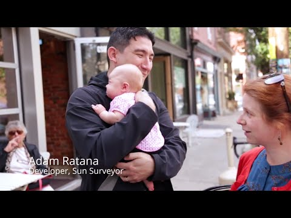

## Sun Surveyor brings augmented reality to photographers using Google Maps APIs

** 视频发布时间**
 
> 205年4月7日

** 视频介绍**

>  See how Adam Ratana, developer of Sun Surveyor, is using Google Maps APIs to help photographers capture the perfect photo.

** 视频推介语 **

>  暂无，待补充。

### 译者信息

| 翻译 | 润稿 | 终审 | 原始链接 | 中文字幕 |  翻译流水号  |  加入字幕组  |
| -- | -- | -- | -- | -- |  -- | -- | -- |
| Wallace4ever | 任皓 | -- | [ Youtube ]( https://www.youtube.com/watch?v=88rG6FHEeUg )  |  [ Youtube ]( https://www.youtube.com/watch?v=thDJf3aUAeo ) | 1504200668 | [ 加入 GDG 字幕组 ]( http://www.gfansub.com/join_translator )  |

### 解说词中文版：

作为一个业余摄影师  我想要能够

找出在一个特定的地点处 太阳会是什么时候

升起或者落下

我的名字叫Adam Ratana

我日常的工作是在一家大型保险公司工作做软件开发带头人

而在我的业余时间里  我开发了一款Android和iOS的APP

它叫Sun Surveyor  可以帮助人们预测和

将太阳和月亮的位置可视化  这在诸如

摄影 建筑 房地产 地球科学等

你能想到的领域里有着广泛的应用

我在Android和iOS端使用了Google Maps API

而且它非常容易使用

随着时间的推移 地图的使用体验也在改变

人们习惯于现在能够放大和倾斜

以及旋转地图  还有能够有很多叠层

和大量的交互元素的功能

所以谷歌给我们开发人员API

以集成在自己的应用程序中

这是在其他API之上的改进

如果一个摄影师想使用Google时区API和谷歌海拔API

来得到太阳升上正空中时候的照片

我可以提供他们

所需要的信息以正确做出拍摄计划

应用程序的用户们真正会喜爱的是现在的街景地图

街景API有一个相当大的转变

它允许你在你的APP中带给用户

一个遥远地区的真正强大的视觉体验

并且真正能够让将太阳和月亮的运动路径可视化

而这路径点你可能在几个星期或几个月都见不到

这已经超出了我能够想到的可以用它来做的事了

它是如此的令人振奋

又是如此的令人意外