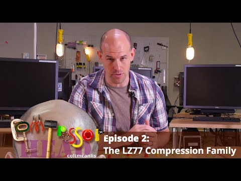

## Compressor Head - Episode 2 (The LZ77 Compression Family)

** 视频发布时间**
 
> 2014年5月20日

** 视频介绍**

> The LZ77 Compression Family from the late 70s have become the most dominant dictionary encoding schemes in compression. Colt McAnlis walks us through why the Lempel-Ziv algorithms are so dominant, in this episode of Compressor Head

** 视频推介语 **

>  暂无，待补充。

### 译者信息

| 翻译 | 润稿 | 终审 | 原始链接 | 中文字幕 |  翻译流水号  |  加入字幕组  |
| -- | -- | -- | -- | -- |  -- | -- | -- |
| 周亿 | —— | —— | [ Youtube ]( https://www.youtube.com/watch?v=Jqc418tQDkg&index=3&list=PLOU2XLYxmsIJGErt5rrCqaSGTMyyqNt2H )  |  [ Youtube ]( https://www.youtube.com/watch?v=Jqc418tQDkg&index=3&list=PLOU2XLYxmsIJGErt5rrCqaSGTMyyqNt2H ) | 1502120374 | [ 加入 GDG 字幕组 ]( {{ book.host }}/join_translator )  |

### 解说词中文版：

在这个数据压缩的领域

每个分支都有他自己的霸主

但是在一段时间之后

有一个家族用霸权

统治了压缩领域

这个统治阶级也就是压缩界的

Lempel-Ziv家族

并且它有跨代的血统

与长期不和的兄弟姐妹

和堂兄弟  甚至隔代阿姨

这颗家族树是如此的错综复杂以至于使得

权力的游戏看起来仅仅是一个本地披萨

不  这个家族不仅仅是这样

它巧妙  有活力  高效率

这使得它无可争辩的统治这个

压缩领域长达超过三十多年

但是要了解什么使得这个家族如此强大

我们不得不回到之前  换一种方式来

了解数据  并且挑战我们对于

熵的基本理解

这将是一个困难的任务

但是不用担心  年轻的程序猿

我就是来帮助你的

我是Colt McAnlis

这里是压缩头

Claude Shannon开发的熵的概念

是数据流中的信息内容的一种度量

或换句话说

熵是表示数据流中的信息

所需要的平均最小值的估计值

例如  你的熵值乘以

数据流的长度  你就能得到

根据信息论压缩

你的数据之后的理论最小值

注意  这里说的是信息理论  而不是信息定律

所以我们可以打破规则

例如  如果我们把这个排序

得到线性增长的序列

其熵值是大约4位一个字符

然而  如果我们使用δ编码

也就是只编译后一个字符

和前一个不一样的情况

我们得到一个全是1的数据流

也就是他的熵值是0

我们所做的是把数据流转化成字符

不相同的频率

抽象一下  也就是说这样改变了熵

使得能够更进一步压缩

将数据转换为状态可以更好的

压缩这种思想是

所有现代压缩理论的核心

但它并不像它看起来那样简单

比如  这个只包含1和2的流

这里使用δ转换

并没有改变字符频率

熵值仍然是大概每个字符

1±1/4位

我们知道每种字符转换

不一定符合每一种数据类型

你需要理解你的数据

尽可能的明白哪种转换

能使你的数据产生更低的熵值

相信我  它比听起来要困难得多

现在  如果我们把索伦之眼

聚焦于压缩文本数据

那么有一种更流行的转换

叫做符号分组

你们看  直到现在

我们只是看着在一个流内的单一字符

但是在现实中

在相邻字符间经常会有许多关联

例如  你经常看到字母Q

紧跟着字母U  将字符分组

意味着着重于字符中的

字符对或者是相邻字符  而不仅仅是单个字符

少年们  我的遥控器坏了

能不能  谢谢

所以对于这个例子中的数据

你能够看出通过分组

新的模式出现了  正如我们所知

熵的值理所当然的发生了改变

下一页  谢谢

但悲剧的是  我们没有机会来

手动看看压缩数据

所以当你得到复杂的字符串时

写一个分组算法会变得很蛋疼

开玩笑啦  不管怎么样

我们要想办法来解决这个问题

你丫在自拍

帮忙翻一下

如果我们把每个字母都定义成

一个字符  那么我们的熵值

大约在2.38左右

对于这样的字符串来说不算太糟

但是我认为我们可以做得更好

下次动作能快点么

看这个流

我们发现单词  或者说已知词汇

能够更简单分组

所以对于生存还是毁灭这个流来说

我们能够得到一个更好的熵值1.98

这比之前优化了很多

但我认为我们仍然可以做得更好

让我们来试试

事实上  一个天真的方法也许会

做出些不同

也许我们实际应该使用可以匹配的

最长的字符串

对于这个例子  to be or not

实际上出现了两次

这一段也是最长的

这里的问题是  我们最终得到的是

单一字符成组

才能实现没有任何重复

和曲解的可能

然而这样做的熵值达到了2.5

你看  我们真正需要的是动态算法

这种动态算法能够在

最长链和最小熵之间找到一个平衡

如你所想  这是很难的一个问题

谢谢

你TM在逗我

让我们进入下一场景

我觉得是时候透漏

LZ王朝的创始人了

你看  早在1977年  在意外的带他出来

竞选冬季奥运会之后

Abraham Lempel和Jacob Ziv

发明了一种算法  能够找到最佳的标记流方式

最初的两种转换方式  叫LZ77和LZ78

它们很善于发现最佳的标记

以至于在30多年内  还没有另一个算法

来取代它们

LZ家庭仍然在所有现代的

支柱和有用的压缩法占用重要地位

LZ算法的工作原理是

把流分成两段

左边流被称为搜索缓冲

包含我们已经看到

和处理过的符号

流的右边是表示前瞻缓冲区

包含我们还没有见过的符号

在实际问题中  搜索缓冲区

非常非常大

而前瞻缓冲区则小上很多

编码器将从向前瞻缓冲区读取一个字符

并试图找到在搜索缓冲区

找到相应匹配

如果字符被找到了  然后编译器

将从前缓冲区读取更多的字符

并继续在搜索缓冲区向后搜索

直到找到最长的匹配

当匹配最终确定时

编译器将输出一个指令

这个指令有三个部分  一个偏移量

一个长度  和流中的下一个字母

在这个例子中

偏移量是9

长度是2

下一个字母是B

做完这些以后  窗口就会右移

如果回瞻搜索区没有找到给出的输入字符的匹配

或者是给出的字符时给出一个新的字符

不是输出一个有长度和偏移量的指令

而是输出一个空指令  也就是0, 0

然后是刚刚操作过的字符本身

压缩的过程其实就是创建整个数据集的

一个个指令列表

然后根据他们自己的关系混合

每一个链来实现压缩

现在我们已经实现了编码过程

是时候见见家族的其他人了

在我们的树顶是LZ78和LZ77

我们的族长算法

每一个只要稍稍改变一下

搜索搜索缓冲区的方法或者是输出指令的方式

都会产生其变种算法

比如  LZW算法总会运行一个

可变长度的字符字典

并且总是尝试找到最长匹配

LZSS则是会比较每一条

比你要比较的字符串

长度要长的指令

或者是我的最爱  LZMA

用马尔科夫链混合LZ算法来更好的压缩

事实上  LZMA是整个树里面的

比较酷的算法之一

他不仅很新潮  并且

混合了统计编码和LZ变换

事实上  大多数在这的

压缩算法都不是你想的那么好

而需要统计编码来实际的到你想要的值

事实上  如果你查看一下现代压缩算法

你会看到很多的LZ

比如  LZW是在90年代早期

很流行的PKZIP算法的中流砥柱

另一方面  LZSS在WINRAR中使用广泛

而这里的deflate算法  你可能认识

它掌握着现如今在大部分

网上运行的GZIP背后的一切

或者你可能知道它的另一个名字WINZIP

当然  是Windows的一个变种

当然  我最喜欢的LZMA是

随着现在7ZIP这种

现代的打包工具而逐渐流行的

事实上所有的LZ都是

高效动态算法

是如今使用最快速

使用最广的打包工具的中流砥柱

就算有其他的算法产生

LZ家族的统治也会比

你我想象的更久

在数据压缩领域

LZ家族仍然处于统治地位

他们是在外流行的被认可的

压缩算法的中流砥柱

但是这个领域也有麻烦

一种全新的算法Markov模型

正在威胁着LZ的统治地位

但是这不是这次我们要说的故事

我是Colt McAnlis

谢谢收看

