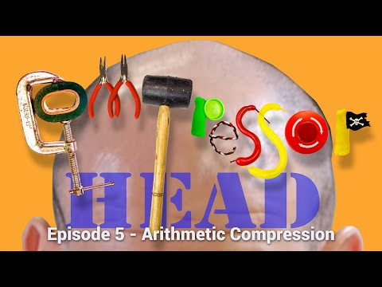

## Arithmetic Compression (Ep 5, Compressor Head) Google

** 视频发布时间**
 
> 2015年3月6日

** 视频介绍**

> Arithmetic compression represents the current dominant form of statistical compressor for most common data types: JPG, MPEG, LZMA, BZIP, WEBM, WEBP etc. It's wide range of use is dominantly because of it's un-rivaled ability to encode data as close to entropy as possible, without bloat. But what's not understood by most developers, is _how_ Arithmetic Compression actually achieves this result. Most public descriptions are mired in technical details of the transform, but don't actually describe the statistical reasoning for the compression savings. Well, Fear not, because +Colt McAnlis walks through the core concept, and how all the crazy math produces one amazing compression algorithm in this episode of Compressor Head.

** 视频推介语 **

>  暂无，待补充。

### 译者信息

| 翻译 | 润稿 | 终审 | 原始链接 | 中文字幕 |  翻译流水号  |  加入字幕组  |
| -- | -- | -- | -- | -- |  -- | -- | -- |
| Chris | lch | 程路 | [ Youtube ]( https://www.youtube.com/watch?v=FdMoL3PzmSA )  |  [ Youtube ]( https://www.youtube.com/watch?v=D3td0YmFNBQ ) | 1503070394 | [ 加入 GDG 字幕组 ]( http://www.gfansub.com/join_translator )  |

### 解说词中文版：

Colt Mcanlis： 在压缩的神秘世界里

有一种算法总是能够难到开发者

这种算法的优秀的压缩能力

得益于统计概率的伟大力量

当然  我所说的算术压缩

是一种在现代压缩技术中无处不在的

真正的统计学上的

压缩算法

你在互联网上看到的一切事物  从图片到视频  甚至是

你的文本数据  都已经

被这种算法处理过了

自己写一个算法可不是一件轻松的事儿

这要求你要凝视着一副陌生的面孔

并且接受它告诉你的一切

但是  请不要恐惧  年轻的程序员们  因为我会帮助你们

我叫Colt McAnlis  这里是Compressor Head

现在  如果你还记得的话  变长编码

简称VLCs  在输入流中占据一个特定的符号

并且给它分配一个

比特位数可变的密钥

那段VLC接着就被送到输出流当中

这样  就得到了压缩之后的数据

这里的关键是变长编码

将实现接近于信息熵的压缩

只需要符号分布的概率

和你用来构建VLC的概率表

相匹配

但是关键在于这些VLC是随着计算机中

一组特定的概率产生的

例如  呃  在这里

让我们看一下Omega的编码和旁边Rodeh的编码

如你所见  对于这两种类型的VLC

它们的每一个n所给的值都不一样

这是因为他们所假设的

统计概率不同

看  Omega的编码显示了不可能有

一大堆的最有可能的符号

如果我们以很多的

概率相近的或者相同的符号结尾

那么我们将陷入麻烦

Omega的编码偏重于由一个主要的符号占据最大的概率

而其他一切符号

则减小到一个非常小的值

而另一方面  Rodeh的编码

显示了最靠前的4个符号

在概率上非常非常接近

但是一旦碰到第八个最大概率的符号

你就会发现编码字符的大小开始急剧的增长

这意味着有一组

概率非常接近的并且此消彼长的符号

因此  你将会遇到一个问题

如果你的数据流的概率的分布

和你选的VLC集不匹配怎么办

那么  在这种情况下  你将会陷入一团糟

你将不能以最小的编码字符结尾

而且  这样以来  你压缩的数据流

也将不会和信息熵相等

这是大多数人

在实践变长编码的时候

所遇到的困难

给我们的数据使用什么样的VLC

才能得到最好的压缩结果呢

我的意思是  我们并不能通过迭代每一个VLC

来找到最好的结果

我的意思是  那只会让我们浪费更多的时间

相反  我们需要一些方法

来编码一个优化可能出现的概率表的数据流

而不是去满足一些已经存在的概率表

朋友们 这就是算术压缩

存在的意义

Jorma Rissanen 即将出版

大多数讨论算术压缩的文献

是这么表述的

[清嗓子]

（模仿书中的语气）比起给每一个符号分配一个编码字符的VLC

算术压缩给整个数据流

分配一个编码字符

这些是很优雅的说法  但是

并没有告诉我们任何有用的信息

我的意思是  这些文献里并没有告诉我们哪种编码

应该被用于我们的数据流中

如果我的输入是AZZ  我可以挑选任意数字

我的意思是  如果我选了12626  这很酷  对吧

但是那会导致数据流膨胀

或者我可以让AZZ等于1  但是这样的话

那我以后又该怎么解压缩

看  算术压缩的魔力就是

实现一种数据转换  这种转换被应用于源数据

目的是为了产生一些单一的

并且比源数据流占用更少比特位的数字

但是  我们先不要太超出自己的能力

首先  让我们来聊一聊折半搜索

我是  我是  完整的  还是不完整的

假如说  我要从数字0-9中搜索出6

折半搜索的工作原理就是把所有数分为两半

并且重复执行  直到找到我们所要查找的数

很快  我们这里最小的数是0

最大的数是9  因此  我们要找的中间数

就是5

现在  因为6比5大  那么我们就去掉小的一部分

然后现在最小的数就是5

而我们要找的中间数就是7

接下来 我们在每次迭代过程中继续这种对半分的过程

直到我们

找到我们想要的数字

但是现在的问题是 

如果在每次迭代中不是对半分整个范围内的数

而是分成3份 4份 甚至16份呢

例如  让我们把数字空间分为4份

然后当我们选择了我们想要的那一块的时候

我们把它再分为4份

这个概念所对应的

不断划分空间并进行搜索

就是压缩算法工作的基础

我们给我们的每一个符号

划分一个子空间

当我们从我们的输入数据流编码符号C的时候

我们进一步分割C的空间  按正确的顺序

分配新的符号到该空间

并且持续这个过程

我们把获得的每个单个的输入

一步步划分成更小的部分

却只需要做出简单的修改

相对于把搜索范围分成几等分

我们则是根据

在数据流中出现符号的概率

这有点像我们的码字表

因此  如果C是概率最大的符号  那么它就获得最大的空间

现在 为了做这些工作 我们需要让我们的数的范围

变得更有意义以便被真正的划分

所以  我的意思是我们不能再使用整数了

相反  我们将细分我们范围内的数

并且定义它所在的范围是0到1

然后  这就使得我们可以给每一个符号

分配一段在字符区间上的等于它自己概率的长度的区域

朋友们  从这里开始

算术压缩就开始了

但这已经足够说一阵儿了

让我们来动手做一做

让我们用R  G  B这三个符号来举例

它们各自的概率分别是0.4  0.5和0.1

现在  根据这些给定的概率

去给它们在0到1上分配相应的区间是很简单的

或者  有一种方式呈现的更加直观 

条形统计图

让我们来编码一个简单的字符串  GGB

首先 我们从输入流中取出符号G

然后 因为根据我们的概率表  G的范围是0.4-0.9

然后我们来给它划分空间

现在  我们得到了0.4-0.9之间的值

这样又得到了我们区间的最小值和最大值

即从0.4到0.59999

G最终的范围是0.6-0.84999999

B最终的范围是0.85-0.999999

现在是时候从我们的输入流中读取第二个符号了

它又是G

当我们读取B的时候 我们会再一次像那样

来划分区间

当编码完B的时候 我们最终的范围确定在0.825-0.85

这个区间就是我们最终要作为编码后的值放到输出流当中去的

现在  恭喜你

你刚才已经真正的使用压缩算法

编码了一个数据流了

现在  解码可以被看成是一个同样的过程

只是顺序反过来了而已

现在  因为我们的最终值的范围是0.825-0.85

老实说  我们现在可以把任何值放到这个范围中

来编码我们的数据流

现在让我们来随机挑选一个值  那么就0.83了

解码的过程可以被想象成

通过我们细分的范围画一条竖直的线

当我们前进的时候更新间隔

因此  如果我们以0.83开始 

落在那个范围里的符号就是G

所以我们把它作为我们的第一个符号输出

然后我们再分那个空间

然后0.83又一次到了B的空间

这是我们的第二个符号

最终0.83到了B的范围里

这是我们的最后一个符号

这下你懂了吧  算术压缩的编码和解码

都已经打包教给你了

[播放音乐]

我看上去好吗

记得这家伙吗

除了发明多变长编码模式之外

Peter Elias首次在20世纪60年代早期

提出了算术压缩背后的概念

直到10年后 

Jorma Rissanen 首次发表了一些关于符号的

的研究成果 并且随之而来的还有巨大的专利

在接下来的20年里

因为IBM执行的气势汹汹的专利战略的缘故 

算术压缩几乎没有任何发展

专利问题如此气势汹汹

而算术压缩又确实非常好用

因此 一种分离出来的编码算法 也就是区间编码

在1979年诞生了

这种算法基本上就是和算术压缩做了同样的事

然而并没有受专利的影响

这种扼杀创造力的制度

一点也不好 对吧

（“开门 查水表！”）

嗯

你知道  我真的认为这一切

都不是必要的

我的意思是  这只是一段视频上的一个评价

我们得到了什么吗

我们得到又一个授权了吗

好吧

我简直不知道在说什么

签名字

你们  当然 同样要签字

说真的 我认为

Eula Frumpkins：还有这里

Colt mcanlis：你们还需要血样 毛发

和其他的东西吗

Eula Frumpkins：只需要签字就好了

Colt mcanlis：好吧  好吧

听着  我很忙的

我可以回到我的我的岗位了吗

Eula Frumpkins：让我检查一下

Colt mcanlis：你要检查所有的吗

好的 谢谢

Eula Frumpkins：谢谢配合

Colt mcanlis：在21世纪初

专利失效了

然后算术压缩再次飞黄腾达了

使得它成为

现代统计编码方法

的金科玉律

事实上 如今的大多数压缩包的格式

比如 LZMA BZIP

声音和视频  例如JPEG WEBM和H.264

所有这些都基于算术压缩系统

作为其统计压缩的一步

因此  有了算术压缩的技术  这是比较棘手的部分

它的工作原理到底是什么

我的意思是  它的概念很简单  但是

它到底是怎么接近信息熵的

好吧  这就要从我们对概率  分布

和我们细分空间时做的每一件是说起了

让我们来尝试均匀的细分我们的空间

如果我们有10个值  并且在0.2到0.3之间细分我们的空间

那么我们就会得到10个新的范围 每一个范围以这些数开始

0.27, 0.28, 和 0.29.

看一看会发生什么

通过细分空间 

我们的范围值已经增加了一位数

如果我们就此打住

那么我们所有的输出都会是两位数的长度

如果我们对其中的任何一个再次细分

最终每个范围将会成为3位数

而且  如果我们继续细分

最终每个范围将会成为4位数  甚至更多

可以帮个忙吗  让我们快点把它翻过来吧

非常棒

非常感谢你

好的

现在  让我们不平均分这个空间

并且  只是为了论证一下

就取这个空间的9/10这个范围

现在我们得到的范围是以下面的数开始 0.2, 0.291, 0.292,

0.293, 0.294, 0.295, 0.296, 0.297, 0.298, 和 0.299.

现在  看仔细了

每次我们在第一个范围中  也就是0.2-0.291

我们将能输出更少的位数到输出流中

最好的是  我们可以轻松的使用0.2这个下限

这个数小于我们范围内

任何其他的起始数值

并且  我们最终根本不会将任何新的位数

引入到我们的输出编码中

即使我们深入到这个二叉树的第10024层

选出它的第一个范围也会输出更少位的数

到我们输出流中  并且  在最佳情况下

根本不会产生任何新的数

这种基于符号概率的单位空间偏移量的思想

使得让算术压缩

成为统计学的压缩算法的核心

更有效的是  符号的概率越多

输出到编码的数字越少

当一切尘埃落定的时候 

算术压缩可以不断的接近任意数据流的信息熵

不论数据类型

和符号分布的概率

这种专注让算术压缩好像是

统计压缩的一把瑞士军刀

但是  在压缩程序员之中

有关哈夫曼和算术压缩之间

存在着巨大的争论

一些人宣称  哈夫曼国王已逝  算术压缩永存

而同时  其他一些真正的信徒则宣称

哈夫曼压缩依然不过时且很好用

只不过是衍生成了另一个名字  动态哈夫曼编码

但是这又是另一个不同的故事了

我是Colt McAnlis

感谢您的观看

