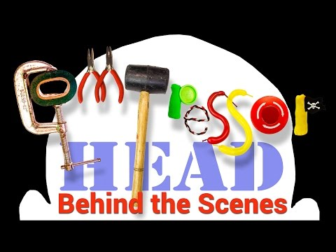

## Compressor Head - Behind the Scenes

** 视频发布时间**
 
> 2015年3月20日

** 视频介绍**

> Compressor Head is the playful, and informative source of knowledge around algorithmic compression. Join Google Developer Advocate Colt McAnlis and Director Brian Grady behind the scenes and learn about the magic and mania that makes Compressor Head tick.

** 视频推介语 **

>  暂无，待补充。

### 译者信息

| 翻译 | 润稿 | 终审 | 原始链接 | 中文字幕 |  翻译流水号  |  加入字幕组  |
| -- | -- | -- | -- | -- |  -- | -- | -- |
| brite | 段威 | 程路 | [ Youtube ]( https://www.youtube.com/watch?v=MvxQkVnpPc8 )  |  [ Youtube ]( https://www.youtube.com/watch?v=MDgu5F0--rA ) | 1503210441 | [ 加入 GDG 字幕组 ]( http://www.gfansub.com/join_translator )  |

### 解说词中文版：

唉哟  老兄

我觉得  让Compressor Head火起来的原因之一

真的就是我们两人之间的

充满活力的互动  

哎哟  兄弟

我们能再来一次吗  

还要再来吗  

当然要  Compressor Head是

一个知识的大观园

这是我采取的方式

尝试去重燃人们对这门冷落了的计算机艺术的热爱 

那么问题来了

压缩算法到底怎么工作的 

即便你计算机科学读到了博士学位

你也未必能领会到压缩的

核心算法之奥妙  

我从来都没领会到

你如何能把最复杂的知识

传授给一个3岁小孩呢

你不会用电脑的

你也不会用图表

你会用一些颜色很亮的方块和贴纸

去演示它们在空间里的动态

而且我说过  如果我那样去教一个3岁小孩

压缩算法

他要是能听懂就肯定会成为程序员

哈

我记得我们俩儿第一次内部展示的时候

我们想把这个亮点子做出来

用玩彩泥的形式来讲压缩

是啊

但是听我们讲的人都毫无反应

他们一脸困惑

我们拍了个视频小样

但没有告诉任何人

然后当我们把这个视频呈现给人们的时候

它像病毒一样的在人群里传播开来  如果你还记得的话

很突然的  我的大大大老板也看到了

而且他们很喜欢  觉得这很赞

他们还想看更多的

然后突然  过了一夜  每一个人

都想看Compressor Head

在这个系列视频里有某些东西是专门为你准备的

这系列视频是真正的Brain版本

它有别于我们以前做过的任何事

这就是Compressor Head的法则

你不能把拍摄用的木条都从外面搬来吧

要用的东西基本都是就地取材

在谷歌  这个地方叫做工作间

它就是一个用来

共享与合作的地方

我们可以进来

把它当成一个工作室

还有其他很多的可能性

在这里有好多的废旧物品可以让我们大干一场

以至于我们可以把Colt的灵感变成现实

并在我们开始拍摄之前制作出完美呈现

这些灵感的物件

还有对于Compressor Head的狂热

表现为在开拍前5分钟我们没有一个人知道

我们正在做什么

表现为我们所有在拍摄现场  所有围绕着它的人

都不得不强装镇定  真的是这样

灯光师可不喜欢这样

这两个人最终创造了

Burrows-Wheeler变换算法

对我来讲  神奇之处在于真正的见到了Mike Burrows

或者  就像他所喜欢的别人在网上对他的称呼一样

 Mike ＊＊ Burrows

那是他一贯的风格

Mike是Burrows-Wheeler变换算法的共同发明者

他在谷歌工作

他是一个迷人的男人  但当你和他谈论到

Burrows-Wheeler变换算法的缘起

你会觉得这可以改编成电影啊

这段故事太神奇了太带感了

怎么就没人知道呢

甚至为什么没有公开呢

为什么连在维基百科的页面上都找不到  咋回事

只要是有机会去见到一个参与此事的人

我都有点儿时追星的感觉了

我特别亢奋

有一次他这样把自己手给夹了

特别逗

你知道我心目中的第二是谁吗

恩？

是的  老兄

就这么干吧

好

真的喔

Magnus在里面好强悍

这就对了！

如果你一直在看Play Service's What New系列视频  

主持人就是Magnus

而且Magnus如此精力过人

我们都自叹不如

然后第三位是Joanna

你还是去忙你自己的事吧

告诉他们怎么正确地压缩

Joanna工作很出色

她其实没必要那样子

她真的非常讨厌我

也讨厌我的所为  那可是太好了

我们来谈谈动态算法

我有事要做哈

她对你不太感冒哈

的确如此

不管怎样  我们正尝试一堆不同的事情

告诉我们  你喜欢哪样的

我们拍了第二季

因为人们总会围着我

希望看到更多的内容

这就是为什么我们为开发者做这些事儿

如果开发者还需要更多的东西

我们听到他们还有更多需求

我们也会很快去忙活第三季

和Brian共事  感受最深刻的是

他的耐心  让我很是钦佩

你看  有这些到处走的疯狂秃头佬们

嘴里还喊着 快看这些疯狂的玩意儿

所以需要我们去协调

拍摄的画面角度以及来回的走位

Brian拍过电影

对这些乱糟糟的事情非常有耐心

然后拍到最后

一切都搞定了

像变了魔法一样

这是Brian的能力体现  他让神奇诞生

确实很酷哈

我玩得很嗨呀

就是我们喜欢互相吐槽

我们才会成了一个好的团队

不是因为荤段子嘛

我要是想和这里的某人共事

必须是某个能和我一起疯的人

我要做些有趣的事儿

他很出名  与他共事的伙伴都会表现得更好

我颇具同感

对于压缩所学良多  以前从未有过

虽然  我也想那样

那确实是我在工作中收获的最大乐趣

搞定

搞定嘞

好样的

噗！

我是Colt McAnlis  这里是Compressor Head

