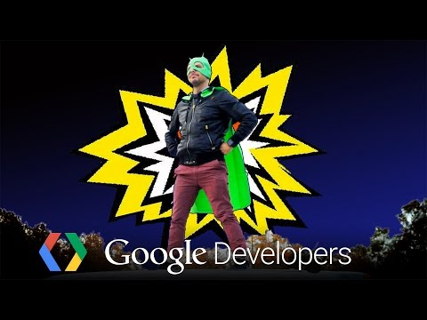

## Google Developers 

  

** 视频发布时间**
 
> 2014年12月30日

** 视频介绍**

>  Google Developers YouTube channel provides developers with the latest news and best practices for designing, developing and distributing your web and mobile applications. Take advantage of this resource by subscribing to http://youtube.com/googledevelopers. MTV

** 视频推介语 **

>  暂无，待补充。

### 译者信息

| 翻译 | 润稿 | 终审 | 原始链接 | 中文字幕 |  翻译流水号  |  加入字幕组  |
| -- | -- | -- | -- | -- |  -- | -- | -- |
| 姜昭宇 | -- | ——| [ Youtube ]( https://www.youtube.com/watch?v=zua0_IXcPFY )  |  已发布  | 1501150369 | [ 加入 GDG 字幕组 ]( http://www.gfansub.com/join_translator )  |

### 解说词中文版：

欢迎

嗨

大家好

我是Rich

我是Google Play的Mark

非常感谢你

能在这里真的很好

我的名字是Stu Anderson

并且我是Google Play教育团队中的一员

嗨

我是Bethany  一名来自Google的设计者

我们将在未来十年中尝试去做的事情之一

就是结束审查制度

我的下一个预约内容是什么

今天下午4点  Android汽车将每月自动更新

这里是一个不可思议的地方

这个地方每天都有很多伟大的东西被创造

我要增加一个元素以便让我们深入研究

这个节目的特色是给创业公司提供一些可执行的方案

欢迎来到实验室

千兆字节

额  好的吧  为毛这家伙到处都在呢

我认为这真的是相当棒的

建立更好的应用

每次说到iOS的时候你都会粗线

非得要这样嘛

这些就是这次的所有内容了

