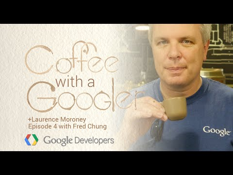

## Coffee with a Googler: Chat with Fred Chung about developer advocacy

** 视频发布时间**
 
> 2015年3月6日

** 视频介绍**

> In this episode of Coffee with a Googler, Laurence chats with Fred Chung about developer advocacy, and how it is a two-way street. We talk about how the developer platform team at Google operates, giving you a peek behind the scenes about what we do and why we do it.

** 视频推介语 **

>  暂无，待补充。

### 译者信息

| 翻译 | 润稿 | 终审 | 原始链接 | 中文字幕 |  翻译流水号  |  加入字幕组  |
| -- | -- | -- | -- | -- |  -- | -- | -- |
| 贺颂 | xin.zhang | -- | [ Youtube ](https://www.youtube.com/watch?v=KDb4SyFtylU )  |  [ Youtube ]( https://www.youtube.com/watch?v=vMkKZswEZpo) | 1503070395 | [ 加入 GDG 字幕组 ]( http://www.gfansub.com/join_translator )  |

### 解说词中文版：

欢迎来到谷歌总部

今天  我们要访谈的是Fred Chung先生  他在谷歌这儿的工作

实实在在的让你的生活更加便捷

他致力于为我们和开发者的交流方式制定战略

来帮助我们开发更好的产品

也帮助你们制作更好的APP

我心底期盼这一天已经很久了

真的很久了

FRED CHENG  我也一样

LAURANCE MORONEY  因为同优秀的开发大使

交流总是一件令人感到高兴的事

FRED CHUNG  还要谢谢咖啡招待

LAURENCE MORONEY  哦  你太客气了

不过咖啡的确不错

而且是真的咖啡

笑声

那么跟我们讲讲你自己吧  是什么让你来谷歌的

现在具体工作是什么

还有你是如何一步步走到今天的

FRED CHUNG  当然 没问题

就是关于我自己的一点背景信息嘛

在谷歌工作之前  我曾是ENTERPRISE INTEGRATION SPACE

的一名软件工程师

LAURENCE MORONEY  所以你是个货真价实的码农

那跟市场可不沾边

FRED CHUNG  我确实敲过代码

[听不清]  上班嘛  你懂的

然后我加入了谷歌  成了一名销售工程师

并且和AdWords API的客户一同工作

使用AdWords API帮助他们与AdWords结合在一起

这是一个基于SOAP的技术

LAURENCE MORONEY  当然我们都还记得SOAP  对吧

FRED CHUNG  那必须  我们那会儿玩的很爽

然后我就转到了安卓部门成为了一名开发大使

那会儿大概是安卓2.0的时代

哇哦

老久了

FRED CHUNG  还记得代码名字吗

LAURENCE MORONEY  叫Eclair

安卓甜点我从不会忘

FRED CHUNG  没错

我们不论是在平台还是在前端应用生态系统

上都取得了很大的进步

我记得第一批展示演讲任务中的一个

是要去巴塞罗那  一个巴塞罗那的会议

然后给听众讲什么是安卓的话题

在那时候  安卓还是很新奇的移动设备操作系统

我只能说  还行吧  这玩意儿有照相机功能

还有几个传感器

那时候我们获得了很多的乐趣

自从那时起  一切有了显著的发展

LAURENCE MORONEY  经过了比较长的一段时间

FRED CHUNG  就我们所看到的

开发者这几年的作为

看到这些很精致的应用如雨后春笋般出现

是很让人惊喜的

LAURENCE MORONEY  同时  随着更先进的设备

和它们更广大的神通

消费者们更迫切需要新类型的应用

和新的应用  开发者们

不得不尽力满足复杂的需求

蛮大的挑战  不是吗

FRED CHUNG  是啊

就安卓平台来说  我们不仅有了电影和平板

还有你手腕上的安卓穿戴设备  安卓电视

交通工具里还有Android Auto

那么这些就为开发者们带来了

许多新的机遇

我们正处于一个激动人心的时代

LAURENCE MORONEY  棒棒哒

开发者想要能够满足这些复杂的需求

也需要很多的支持

所以我认为这就是你充当安卓平台经理这个角色的

切入点

那么当人们在安卓平台和

谷歌平台持续深入地时候

他们就需要学习如何完成所有这些新的事物

这也就是你大显身手的地方了  对吧

那来跟我们讲讲DPM到底是干啥的

FRED CHUNG  行  DPM是开发者平台经理的缩写

先来聊点关于开发者平台的事儿

开发者平台到底意味着什么

纵观谷歌  其实我们很少提供允许第三方

开发者构建创新的解决方案的产品

例如  谷歌地图应用接口

它允许移动应用开发者  包括安卓的  IOS的

和基于网页开发的  可以很轻松地将地图应用整合到

他们自己的方案之中

还有Google Play游戏服务

也允许游戏开发者设计出更多吸引人的游戏

给用户花时间同它们一起玩耍

LAURENCE MORONEY  还有那些常用功能

如高分排名表和类似的东西

FRED CHUNG 是啊  排行榜  过关模式

等等类似的东西

但关键是在我们眼中这些API产品和

平台还有工具都是为开发人员平台的

LAURENCE MORONEY  我懂了

FRED CHUNG  同时作为开发者平台经理

我的工作贴近安卓产品和工程团队

来同他们一起制定开发者产品的

推广策略

LAURENCE MORONEY  酱紫  如此说来你就代表开发人员

与工程团队一起倡导

或者反过来说也一样

FRED CHUNG  没错

实际上我们把对开发者的倡导看做双向沟通

我们不仅仅要通过相关的机会

启发激励开发者

的新的风格  最佳实践

和第三方完善方案  还希望借助这些机会

来倾听开发者的声音

实际上  在线上线下我们都有

多个频道

所以如果你在线的话  就安卓来说

我们有Google+ 上的安卓开发者

LAURENCE MORONEY  那个交流社区很大

FRED CHUNG  没错  社区里每天都有

很多活动和巨大的信息量

这是很让人兴奋的

对于线下现实世界

我们也同安卓开发者小组共同战斗

我们总和他们组队举办各种活动

这也是一种从开发人员那里获得反馈的

很好的渠道

LAURENCE MORONEY  棒棒哒

所以有开发者在看这个栏目的话

如果很想给我们一些反馈  他们就可以通过这种方式达到目的

他们既能上Android+网站

又能去谷歌开发者小组参与讨论

我们有很多新的小组  酱

FRED CHUNG  这个不错

所以如果你有让人感兴趣的方案

不妨也通过以上渠道中的一种告知我们

我们很期待从创新方法中受到醍醐灌顶的启发

LAURENCE MORONEY  我们经常听到这个叫做

开发者体验的概念

确实好的开发者体验是很重要的

开发者体验对你来说是什么呢

到底什么是开发者体验  在谷歌我们能做些什么

来提供上乘的开发者体验

FRED CHUNG  开发者体验是一个很广泛的领域

但是我们特别关注比如接口设计等方面

我们要确保融于接口中的设计是能够

被开发者接受的

这些设计必须遵循开发者们熟悉的

语义规律

举个栗子  我们最近拓展了支持库中的

通知应用接口  使得它不仅支持手机

和平板电脑  还支持Android Auto 和安卓穿戴设备

这些新型要素

我们想要确保这些设计参照一定的标准

这也是为什么我们在支持库里有如车拓展

和可穿戴拓展的原因

LAURENCE MORONEY  这么说我们建造了核心应用接口

但是随后又能在新产品出现的时候

不断扩展支持

FRED CHUNG  一点儿没错

再说到开发人员教育

我们得确保有足够的内容

不论是在developer.android.com

我们为教育开发者所提供的最好的官方文件站点

还是与主题特色相关的接口

LAURENCE MORONEY  而且那里也有一些很好的范例

大家可以下载下来仔细分析

和借鉴学习

FRED CHUNG  说的不错

我们希望通过教学典例来帮助开发人员

领会特定的功能

同时  我们也要强调的是最佳实战

LAURENCE MORONEY  不久之前我们聊到

线上新的复杂需求是如何产生的

那么当下使得开发变得困难的东西是什么

开发者可能面临的共同挑战有哪些

FRED CHUNG  准确的把握用户体验

是所有开发人员都需要意识到的重要的事情

并且我认为这也是当前所有开发人员都

不得不面对的共同挑战

举个栗子  如下的不同大小屏幕

你没必要在这些屏幕上适配已有的手机

应用

既不想把应用缩水到你的手表大小

同样你也不想把它拉伸到

大屏电视大小

你得三思在这些形式的设备上的

用户体验的微妙不同

如果能接触到设计师  尽量和他们一起工作

如果接触不到设计师

在我们的文件站点上  也有

一些以设计为核心的内容

而且在yutube频道里还有我们的攻城狮

和设计内容

LAURENCE MORONEY  棒棒哒

这个不只是在谷歌打造中的Android Studio里

在不同的设计形式要素里也有模板吧

FRED CHUNG  对的

咱们来说说Android Studio

Android Studio实际上是一个给安卓开发人员的集成开发环境

LAURENCE MORONEY  安卓一枝花  人人都爱他

FRED CHUNG  那必须的

在Android Studio里  我们添加了

用于新项目的模板

所以如果你在开发新的项目

就可以选择性的添加附加功能

比如说对穿戴设备来说可以添加安卓手表支持

给应用添加Google眼镜支持

此举用意在于让开发者专注于

自己的专业知识领域

至于制作模板来让中间的生成过程变得自动化

就让我们来操心

LAURENCE MORONEY  原来如此

要是开发者开发体验丝滑顺畅

用户使用体验也会是杠杠滴

FRED CHUNG  没错

LAURENCE MORONEY  说来你在谷歌作为安卓平台经理

工作也有一段时间了

你同开发者打过交道

也见识过所有这些对开发者来说很棒的机遇

像互联网啊  云计算啊

还有可穿戴设备和移动设备

对开发者们来说  我敢确信他们

在下一个伟大的机会到来时

关注从哪里开始可能也有点困惑

你有好的建议吗

FRED CHUNG  我认为移动设备平台始终是开发人员

应该花大心思的一个

重要领域

当你回首移动设备应用的时候  它们中的许多

在背后实际上都是被某种云计算推动的

所以同时关注这两大领域也是极好的

LAURENCE MORONEY  差点忘了

在这些全速发展的时候  必然会有新兴市场

云计算和移动终端会在新兴市场里占据大量份额

那么你对于安卓开发者求索

杀入这些新兴市场寻找新的用户基础的路

有什么建议吗

FRED CHUNG  我觉得新兴市场

是特别让人感兴趣的一块

因为脑补新兴市场里的用户如何

访问互联网

他们用的不是点击桌面图标而是手中的智能机和大腿上的平板

LAURENCE MORONEY  这么说  就算是在新兴市场里

也会有使用手机的用户

当然也会有可能断开连接的情景

许多新兴的企业

他们不具备同发达地区如东亚

或者西欧 美国和加拿大同水准的

网络基础设施

对于建设搭造那些东西的开发人员来说

挑战就更加独一无二了

FRED CHUNG  这对于开发人员的暗示

就是当你在搭建你的应用的时候

要考虑到这些场面

你得确保你的应用具有

离线运行的能力  或者你的应用

无论在什么网络情况  内存性能  和CPU配置的条件下

都能高效运行

LAURENCE MORONEY  棒棒哒

还有  我理解你组合了很多

资料来帮助开发人员解决这个问题

围绕这个问题做了DevByte系列视频

那个后来叫啥来着

我记不得

FRED CHUNG  你说的没错  这个团队

已经放出一系列DevByte视频称作

安卓性能模式

LAURENCE MORONEY  是  是叫性能方式

性能是很重要的

FRED CHUNG  性能很重要  你也这么觉得吧

所以在只做自己的应用的时候

总要把流畅运行放在第一位

LAURENCE MORONEY  说得对  说得好

那还有其他什么事的你想对开发者谈起的

或者你想从开发者那里听到的吗

FRED CHUNG  如果你在考虑设计一个平台

设计应用接口  这活儿不好做

很艰难

尤其是第一次尝试的时候想把它做对

LAURENCE MORONEY  我们也希望帮助开发者把它做好

FRED CHUNG  而且说实话  我们也不总是能

把它做的很正确

所以这就是为什么我们想要聆听开发者

其实我们把这种提倡看作双向通道

我们不仅仅想把典型案例教给

开发者们还希望借助这个机会

从开发者身上借鉴

借鉴他们的痛点  他们的难点  他们面临的挑战

和他们对产品改进的建议

同时我们要做的事情大部分

是和内部团队  产品以及工程团队合作

来提供我们从开发者身上得到的反馈用以

改进我们的产品

LAURENCE MORONEY  Fred 跟你聊天获益匪浅啊

真心感谢

而且了解谷歌是如何在

提倡行为中作为双行道和谷歌如何从开发人员身上获得反馈

感觉棒棒哒

还有开发者朋友们  请好好利用这些信息

所有Fred提到的沟通方式

都在屏幕下方

在这次访谈结尾也将显示

听君一席话胜读十年书

我们想建立更好的应用程序接口和

更好的平台来

为大家开发APP提供更好的保障

谢谢大家观看这集"Coffee 

更感谢Fred莅临此地

作为我们的特邀嘉宾

FRED CHUNG  谢谢你们的邀请 Laurence

