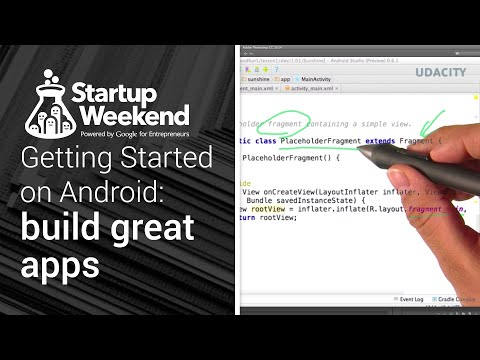

## Getting started with Android: A crash-course in developing for Android

** 视频发布时间**
 
> 2014年11月17日

** 视频介绍**

> Preview the full Udacity course and get started building your Android app, or get the full course at https://www.udacity.com/course/ud853. Android Developer Studio resources are available at https://developer.android.com/sdk/installing/studio.html

** 视频推介语 **

>  暂无，待补充。

### 译者信息

| 翻译 | 润稿 | 终审 | 原始链接 | 中文字幕 |  翻译流水号  |  加入字幕组  |
| -- | -- | -- | -- | -- |  -- | -- | -- |
| 素年待锦 | 韩晓健 | —— | [ Youtube ]( https://www.youtube.com/watch?v=brW2DYHdDmk )  |  [ Youtube ]( https://www.youtube.com/watch?v=U6aBXZIFUHQ ) | 1504120601 | [ 加入 GDG 字幕组 ]( http://www.gfansub.com/join_translator )  |

### 解说词中文版：

欢迎来到  安卓开发起步

这是一次安卓开发的速成课

通过这次简短的视频你会发现

安卓开发有多么容易上手

不论你之前尝试过多少次亦或这是你第一次码代码

有些东西每个人都要了解一下

在你创建之前  你要和你的团队

商量好一些重要的问题

比如说是做app还是做移动网站  以及你要给用户带来

哪些体验

你也要预先调查确立

你希望用户能够通过你所创建的内容做些什么

如果你已经做好了决定

那就带上你的产品原型  让我们开始吧

如果你还未安装

请先通过下面提供的链接安装

内含具体介绍

打开Android SDK Manager

你会看到有哪些已经安好的工具 平台 以及组件

在我们以上所提到的地方  我们可以使用安卓L

但它依然处在开发预览模式下

这就意味着到官方发布前会随时更改

如果以安卓L为开发平台的话

你将无法向Google Play上传

所以我们还是希望能够使用最新最稳定的平台

取消其他所有的package

只选择安卓API Level 19

我们希望SDK和SYSTEM IMAGES都给模拟器

我们也希望Android Support Library向下兼容性

我们使用Gingerbread即Android 2.3的最新版本API Level 10

因为它修复了API Level 9所没有修复的bug

接下来我们点击NEXT

我们将使用Blank Activity with Fragment模板

考虑到背景内容

Activity是用户界面的表示层

而其中的Fragment代表着

屏幕的行为或其组成部分

稍等一下

然后我们点击这个按钮来运行这个app

它会显示提示对话框让我们选择设备

在没有实际设备的情况下

我们可以使用模拟器  它包含在Android SDK里

现在它提示没有可用的安卓虚拟设备

所以现在让我们打开AVD Manager  新建一个虚拟设备

点击NEW

通过创建AVD  我们可以配置了一个模拟设备

的安卓版本

我们可以在其中进行测试  就像在硬件上一样

在它打开之后  我们看到Sunshine app显示了一行文字

下面我们需要开启USB调试

这个可以在设置中的开发者选项中找到

为了找到隐藏菜单  我们先去  设置

向下拖动到  关于手机

找到  版本号  然后点击七次

当你回到  设置  页面时

你会发现  开发者选项  出现了

现在在Android Studio中  你可以点击Play按钮

来使app在你的设备上运行

在设备选择对话框中  你会看到你所连接的设备

为了防止对话框再弹出 选中这个选项

然后点击OK继续

过一会儿  你就会在手机上看到它

在设计方面  我们也有一些手段

也就是线框图  或者说低分辨率线框图

假设你的用户有个任务想完成

比如说  我想吃饼干

最起码  我要买点饼干吃

你就需要考虑

要完成这个任务你的用户需要做哪些步骤

而这是个很简单的例子  因为只有一个任务

那么步骤就是登录  选择你要的饼干

付款  然后你就可以享用它们了

所以当我们像这样详尽地

列出这些步骤时  它们的每一步

就像JAVA中的接口一样

很显然

你在考虑接口时

有些是不需要实现的

因此你不必完全把底层细节考虑进来

但你需要考虑

接口与其他接口和类连接的规范

在这样的情况下  你回顾步骤时

你会发现它们之间如何互相连接

不要单纯地关注一个步骤而忽视其他

你要思考整个版图

这儿有正确的流程

关于用户如何与app发生互动

但是到目前为止还没有最终的视觉效果和感受

我们会逐步建立  现在让我们通过Main Activity开始

然后我们就会去做Detail Activity

最后我们会建立平板UI

在你打开app时MainActivity的就启动了

在MainActivity的底部 有PlaceholderFragment

是由我们创建project时由模板生成的

Fragment是你的activity中的模块化容器

在接下来的课程中  我们将会学习

如何在一个activity中使用多个fragment

与此同时  我们也会说明我们为什么要使用它们

但是现在  我们的activity只包含了一个fragment

在PlaceholderFragment中

我们会考虑界面资源布局  也就是fragment_main

这个xml文件在我们的项目文件夹下的

resource目录  即res中

除了布局你也会看到各种资源

比如说资产设计 drawables和string文件

当我们的组件运行时

它会创建PlaceholderFragment 它可以将xml中定义的布局找出来

把xml文件中的内容转换成

存储中的视图对象层次结构

通过控制Control或Command  选择哪个依赖于你的操作系统

然后点击超链接到fragment_main

Android Studio会把我们带到Visual Layout Editor中

我们操作布局xml文件时

我们可以随时在Design标签之间切换

我们可以通过它拖放新的元素或者修改布局

在Text标签里  我们也可以编辑

规定布局以及UI元素的xml文件

为了在安卓中创建用户界面  我们使用view类

我们的显示屏是矩形的

可能会看到也可能看不到边界

从本质上来说  view类处理绘图和事件

安卓中所有的基础部件都可以从基类中添加

安卓设计指南上有关于

app基础设计的可视化例子

花费数小时来制作出完美的效果

如果把屏幕横过来

你的界面布局会变成什么样呢

或者将它在一个更大屏幕的设备上运行

有个好消息就是安卓平台提供

非常棒的工具来帮助你改善显示

你需要理解他们来使你的app

看起来效果很好  不论是在手机  平板

或者其他你希望运行你的app的设备上

今天  手机和平板的区别正在逐渐消失

所以考虑界面在各种屏幕上如何展现

至关重要

不要茫然不知所措

就像给网页设计响应式布局一样

把你的布局做得合理而灵活

而且要符合常见的设备尺寸

这样你就可以设置分支  为不同的尺寸

提供不同的布局

大体了解了安卓相关资源

从字符串到布局  以及图形绘制和动画

它们都在你项目的res文件夹中

你已经把字符串放到了xml文件中

它存储在values文件夹中

你也会把布局放在layout文件夹中

你也知道在xml文件

或者代码中使用@标记来引用资源

在运行时

安卓会为你嵌入对应的资源

是不是很棒呢

下面这些东西会变得更加有趣

安卓平台能够让你创造不同版本的资源

你可以将所有的资源放到

不同限定词的文件夹中

我们利用连字符来隔开限定词

我们添加的限定词可以基于任何事情

比如语言或者设备是否支持方言

触屏的类型 设备像素密度

屏幕的方向  

当然响应式设计最重要的是

让最小的屏幕支持你的布局

这只是个有关安卓开发

简单的介绍

你可以通过Udacity的课程来学习

全部的内容  也可以访问

安卓开发者网站

如果你决定在安卓发布并受益

你就要找出我们最棒的资源

包括对初创公司的品质核心指南和引入市场流程

它们都在g.co/launch上

祝安  快乐敲代码哦

