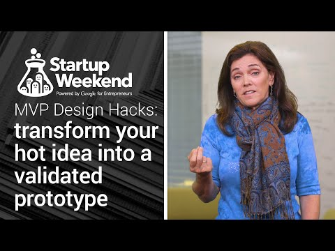

## MVP Design Hacks: transform your hot idea into a validated prototype

** 视频发布时间**
 
> 2014年11月17日

** 视频介绍**

> Join designer, entrepreneur, and startup coach Amy Jo Kim as she coaches you through defining your Minimum Viable Product. Join a Startup Battle event at http://www.globalstartupbattle.co/, or a Startup Weekend event at http://startupweekend.org/. Learn more about MVP design hacks at www.mvpdesignhacks.com. View all Startup Launch resources at http://g.co/launch. For startup specific video content, subscribe to the Startup Launch YouTube channel here: http://goo.gl/vf6Ngg.

** 视频推介语 **

>  暂无，待补充。

### 译者信息

| 翻译 | 润稿 | 终审 | 原始链接 | 中文字幕 |  翻译流水号  |  加入字幕组  |
| -- | -- | -- | -- | -- |  -- | -- | -- |
| 素年待锦 | 葛伟 | —— | [ Youtube ]( https://www.youtube.com/watch?v=brvh8NreUwE&list=PLOU2XLYxmsIK4Kyt5EY-iJY3c7YsSNC8i&index=3 )  |  [ Youtube ]( https://www.youtube.com/watch?v=bkW3dxtoJ5k&index=12&list=PLvivLNHqjoowK2IZ9j_NYIucUrGgdiDrT ) | 1504120602 | [ 加入 GDG 字幕组 ]( {{ book.host }}/join_translator )  |

### 解说词中文版：

大家好  我是Amy Jo KimHi  是个设计师  企业家  同时还是个启蒙师

我带领过很多新人以及游戏工作室的新手

以便于帮他们将想法变成现实

这需要创建MVP  也就是Minimum Viable Product

通过不断地尝试  我已经摸索在创新的初期阶段

出什么样可行  什么样行不通  

我把这些课程整理为一个系列

我把它叫做  MVP Design Hacks

今天我要教你一个快速有效的方法

这有助于你迅速掌握相关知识

也就是MVP Design Canvas

这儿给你的团队

一个相当实用的工具  它可以清楚地表现和展示

你的产品战略和关键假设

你可以记录你的灵感

有关于你的用户群体 他们的需求

你需要解决的问题  你会面临的困境

这有助于你解决以上的问题

这需要你的解决方案  不公平的优势

亦或是你们团队所具有的竞争优势

让你更完美的解决这个问题

早期的指标是用来衡量你是否

走上正路  最终

这个需要加入到这个项目中的关键假设

需要通过测试来决定

这是否是个值得推行的决定

你需要使用canvas元素  在你测试并改善假设的过程中

贯穿整个开发过程

向你的团队  投资人或者有兴趣的人

补充或者交流你的新的视觉策略或者方向

它在很大程度上能够帮你和你的团队

在战略上保持一致

我们看看它如何工作的

我先给你讲个故事 有关于最近我所服务的顾客

暂且把他们叫做Toy Co吧

他们是Collaborative Consumption的一部分

它们是个玩具租赁公司

专注于制作玩具

我们用问卷来指导工作

也由此发现了很多无法回答的问题

有些事明确的假设

和许多公司一样  Toy Co也是为了解决一个问题而起家

他们有个想法  数字社区中的人们

可以通过对玩具共同的喜爱而联系到一起

这对公司来说很棒

这是他们的驱动指标

特别是满意度的保留

以及租金的使用时间

所以我们把它当成一个起点

并从我们的设想慢慢具体化

在完成Design Canvas后

我们的猜想更加明确 我们准备进行测试

以便于找出我们用户真正的需求

通过一系列的调查和访问

我们找到了早期用户

并通过草图表达出我们的想法  并落实下来

这儿是我们的一些感受

首先 我们来看看解决方案

我们发现 实际上我们所交流的人中并没有

对我们所想处理的问题有兴趣

但是 他们对和玩具有关的视频有兴趣

因为它可以帮他们取悦并教育他们的孩子

以便他们自己不被打扰

我们从采访中发现了这些

我们发现早期的用户有难以满足的需求

而我们对此一无所知

他们所需要的是具有辅助功能的 有益健康的

以及宜家的  他们

相信它能够帮助孩子们建立正确的玩玩具的习惯

对小孩来说 当他们处于某个特定年龄时

这就是他们所有的念想

而父母 爱好者

早期的支持者 都很清楚地知道这就是

他们所寻找的东西 而且他们没有找到

所以产品的价值就此显现 这比联系其他父母更有价值

也就是丰富视频内容

父母相信可以把它给他们的孩子看

所以他们可以打电话 用餐

在每天留点时间和她们的丈夫共享

我们发现这是我们所没有发现的需求

因此我们改变了自己预设的想法

成为这个视频集合

结果 我们的MVP变为成为YouTube视频集合

我们自身并没有在技术方面做太多

只是扩展了一些内容

并通过使用YouTube平台给用户进行测试

不公平的优势依然存在

基本指标也几乎没变

我们测试的假设

让我们关注到数字社区

这以我们成员需求为基础

也不需要独立的技术

或是写任何代码

这就是MVP的力量

通过canvas来思考并测试你的猜想

希望这个例子能够启发你

用自己的想法来尝试

这是具体化的好办法

而且可以形象地描述你在做什么

这也是个很好的工具  让你改变并交流

产品的变化

如果你能把无谓的自信放到一边

以科学的工作去面对

并与用户一起  通过严谨的测试

把MVP想法落实

你就能节省时间  金钱  并大幅度

增加你成功的几率

祝你交好运

一定要去MVP Design Hacks寻找更多信息

你会看到更多的干货 八周计划

这都有益于新手使用MVP

谢谢

