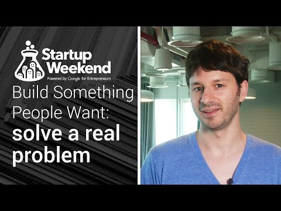

## Build something people want: Solving real problems

** 视频发布时间**
 
> 2014年11月17日

** 视频介绍**

> Designer, developer, and founder David Katz explains how he coaches startups to define their problems and stay focused.Join a Startup Battle event at http://www.globalstartupbattle.co/, or a Startup Weekend event at http://startupweekend.org/.View all Startup Launch resources at g.co/launch.For startup specific video content, subscribe to the Startup Launch YouTube channel here: http://goo.gl/vf6Ngg.

** 视频推介语 **

>  暂无，待补充。

### 译者信息

| 翻译 | 润稿 | 终审 | 原始链接 | 中文字幕 |  翻译流水号  |  加入字幕组  |
| -- | -- | -- | -- | -- |  -- | -- | -- |
| 素年待锦 | 苏楚霖 | —— | [ Youtube ]( https://www.youtube.com/watch?v=7kPrLMchT5o )  |  [ Youtube ]( https://www.youtube.com/watch?v=LqPzUYv_jCo ) | 1504120605 | [ 加入 GDG 字幕组 ]( http://www.gfansub.com/join_translator )  |

### 解说词中文版：

大家好 我是DAVID

我是一名设计师 开发者 也是个创业者

在过去的七年里我已经创建了三个公司了

最近我正为谷歌做一些工作

帮助他们着手进行教育项目

这一年来我对于创业方面做了很多演讲

在伦敦 特拉维夫以及里约热内卢

我对这个社区接触得很多

我接触过许多新手 少说每年也有一百个

这确实帮助我模式识别的发展

今天我想和你讨论的是

什么听起来是是可行的

也就是构建某些解决人们需求的东西

众所周知 大多数创业者并不成功

它取决于你如何衡量

但是70％乃至于90％的人都无法成功

究其原因

并不是他们没有做出什么

实际上他们都有做出产品

特别是那些团队里有工程师的人

之所以大部分新手不能成功

是因为他们的产品不是人们需要的

你要知道 新手会遇到各种不可思议的问题

人们不可能缓下脚步等待

新人推出新的产品

他们并不指望变化

所以如果你指望人们使用你的产品

你需要为他们切实解决问题

通过不断地调整

使它比原来好无数倍

稍微好一点点

是永远不够的

因为人们对变化都是有所抵触的

另一个需要把它做得

比原来好很多倍的原因是

绝大多数时候产品的初次使用体验

并没有那么好

所以总会有你没预料到的问题

大多数情况下你也难以很好地描述他们的优点

和它们的价值所在

你也不知道如何找出

从哪里引进合适的人 合适的用户

以及合适的顾客

创建一些更好的东西

更容易推进整体的发展

所以 你应该如何把产品做得更好呢

有一点明确不要做的是

参照竞品 并比较各个特征

只想着把它做得更好

如果你想做得更有意义

恐怕需要再做点别的

需要来点新的尝试

需要对问题有全新的理解

找出你的竞争者所没有发现的问题

举个例子 我做了个产品

叫做MixTiles 它是个app 可以帮你

把手机里的照片导出做成照片墙

这个在线打印的功能在行业里相当具有竞争力

那个行业里有很多

价值数十亿的公司 比如说Shutterfly

他们很有特色

而MixTiles 在刚上线时几乎没有什么特色

接下来我会展示一些它所不具备的功能

你不能对照片进行裁剪

甚至连预览都不可以

这就导致无法看到照片是什么样

它连从app支付都不可以

所以需要用邮件来支付

而它能做的就是把照片打印到墙上

这就是我所说的人们的需求

这就是我所认为的MixTiles的价值所在

尽管它不具备

裁剪或付款等功能

在项目开始就知道要解决的问题

的确是非常重要的

当我建立第一个版本的MixTiles时

我就知道我要解决的问题是

把照片转印到墙上

每次我考虑其他特征

比如裁剪时 我都会问自己

这能帮你把照片从手机投到墙上嘛

或者说你能把照片从照片转到墙上嘛

如果产品不具备这个功能的话

答案是肯定的 即使没有裁剪功能

也能把照片从手机投放到墙上

这也是我不做那个功能的原因

你是如何知道的呢

如何知道你的产品是

人们所需要的呢

有两个技术我想和你聊聊

其一是数据驱动技术 它是基于分析的技术

可以测量保留期限

保留期限是一个量度

它可以监测人们是否愿意继续

使用你的产品

这是个很好的测量方案 因为人们只会

使用他们想要的产品

其他测量方法 比如说下载量

或者登记数量 都是很容易受到影响的

比如 如果你有新闻报告

大家就会下载你的app

或者你做了广告 别人也会下载

但这并不代表他们真的需要它

这只能说明用户知道了这个产品 并体验过

只有用户需要你的app时 保留期限才生效

有个很简单的测量保留期限的方法叫做30天

主要针对那些初次使用

产品的人 30天后会有多少人仍然使用呢

如果说那个数字是有意义的 比如说20％乃至于30%

或者确实有其意义所在

那你就确实有个产品可做

而且是被人们所需要的

另一个好的途径就是用户反馈

听听用户的想法

我想做的是

让我的用户和顾客能更方便地

通过产品给我们进行反馈

比如 按下按钮就能给我们发邮件反馈问题

如果你搜集用户反馈 人们就会告诉你

他们对产品的看法 你就可以看出来他们是喜欢或不喜欢你的产品

而你想看到的 就是人们喜欢你的产品

你不想看到邮件上说 恩这个不错

或者这样的话

你希望人们对它着迷

你希望他们给你讲述

你的产品如何帮他们解决了问题

或者他们对哪些方面的缺失有意见

因为任何使用了产品

并提出看法的人

都是真正的使用你的产品并发现了它的价值

总地来说 我想告诉你的就是

做人们想要的东西

听起来这是很显然的道理 但做起来就不是这样

所以新手难以创建出人们需要的东西

你从这里学到的都专注于此

如果你能真诚地

创建出人们需要的东西 那就真的太棒了

我们也讨论了如何创建人们需要的东西

也就是创造出

好过已存在的产品

这不只是一丁点好 而是非常好

最后我们讨论的是

如果你成功了该如何衡量

我们已经讨论了保留期限 也就是人们

重复使用产品的时间长短

也分析了用户反馈

也就是人们告诉你他们喜欢你的产品

或者对哪些地方有所不满

希望这些工具能帮你创建人们喜爱的产品

这些在过去在帮了我很多

就是这样

祝好运

