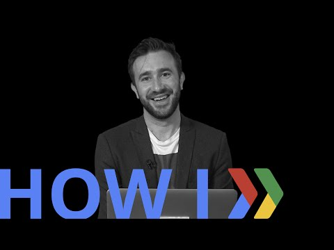

## How I: Use events to build DeadSocial's brand  

 

** 视频发布时间**
 
> 2015年4月2日

** 视频介绍**

>  Social from beyond the grave? Founder James Norris uses events like SXSW and local pop-up shops to get users, build his brand, and forge collaborations. Learn his six-step process, and check out his event ideas, in this video.

** 视频推介语 **

>  暂无，待补充。

### 译者信息

| 翻译 | 润稿 | 终审 | 原始链接 | 中文字幕 |  翻译流水号  |  加入字幕组  |
| -- | -- | -- | -- | -- |  -- | -- | -- |
| 隆斯朝 | 田源 | -- | [ Youtube ]( https://www.youtube.com/watch?v=WjKWoErGg5w )  |  [ Youtube ]( https://www.youtube.com/watch?v=YQD1uo7XWfk ) | 1504070557 | [ 加入 GDG 字幕组 ]( http://www.gfansub.com/join_translator )  |

### 解说词中文版：

我的名字是James Norris

我是DeadSocial的创始人和CEO

DeadSocial是一个临终规划项目

它使我们可以向我们的朋友和家庭道别

无论是线上还是线下

今天 我来向大家介绍一下我遵循的6个步骤

通过这六步 利用流动铺位推广和事件推广以确保我的公司和品牌

得到最大程度的宣传

第一步是 你必须

决定什么时候 在哪里

以及以怎样的形式来开展你的流动铺位或者事件

所以 你要做的第一件事可能是

尝试着决定

你将要花费在某项特定的项目上

的时间和花销 -- 如果你要进行一次展出

展台的花销 

你需要分配的人员的数量等等 等等

通过运营流动铺位 我们与潜在的客户成功

铸就了非常

牢固的关系 无论是在关于利益的领域

还是无关利益的领域

这既使我们的生意做成了

也增加了我们的品牌在

这个领域的知名度

我们去年在西南偏南启动了DeadSocial

我们希望尽可能地制造声势

西南偏南是世界上数一数二的技术会议

我们必须要创造深入人心的故事

使它最大程度上 既能吸引普通大众 又能吸引技术团体

我们决定租用一个叫奇怪的博物馆的小场地

在活动之前用来激发讨论和思考

我们以10倍的数量卖掉了我们的启动派对的门票

在整个活动中 我们都采用了深入人心的故事

每一个事件 我们都采用一个故事或者使用不同的叙述方式

来确保人们感到它非常的新鲜

从而帮助确保每个人都有良好的参与性

在介绍临终事项认知的一周

我们建立了一份生存信息表

我们采用从调查死亡问题的数字问卷中抽取的实时数据

来生成了这张生存信息表

在这周中

当这些数据被填写好之后

我们在活动中把它们制作出来 摆在那里

让这些生成的数据更好的被展示

我们在西南偏南和流动商铺

进行的死亡事项认知周非常的不同

从它们的描述来看

他们采用了非常不同的路线

但是 两者都能有助于体现品牌形象

并促进关于我们的业务和核心精神的讨论

在理想死亡演出中 我们有一个小的展台

这跟流动铺位完全不同

但是同样 我们希望建立一个故事

讲一个围绕着技术和死亡的故事

我们出于非常简单的目的用单反相机 

只是增加快门的速度

这样做 我们模拟出维多利亚时期的的那种老照片

和交织着维多利亚时期神话的鬼影

通过这种方法

来强调技术和死亡的关系

第六步 回顾和衡量成功与否

对于一个事件或者是开展的流动商店而言

有很多方法来

分析和回顾你是否成功

你可以采用谷歌analytics做定量的统计分析

份额的数量以及

回复的数量 等等

或者全凭一般的直觉

或者来自于你已经结成伙伴的人的丰富的评价

我就是采用这六步

来保证我的品牌在事件活动和流动商铺中

尽可能多地提高关注度的

