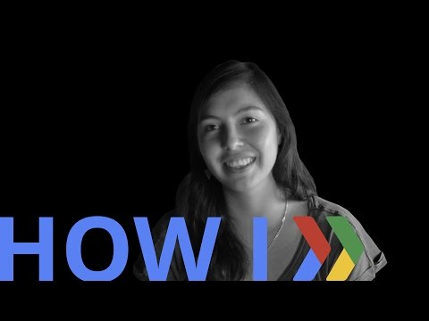

## How I: Drive engagement with social challenges  

   

** 视频发布时间**
 
> 2015年3月18日

** 视频介绍**

>  Founder Pamela Aránguiz Gómez uses social challenges to drive adoption of her Google Cloud-backed app Stories. Stories is a member of Startup Launch, our program to help startups build successful apps on Google and open-source technologies.

** 视频推介语 **

>  暂无，待补充。

### 译者信息

| 翻译 | 润稿 | 终审 | 原始链接 | 中文字幕 |  翻译流水号  |  加入字幕组  |
| -- | -- | -- | -- | -- |  -- | -- | -- |
| 黄莘 | 隆斯朝 | -- | [ Youtube ]( https://www.youtube.com/watch?v=B3FJCq54CT4 )  |  [ Youtube ]( https://www.youtube.com/watch?v=aswbfX0d_r8 ) | 1504070558 | [ 加入 GDG 字幕组 ]( {{ book.host }}/join_translator )  |

### 解说词中文版：

音乐

大家好  我的名字是Pamela

我是Stories的CEO

我们开始开发一个用来在美国的评测想法的应用

并且现在我们正在使用python  Reis以及Django开发服务端

来使得它在Google Cloud下运行

通过Stories  我们想建立一个关于故事的

世界性文库

所以我们想从全世界获得故事

并且或许当你去别的地方的时候

你能够阅读有关这个地方的故事  或者知道是什么

激发了人们写这些故事

许多人正在开始他们自己的挑战

举个例子  一个智利作家完成了

100天的写作

并且现在她正准备出版她的书

并且因为如此  所有的人开始进行他们自己的挑战

举个例子  通过具体的数据

比如万圣节  用户开始写  因为他们想分享那些有关

万圣节或者恐怖的故事

并且他们要求我们来描述一个挑战

来鼓励更多的人来写

每个人都有故事可以讲

并且每个人都想听好故事

所以我们正在尝试邀请人们来分享故事

并且在作者的视角见证他的生活

