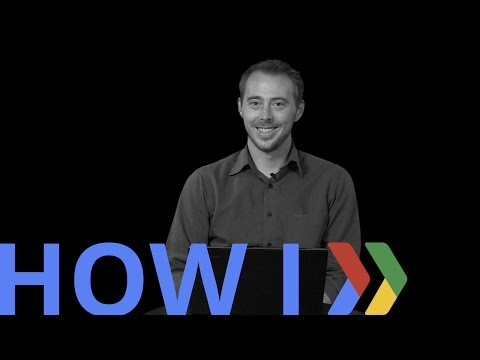

## How I: Test beta-product features using Google Apps 

  

** 视频发布时间**
 
> 2015年2月5日

** 视频介绍**

>  Building two-sided marketplaces can be challenging, but FlatClub's Chief Commercial Officer Matt Chic describes how they verified interest and matched users with suppliers cheaply and quickly using GoogleApps. https://flatclub.com/

** 视频推介语 **

>  暂无，待补充。

### 译者信息

| 翻译 | 润稿 | 终审 | 原始链接 | 中文字幕 |  翻译流水号  |  加入字幕组  |
| -- | -- | -- | -- | -- |  -- | -- | -- |
| Uucky | Galory | -- | [ Youtube ]( https://www.youtube.com/watch?v=5Pro9WpF2LE )  |  [ Youtube ]( https://www.youtube.com/watch?v=WMztHjzJt84 ) | 1504070563 | [ 加入 GDG 字幕组 ]( http://www.gfansub.com/join_translator )  |

### 解说词中文版：

嗨  我叫Matt

我是FlatClub的首席商务官

我们做的是短租平台

今天  我来讲一下非开发者是如何

在Google Apps的帮助下测试beta版产品的

拿我们自己做例子  我们是一个

短租交流平台

我们遇到一个常见情况  我们的房东们

尤其是那些潜在的新房东

都想更了解房客们的需求

我们也一直在试图

改进这一点

然而另一方面  我们的房东们只想让我们

直接告诉他们目前提供什么

或者可能会提供什么

因此  基本上  他们根本没时间好好选

只希望我们直接拿出个适合他们住的

房屋清单给他们看

所以呢  我们想找个能同时解决这两个需求的新方法

而不是像传统的交流平台一样  你得在所有的列表里搜索

看看有什么能订的

我觉得我们可以实现这两个目标

提供给房东大量的客户需求

这样就满足了

那些想要一些可选列表的客户

他们不想花大把时间去寻找目标

所以  我们测试这个的解决办法

就是一切都工作都使用非常基本的模板  电子表格和邮件

我们之前已经收集过访客们的搜索信息和标准了

因为需要一些预算来帮助房东们选下家

我们搞了一个基本的模板

还跟客户交流了一下

关于我们即将用填表来替代搜索的事情

填上他们想找的房源以及预算

我们用这个模板自动生成了一个sheet

接下来我们需要足够多的需求来优化它

对于房东  我们就复制粘贴这个表格

然后放在邮件里

发给我们的团队

我们给我们主要的200家房东测试了这些

结果打破了入住率的最高记录

我们以前从来没在产品上做到这么棒过

问题来了  房东直接在电子邮件里

回复了租客想要的出租信息跟出价

还有房源信息

这马上变的很难管理了

所以我们在云服务系统上面又做了一些改动

我们做了另一个模板  房东们

仅在一张表上就能看到所有当前

正在网上找房子的申请ID

然后他们把那个ID填到模板里

填上相同的信息就行

这么做可以让我们的背后工作变的更快

房源也在一张表里

我们把这个发给网站的访客  然后

在打开交流串的时候收集起来

其实我们至少花了两周

来搞定语言的问题

我们要确认我们正确的收集了所需要的数据

数据的格式也得表达正确

接下来才开始开发beta版的产品

我们发展这个系统的时候，从头到尾

都在跟我们的房东们互动

现在终于发布了迭代后的产品

每个人都非常喜欢  对这个印象非常好

总之呢  非开发者们在使用云服务

测试beta应用的时候跳出思维定式是双赢的

一是让客户们更容易

理解

所以说  如果你想测试一个新产品或者更新

你会比较想在已有的用户基础上操作

用一些电子表格跟模板

简单地用电子邮件沟通

你团队里的任何一个人都能参与这个项目

客户们也能容易地理解正在进行的改动

可以立即反馈给你

直到测试版真正要开始开发的时候

你们其中不是开发者的人能

更有效的跟开发者团队交流

到真正测试的最后阶段呢

非开发者团队在整个系统的

开发进程里都是参与着的

他们的想法可以直接被翻译成代码加到产品上

另一个好处就是当你

找你客户们做这些的时候

他们会非常高兴参与产品的开发进程

这比给他们点什么

感觉好多了

