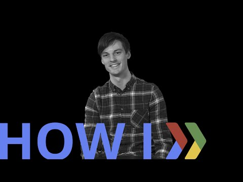

## How I: Prep to fundraise with four questions  

 

** 视频发布时间**
 
> 2015年1月21日

** 视频介绍**

>  Jukedeck founder Ed Rex shares the four questions he answered to prepare for successful investor meetings.http://www.jukedeck.com/How I: is a video series where entrepreneurs share their tips, hacks, and lessons learned. See full playlist at http://goo.gl/42KKTj Ed is an alumni of our Launchpad program - learn about our programs at http://g.co/launch.

** 视频推介语 **

>  暂无，待补充。

### 译者信息

| 翻译 | 润稿 | 终审 | 原始链接 | 中文字幕 |  翻译流水号  |  加入字幕组  |
| -- | -- | -- | -- | -- |  -- | -- | -- |
| 點墨 | 伍文其 | -- | [ Youtube ]( https://www.youtube.com/watch?v=ceqbkxwuqJo )  |  [ Youtube ]( https://www.youtube.com/watch?v=Je5GnzJF1uw ) | 1504070564 | [ 加入 GDG 字幕组 ]( http://www.gfansub.com/join_translator )  |

### 解说词中文版：

音乐……

大家好  我是Ed Rex  Jukedeck的创始人

在Jukedeck  我们开发了 

可以通过触摸一个按钮来编写原创音乐的软件  

这也就意味着  你可以用它

为你的视频创作独一无二的音乐

至于具体怎样

可以听听现在播放的这段视频的音乐

我们已经收到多轮投资了

而我想向大家分享一些

我们募集资金的经验

我认为先问问自己以下4个问题

在你筹集资金

何时集资  向谁集资  怎样接近投资者

以及投资者想要看什么

首先第一个问题  何时集资

我觉得在种子轮筹集资金

与在创业后期是不一样的

种子期  

你没有必要去想集资的事

在证明你的想法有前景之前

这有两个原因

首先 投资者

在你证明之前是不会听你废话的

其次  更重要的一点

如果你连自己正在为之集资的对象可不可行都不知道

你就完全是在浪费自己的时间

所以对我们来说  这意味着

在我们去找投资者之前

我们花了大量时间来研发软件

而到找他们时  我们已经有一个可行的原型方案

一些可以拿得出手的东西了

而这的确可以帮助我们筹到资金

这的确会有点不同

如果你在后期募集资金

据我们发现  你确实

有必要在真正需要它之前就开始集资

因为如果等到你需要它时才开始

你们不会达到一个理想的交易

当你去找投资者谈时  你会很失望

并陷入一个不利的境地

我们的另一个经验是  你真得有必要尽早开始

集资所需的时间多得惊人

我们就花了六到九个月

而且你还要提前计划

提前动手 因为不这样的话  

如果开始了三个月就没钱了  那会是很大的麻烦

那会是很大的麻烦

下一个问题是  你应该从谁那里集资

你可能会广撒网

联系尽可能多的人

但事实上  你真正需要的是

那些对你做的东西感兴趣的投资者

如果你是一个像我们这样的音乐公司

却去找一家只投资社交媒体的投资者

那就是在浪费大家的时间

就此而言  我们的确很幸运

因为我们约谈的第一个人  一个叫Mike的可爱家伙

以前曾经做过音乐生成类的工作

而这也是我们正在做的

所以他能明白我们辛辛苦苦做出来的是什么东西

当时他就是听了我们的介绍后  就对我们说

你们这东西做得真得很棒

所以  我们可能会投资

但你不要期望他们太过感兴趣

如果你去找一个之前投过类似项目的人

他们要么

因为这项目不可行而推迟约谈

要么项目可以继续

但你会成为它的竞争者

如果你去找那种人  你依然在浪费时间

所以  你需要在其中找到平衡点

你需要找那些对你的项目有兴趣

但不会太过兴趣以至于他们曾经投过类似项目的投资者

然后  一旦你找到目标投资者

你就需要考虑如何接近他们

而对此  我刚开始就犯了个很大的错误

我向一大群人发了很多电子邮件

而并没有多少人回信给我

大概是因为

他们有比回复每封收到的邮件更重要的事情去做

反正我是这样安慰自己的  呵呵

相反  我发现引起这些人注意的最好方式

是跟他们建立人际关际

很明显  如果这些人

将要在你的初创期投资 他们真得了解你

他们会向自己了解的人投资

会向曾谈过很多的人投资  会向自己喜欢的人投资

而这最终可归结为

他们会向与自己有私人关系的人投资

你需要参加尽可能多的活动

你需要跟尽可能多的人讨论

你需要走出去  

见识更多的人  最终才能找到合适的人

你遇到的第一个合适的人

并不一定是投资者

但如果你能坚持走下去

最终你一定能发现适合你的人

对这一点来说  打造个人关系可能会非常棘手

特别是对那种刚开始创业的人

我觉得很有用的一点在于自我介绍

能由你认识的人介绍给投资者

要比在会议上

直接走上前去跟他们攀谈好得多

能从任何认识他们的人得到的各种介绍

都是非常非常有价值的

非要这样做的确有些恼人

你希望你的想法可以单纯地根据其价值来评估

但最终来看  这不是世界的运作方式

你必须有人可以为你担保

第四 也是最后一个问题

在你约谈投资者时

他们想要看什么

有几点需要考虑

首先  很明显的一点  即产品的吸引力

投资者很想看看

使用你产品的人

投资者会希望看到你的产品在被使用

否则  他们不会投资它

但是  我发现有一点挺有趣的

这个吸引力并不是指

必须有成千上万的人用你的产品

我从一个在Index工作的好友那里

得到的关于吸引力的一个很好的定义是

吸引力是非理性的

即使只有五人在使用你的产品

如果你能证明他们的回头率很高

而且他们非常喜欢它

你就能获得意想不到的收获

投资者并不需要看到非常非常大的指标

他们只需要看到一个有所保留的情况即可

因为这样你就可以回去跟他们说  你看这个

我们已经实现它了

现在  我们该扩大一下规模了

这也就是为什么我们需要你的钱

我们发现还有一点挺有用的

给投资者一个产品原型

如果你找到他们  然后说你只是有一个想法

那想要说服他们

你正在做的可给他们带来的好处是非常难的

但是  如果你可以向他们展示什么东西

如果你可以把这东西放在他们手中

他们可以动手玩  那这就是一个

可以展现你所做东西的非常有力的方法

而你也就更加可以抓住他们的注意力了

而我记得  在我们第一次集资会议上

我们就带上了产品的原型

当我们把它展示在大屏幕上

激动人心的时刻随之到来

我们按下按钮  它就谱写了一个音乐作品

这时投资者便说 

OK  我们可以投资

回顾一下  四个我认为可以帮你

募集资金的问题

何时集资

向谁集资

怎样接近投资者

以及投资者想要看什么

