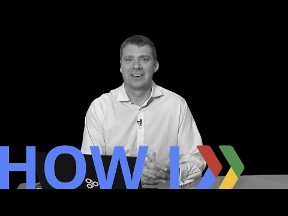

## How I: Build open platforms on Android 

 

** 视频发布时间**
 
> 2015年4月9日

** 视频介绍**

>  Awesome apps, sure, but what about awesome platforms? Enplug’s chief software architect shares how they deployed their SDK (and shares their gitHub sample) to build an open platform for digital signage on Android.

** 视频推介语 **

>  暂无，待补充。

### 译者信息

| 翻译 | 润稿 | 终审 | 原始链接 | 中文字幕 |  翻译流水号  |  加入字幕组  |
| -- | -- | -- | -- | -- |  -- | -- | -- |
| 黄莘 | Martin | -- | [ Youtube ]( https://www.youtube.com/watch?v=XVrZs-0lfcg )  |  [ Youtube ]( https://www.youtube.com/watch?v=fkJNJk6uw8g ) | 1504120596 | [ 加入 GDG 字幕组 ]( http://www.gfansub.com/join_translator )  |

### 解说词中文版：

BRUNO DENUIT  大家好

我是Bruno

我是 EnPlug 的首席软件架构师

我们是第一家做数字标牌的开放软件平台

在这个视频里  我将要给你们展现

你怎么才能使用 EnPlug 平台来开发一个应用

并且在世界上的任何一个物理设备上展现你的内容

所以当我们开始做 EnPlug 的时候   

我们决定从 Android 平台开始着手  因为它是一个开放的平台

这是非常有名的  并且这让我们可以在非常便宜的设备

上运行我们的软件

我们决定使我们的软件成为一个开放的平台

所以那些想展示自己页面在

数字世界的人可以通过

我们的平台专注于自身价值增长

并创建他们的应用

并且他们并不需要担心我们所担心的所有细节问题

所以你怎么才能开始做呢

你怎么才能开始在 EnPlug 的平台上写应用

访问developers.enplug.com

注册并且下载我们的 SDK

我们的 SDK 由两个部分组成

明显的是  这里有为写我们实际运行在设备上

的应用所准备的 SDK

这个将为 Android 所使用  但是它也同样

可以运行在桌面端  Mac 和 Windows 以及我所提及的 Chrome OS

另外的部分就是如果你想让你的应用

更好地可制定化  如果有一些配置

是你想让你的用户进行选择的

然后你可以使用我们的网页 SDK 来创建一个网页

并且让用户在 EnPlug 保存所有的配置以及各种事务

我们在 Github 上有两个样例应用

你们可以下载并且使用它们

第一个样例是一个非常简单的应用

能够允许你展现任何样式的网页

所以你能够从头开始做

只需要下载那个应用  让它指向你的网站

然后它将展现在屏幕上

第二个应用是为那些

有点基础并且想创建他们自己的应用的人准备的

他们想定制他们自己的应用

并且那个包含了一个在我们平台上创建应用的一个框架

这里有一个我们网页应用的一个样例

你可以配置你自己的独特的应用

你可以把他们打开或者关闭

我选了 Waitlist.me 的应用来展示怎么来配置它

你可以去配置你的 Waitlist 应用

它向你申请连接 Waitlist.me 的账户

所以这是一个 EnPlug 和第三方平台

集成的样例

输入你的 Waitlist 的证书

你选择了你登陆的地点

并且输入一些文本  一些标签

最少的聚会人数

这些是Waitlist.me的所有配置信息

你保存它  并且它展示

你的屏幕的样子的预览

我希望你们体验一下 EnPlug

去 developers.enplug.com

注册  下载我们的 SDK  试用它  然后你就会发现

这是多么简单多么开心的事情

谢谢

