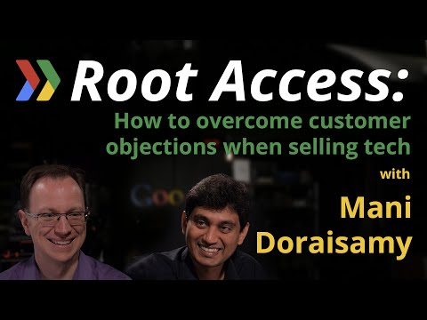

## Google Root Access: How to overcome customer objections when selling tech, with startup Guesswork

** 视频发布时间**
 
> 2014年12月2日

** 视频介绍**

> When you are a startup, you need extra ammunition to convince potential customers about your technology. Mani Doraisamy shares his tips on how to do that, in conversation with Martin Omander.

** 视频推介语 **

>  暂无，待补充。

### 译者信息

| 翻译 | 润稿 | 终审 | 原始链接 | 中文字幕 |  翻译流水号  |  加入字幕组  |
| -- | -- | -- | -- | -- |  -- | -- | -- |
| 吴雅婷 | 方杰 | 程路 | [ Youtube ]( https://www.youtube.com/watch?v=L0hfcYb9XiY )  |  [ Youtube ](  https://www.youtube.com/watch?v=0LmG9KMhgeY ) | 1503280458 | [ 加入 GDG 字幕组 ]( http://www.gfansub.com/join_translator )  |

### 解说词中文版：

大家好

我叫Martin Omander  欢迎大家

来到  创始人访谈  一档专注于

可行创业建议的访谈节目

我们今天的嘉宾是Mani Doraisamy  Guesswork的创始人

Mani 跟我们谈谈你的公司呀

我们是一家机器学习公司

帮助挑选潜在客户  增加客户转化

我们通过建立CR智能预测来完成工作

客户关系管理体系的智能预测

对

你是如何决定做这一行的

我们发现一个问题

那就是通过网络营销渠道获得的潜在客户

不能很好地转化成最终客户

举个例子，你去看看那些房地产经纪人

他们每天都会收到大概一百位潜在客户的信息

而在这100位潜在客户里面  有90位的信息

是来自网络营销渠道  像Trulia和Zillow（均为房地产网站）

剩下的10位的信息来自传统渠道

但问题在于，在这90位潜在客户中，只有五位

转化成最终客户

另一方面 在那10位潜在客户中

同样只有五位潜在客户通过传统渠道转化为最终客户

所以我们常常能看到  房地产经纪人

和小型企业主认为网络营销渠道的

潜在客户都没怎么咨询过  所以通常会忽略他们

嗯嗯

他们抛弃了一半真正想咨询的潜在客户

对  就是这样

即使这能让他们的销售额翻倍  他们还是选择忽略这些潜在客户 

所以这就是我们如何决定建立Guesswork的

我们开始建立这项机器学习服务

来预测哪些潜在客户真正想咨询

哪些只是随便问问而已  这样一来他们

就能专注于那些真正想咨询的潜在客户

我明白了

那我们接着谈谈异议处理

我知道你们的客户是客户关系管理的卖主

他们都特别狡猾

你在跟他们谈机器学习的时候

他们会不会问你说  嘿  我为什么要

跟一个小公司和他们的机器学习打交道

在当今这个时代  有像Google和美国国际商用机器公司这样的大牛

还有其他我们不知道的大牛  正在

用更多的资源做机器学习这一行

这样的情况会发生吗  你是如何回应的

经常会这样

所以事实上  你不能跟Google来比机器学习

他们在机器学习这方面已经领先多年

他们每天有几百个操作机器

学习的工程师  对吧

所以我们不能跟他们比

我们利用他们

所以我们在Google Prediction API的基础之上操作

同样地  我们在App Engine和BigTable的基础之上操作

来衡量大量的数据

所以事实上，我们说到把Google Prediction

API用于机器学习时  大多数

关于技术的异议已经被解决了

嗯 很棒

如果这就能让客户停止异议的话 这是处理异议一个很好的办法 

那么我能想到由你们客户提出来的

另一种潜在的异议

客户会说  呀 你们在使用Google Prediction API

和Google BigQuery

那我为啥不自己用呢

的确会这样

所以我们的价值就在于我们

的操作所基于的规则引擎 Google Prediction API

比如  想想刚刚房地产的例子

如果一位客户要帕洛阿尔托的一套公寓

好  机器学习运算法则

能推荐公寓  对吧

但所推荐的公寓有可能已经被卖出去了

因此机器学习自身并不能进行智能预测

一个能理解业务环境

并决定采取次优选择的规则引擎

在这种案例中是非常重要的

规则引擎就是我们已经推上台面的IP

好

那么你们就是将机器

学习与规则引擎进行互补

完全正确

并且你很擅长建立规则引擎

因为你做这个已经有一段时间了

那么接下来就是关于关注点

以及潜在客户了

关于这点能否再谈多一些

当然可以

我们都知道并且总谈到技术  因为我认为

有一部分利益相关者

感兴趣于  我是说  举个例子

一个客户关系管理公司  这个公司对我们

在技术方面带来的价值很感兴趣

但如果你得去说服这些商人

那么我们就得谈谈我们能带来什么价值

以及我们能解决什么问题

所以我们一直在说我们多么想转变客户关系管理

将其从记录保管系统转变为客户转化代理

商业价值便是能说服

客户关系管理中的利益相关者  也就是商人  的东西了  对吧 

他们关注的是解决商业问题  而不是

仅仅解决技术问题

所以你必须将两方面的异议处理结合起来

技术利益相关者方面的  和商业利益相关者方面的

当你看中的目标市场中

有这两方面的利益相关者时  这种结合便是非常重要的

嗯嗯  我明白了

所以在销售会议上  你就准备好说

为什么这对你的公司有利就行了

也不用提及技术讨论

然后当技术CTO

之类的  当他们来检测的时候  你

就可以跟他们说这是一个好玩意儿

这样就能hold住场面了

对  就是这样

所以我觉得  就是掉进销售循环的入口

你不断说服商人们  让他们相信价值

命题

随后在另一个销售循环中

你要跟技术决策人谈谈

你的技术有多厉害  对吧

所以我们要搞定两边的把关者

嗯嗯  对

这两方中任何一方都能阻止你

所以你最好做好两边的准备

完全正确

好

那么  Mani  你公司做这事也有一段时间

了

对于其他建立在别人技术基础之上的公司

你的建议是什么呢

如何考虑异议处理这个问题

以及如何在销售中处理异议

我觉得  如果你想

选择别人家的技术

那么必须基于这项技术能够如何为你的客户增值

对吧

我们往往能看到一些人选择一项技术

是因为这样他们就有销售业绩

这种现象很典型的  真有这样拓展业务的家伙

他负责合伙关系这一块的

他发现如果你在他们网站上有一个大牌的商标

他会得到更多的客户

哦哦  网站上的商标

对

我在一些类似的公司工作过

对

所以就是说你给我一点好处

我也会回报你一点好处

这就是选择一项技术最糟糕的方式

我认为选择别人的技术最好的方式就是

想想你是否会选择

这项技术  在不考虑销售业绩的情况下

在不是因为你能从向你提供技术的

大品牌那里提升销售业绩的前提下

我觉得这一点是能向

客户提供长期利益的

不考虑其他公司能为你做什么

这样子你就能成功

并且这样你也能在销售中

更好地处理异议

对  就是这样

并且我认为异议处理不仅仅是跟使用

别人的技术有关

也跟结合互补的优势有关

它可以是技术（听不见）

比如  在我们的案例中  我们将规则引擎IP推上

台面来说了  对吧

这是有帮助的  因为我们在建立规则引擎这方面

已经有14年的经验了

在创业的初期

客户们买的不是产品

他们买的是你

创始人就是产品  对吧

没错

产品可能还不够成熟  甚至可能还不存在  对吧

正是如此

所以你以个人名义担保你

会交付结果  不管

你是否有产品  对吧

是的

所以我觉得创始人要适应市场这个理念

在投资界是相当流行的

Chris Dixon引起这个风潮的

但我觉得这种理念

在创业初期也是同等重要的

因为你说服你的客户  是基于

创始人的实力  而不仅仅是基于你的产品

对

那么  Mani  谢谢你前来与我们

分享你的经历

谢谢Martin

我很乐意

感谢您加入我们

我们希望您能找到对您创业有用的东西

您的资源非常重要

请在下方留下您的评论

我们会阅读您所写的一切

想了解Google能如何帮助您创业

请浏览网页developers.google.com/startups

如果您想成为节目嘉宾

请浏览网页bit.ly/applyrootaccess

今天的节目到此为止

我们下次再见