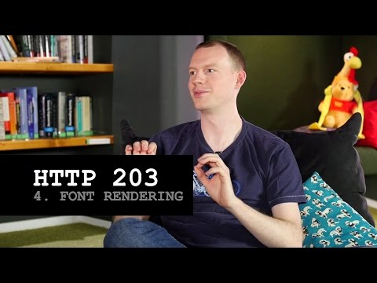

## HTTP 203 Font Rendering

** 视频发布时间**
 
> 2014年12月4日

** 视频介绍**

> There's nothing more annoying than visiting a site and just seeing white space where the text should be, just because the web font is taking an age to load. Jake brings news of a potential improvement to the web that could help, and he also discovers that conferences are incredibly dangerous places to frequent!

** 视频推介语 **

>  暂无，待补充。

### 译者信息

| 翻译 | 润稿 | 终审 | 原始链接 | 中文字幕 |  翻译流水号  |  加入字幕组  |
| -- | -- | -- | -- | -- |  -- | -- | -- |
| 姜昭宇 | —— | —— | [ Youtube ]( https://www.youtube.com/watch?v=GhFR-G42mOA )  |  [ Youtube ]( https://www.youtube.com/watch?v=GhFR-G42mOA ) | 1501080016 | [ 加入 GDG 字幕组 ]( {{ book.host }}/join_translator )  |

### 解说词中文版：

Paul  我想和你讨论一下字体渲染问题

当你浏览一个站点的时候

浏览器下载了HTML,

CSS, JavaScript代码

但是没有下载网页内容的字体

发生了什么

你通常会盯着白色的窗口看

它取决于浏览器

例如在Safari中  它会给你网页的大体框架

甚至所有的内容  但是这会阻碍文字字体的渲染

我认为在Chrome中也是那样的

Chrome做了一些相似的事情

过去我们就是那么做的

我们从Firefox浏览器得到了启示  我们决定

会增加3秒的延迟时间

然后我们将会渲染为预置的字体

当新的字体下载完成时  它会切换到新的字体

我有两个问题

一

你有两个或更多的问题

但是我认为你要说的是两个具体的问题

嗯  是的

今天的时间只够解决这些问题了

哈哈  是的

首先  3秒钟对我来说感觉很武断

我不确定它是从哪来的

我相信他们做过了调查

关于它的其他的事情

是切换字体真的很困扰我

例如当你阅读到一句话一半的时候

字体改变了  它会产生一个完全不同的观感

然后那是什么

是的  那很糟糕

甚至单词会从一行换到另一行

这

太糟糕了

所以我认为这是完全没有任何

正确答案的一个问题

甚至像我们做的那样  你知道  火狐浏览器所做的

有朋浏览器所做的  它们像是一种妥协

而且是全世界最糟糕的事情  是吧

我们已经有了延迟

我们有时也需要切换

是的

嗯  是这样

值得庆幸的是CSS新的属性终于来了

我说这是终于来了

因为它是在之前被提出的

现在说它已经来了还有些早

是的

这是由Kenji Baheux和

Ilya Grigorik提出的建议

现在就在Github上

哦  那两个人

在这里是性能和Funk组合而成的

这是CSS字体渲染属性

你需要选择用什么方法去解决

像你要停滞它们多久

你想交换么

你想使用一个预置字体然后切换到新的字体吗

如果你使用其他的技术也是可选的

这是我们已经看到的一个首创

我认为是TheGuardian最先做的

如果已经有了它们使用字体  像它就在缓存中

如果它在那  它们会使用它

如果不在  它们回去使用预置字体

它会下载这个字体  但是字体不会换过来

它们下载了

它们把它放在本地存储里下次使用

但是我认为这是我们见过的人做到

这一点的可扩展网络的一个很好的例子

你经常看到The Guardian做了

Smashing杂志现在也做到了这一点

其他人也有  你知道我们选择了它然后去思考

我们一起去掉这些坏习惯

让我们避免了那些代码的编写量

让我们避免在本地存储数据

让我们有一个它的CSS属性

是的

最近我在开几个会议

你知道在会议后的派对是一个很棒的地方

对于开发者们

可以到这里来一起聊天

所以我们会把音乐的声音放的很大很大

去真正的让对话开始轮流进行

正是如此

所以没有说是有质量的对话

比如像在有两尺远的距离对另一个人大吼大叫

是的

所以正当我和一个人在聊天的时候

他在某件事上给我了某个建议

然后随着他大叫  许多口水从他的嘴里出来了

它们跑到哪里去了

在我的耳朵里面

这一次的降落将会是

Luke Skywalker最自豪的一次

就是当在右边的耳朵的洞里面

Luke  快用力

是的

你知道如果在你的耳朵中进了水

然后声音开始变得有些

那个时候有好多的口水在我的耳朵里

继续

这件事情你是怎么解决的

是的  真的是非常有礼貌的

那种方式去处理的

是的  那可以说的通

你应该有一些提议

你绝对应该把那些写下来

我现在要去厕所了

我一会就回来

然后冷静下来  继续走

不要跑

不要跑

不要跑

不要跑

不要跑

不要跑

然后随着门打开  跑到水缸那里

然后像这样  我必须要让这些东西从我的脑袋里面出去

这个会议真的是非常危险啊

是的

