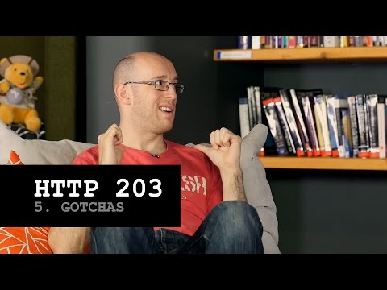

## HTTP 203: Gotchas

** 视频发布时间**
 
> 2015年2月12日

** 视频介绍**

>Building for the web is awesome, but sometimes you can find yourself baffled by gotchas. Check out the latest episode of HTTP 203, where Paul tells Jake about three he recently discovered!

** 视频推介语 **

>  暂无，待补充。

### 译者信息

| 翻译 | 润稿 | 终审 | 原始链接 | 中文字幕 |  翻译流水号  |  加入字幕组  |
| -- | -- | -- | -- | -- |  -- | -- | -- |
| 卢治泷 | 田源 | —— | [ Youtube ]( https://www.youtube.com/watch?v=VJQtNxyKJhQ )  |  [ Youtube ]( https://www.youtube.com/watch?v=fjnDDPdS-Bk&list=PLvivLNHqjooz0jg-8ShYbWz4BERNNNR6Q&index=40 ) | 1501140368 | [ 加入 GDG 字幕组 ]( {{ book.host }}/join_translator )  |

### 解说词中文版：

Paul: 现在轮到我来吐槽一下了

我最近创建了一个Chrom Dev Summit网站

Jake：我也认为你做了一个非常棒的工作

Paul: 谢谢

Jake：别客气

Paul：但是当我创建这个网站的过程中  我遇到了一些陷阱

首先是 --Position Fixed--  告诉我你认为Position Fixed是什么意思？

Jake：把一个元件从网页本身分离出来，并且把元件放置在与视口（Viewport）相关的位置上

Paul：什么？

Jake：Viewport

Paul：Viewport

Jake：对的

Paul：是的

Jake：我说的对吗？

Paul：当你把一个会变形的元件的子元件设置为Position Fixed（你得到了另一个会变形的元件）并且这个子元件里面有另外一个子元件也是Position Fixed的时候

Position Fixed的作用会改变

这个会变形的子元件变成了一个新的容器元件

Jake：哇

真的吗？

Paul：是的，它就像一个Viewport里面得一个新的Viewport

所以我的做法是  因为我有一些卡片是要变形的  在变形结束后  我按比例改变所有变形的元件  这样才不会看到奇怪的效果  超级烦人的

陷阱2号 -- Pop State

Jake：Oh 是的 我曾经用过Pop State

Paul：恩

你知道它会重置滚动条位置吗？

Jake：不知道耶

Paul：是的

它也让我发狂

你用历史API做一些事情  你把一个state推出来  然后又把state弹走  因为你完全自己操控着APP state

但是浏览器会按照他们的想法来做  我知道你想做什么

我知道你想重置滚动条的位置去你推出state的时候的位置

但是如果你在做一些异步的事情  对吧？

如果你在做一些…… Jake：就是之前我做的所有事情

Paul：是的  就是突然的  你的页面会回到它之前滚动条的位置

我认为我可以修理好它

我会想些偏方来解决它  手枪

Jake: 嘭~ 嘭~

Paul：我要做的是为滚动条位置创建一个Listener  如果它在关掉PopState之后改变了    它会滚动一次

滚回应该的位置

Jake：让它再滚回来

Paul：然后它会像  呵呵  什么都没发生一样. 完美！

Jake：是的  Paul：不
JAKE：Yeah  PAUL：No.

因为Chrome是这么做的  它在pop state之后做这个滚动动作

而Firefox是在它之前做

所以你实际上并不知道你是从哪里开始滚动的

你只是很确定地知道你不是在你之前的位置

说到滚动 --最后一个-- Body

你知道你不能终止Body的滚动吗？

Jake：实际上，那是我下一张专辑的名字 （说笑而已）

Paul：是的 Jake

那太棒了

Jake：用鼠标滑轮事件？

Paul：你可以那么做  但是在移动设备上根本不起作用。

Jake：移动设备上…… 你有触碰事件

Paul：不是的

没有

Jake：那么你就不得不重新去实现所有关于滚动的东西

Paul：是的 所有沿着Y轴移动的内容

Jake：如果你这样做了  你会丢掉性能  丢掉所有的东西

Paul：算了吧

表那样做

不喜欢那样

不想要那样

因为那些卡片又会被扩展

需要可滚动的内容在里面

当它们到达可滚动内容的底部的时候  Body会说  我会处理这个

现在我要滚动了

其实有一个应急方法  开发者能做的  你知道是什么吗？

我想掌控这个

我知道这种情况应该做什么

我会处理这个

可扩展网页会说  吁~~

Jake：吁

Paul：是吧？

是的

好消息是

在Spec Land，在discussion world，（不知道指什么）有一个beforeScroll事件  它有一个CSS属性是关于滚动应该被什么中止

但是默认的行为还是和今天一样

它给了开发者更多的选择  我知道我在做什么

让我把汽车调到手动挡  Jake：手动挡

Paul：或者叫手动变速器  就像它以前一样  我们会从那个状态做起

所以从可扩展网页的观点来开，耶~

Jake: 耶~

